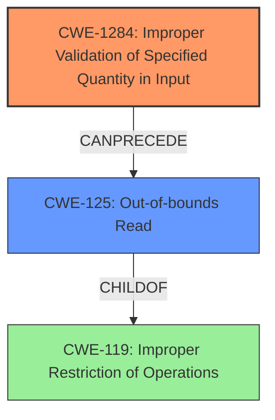

# Final Resolution for CVE-2022-20690

# Summary
| CWE ID    | CWE Name                                               | Confidence | CWE Abstraction Level | CWE Vulnerability Mapping Label | CWE-Vulnerability Mapping Notes |
| :--------- | :----------------------------------------------------- | :--------- | :-------------------- | :------------------------------ | :------------------------------ |
| CWE-1284  | Improper Validation of Specified Quantity in Input    | 0.95       | Base                  | Allowed                         | Primary CWE. Missing length validation allows crafting malicious CDP packets. Mitigation includes an 'accept known good' input validation strategy.                                                                                                                                                                                                                                                                                               |
| CWE-125   | Out-of-bounds Read                                        | 0.80       | Base                  | Allowed                         | Secondary Candidate. Consequence of CWE-1284. Crafted packets lead to out-of-bounds reads, causing memory corruption. Mitigation includes validating length arguments and ensuring correct buffer size calculations.                                                                                                                                                                                                                                           |

## Evidence and Confidence

*   **Confidence Score:** 0.90
*   **Evidence Strength:** HIGH

## Relationship Analysis
The primary relationship impacting the decision is the chain relationship where **CWE-1284 (Improper Validation of Specified Quantity in Input)** can precede **CWE-125 (Out-of-bounds Read)**. **CWE-125 (Out-of-bounds Read)** is a child of **CWE-119 (Improper Restriction of Operations within the Bounds of a Memory Buffer)**, however, due to the explicit mention of "**out-of-bounds read**" in the vulnerability description, **CWE-125 (Out-of-bounds Read)** is a better fit than its parent. The abstraction levels of Base for both selected CWEs also support the selection, since these are the preferred levels of abstraction for vulnerability mapping.

## Vulnerability Chain
The vulnerability chain starts with the **ROOTCAUSE** of **CWE-1284 (Improper Validation of Specified Quantity in Input)** due to the "**missing length validation checks**". This allows an attacker to send a malicious CDP packet with a malformed length. The **WEAKNESS** is then exploited, resulting in **CWE-125 (Out-of-bounds Read)**, where the system attempts to read data beyond the boundaries of the buffer. The final impact is memory corruption in the internal Cisco Discovery Protocol database of the affected device.

## Summary of Analysis
The initial analysis and criticism were both well-reasoned and provided a solid foundation for the CWE mappings. The vulnerability description clearly states "**missing length validation checks when processing Cisco Discovery Protocol messages**", which directly corresponds to **CWE-1284 (Improper Validation of Specified Quantity in Input)**. As stated in the initial analysis, the CVE Reference Links Content Summary confirms this as well, stating "**Missing Length Validation:** The software fails to properly validate the length of certain fields within CDP packets. This allows an attacker to send crafted packets with malformed lengths."

The criticism correctly suggests considering potential mitigations. Mitigation for **CWE-1284 (Improper Validation of Specified Quantity in Input)** includes employing an 'accept known good' input validation strategy, strictly conforming to specifications and rejecting any non-conforming input. For **CWE-125 (Out-of-bounds Read)**, validating length arguments and ensuring correct buffer size calculations are essential mitigations.

The criticism also suggested discussing why **CWE-20 (Improper Input Validation)** is not the ideal choice, even though it is a parent of **CWE-1284 (Improper Validation of Specified Quantity in Input)**. Although **CWE-20 (Improper Input Validation)** is a parent of **CWE-1284 (Improper Validation of Specified Quantity in Input)**, using **CWE-20 (Improper Input Validation)** is discouraged as **CWE-1284 (Improper Validation of Specified Quantity in Input)** provides more specific information about the nature of the input validation failure.

The criticism also suggested considering **CWE-770 (Allocation of Resources Without Limits or Throttling)** and **CWE-789 (Memory Allocation with Excessive Size Value)**. While the malicious CDP packet could potentially lead to excessive resource allocation, represented by **CWE-770 (Allocation of Resources Without Limits or Throttling)** and **CWE-789 (Memory Allocation with Excessive Size Value)**, the primary vulnerability lies in the missing length validation, making **CWE-1284 (Improper Validation of Specified Quantity in Input)** a more accurate representation of the **ROOTCAUSE**.

The selected CWEs are at the optimal level of specificity because they directly reflect the **ROOTCAUSE** (**CWE-1284 (Improper Validation of Specified Quantity in Input)**) and the immediate impact (**CWE-125 (Out-of-bounds Read)**) of the vulnerability, as evidenced by the vulnerability description.