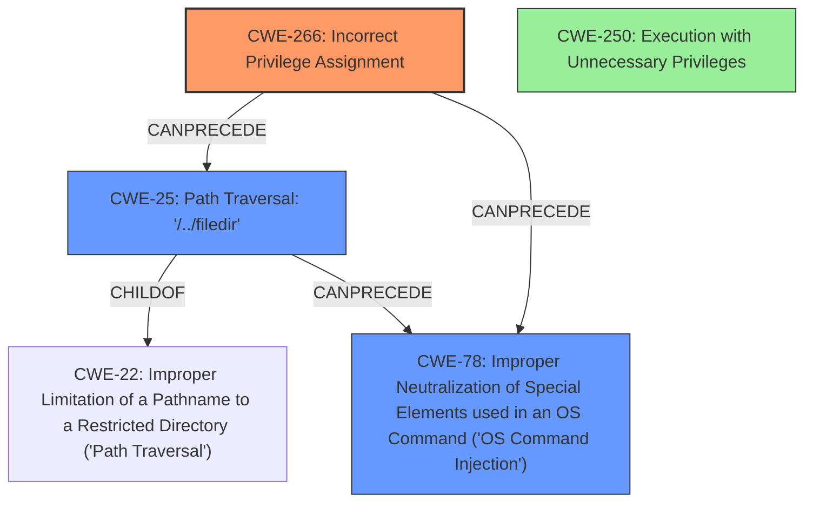

# Final Resolution for CVE-2022-20775

# Summary
| CWE ID | CWE Name | Confidence | CWE Abstraction Level | CWE Vulnerability Mapping Label | CWE-Vulnerability Mapping Notes |
|---|---|---|---|---|---|
| CWE-266 | Incorrect Privilege Assignment | 0.85 | Base | Primary | Allowed, Due to **improper access controls**, an attacker can run commands as root. This leads to privilege escalation. Mitigate by carefully managing privileges and following the principle of least privilege. |
| CWE-25 | Path Traversal: '/../filedir' | 0.70 | Variant | Secondary | Allowed, An attacker can set `USER` to `/../filedir`, bypassing the restricted shell, leading to Path Traversal and arbitrary code execution. Mitigate using stringent allowlists and input validation. |
| CWE-78 | Improper Neutralization of Special Elements used in an OS Command ('OS Command Injection') | 0.65 | Base | Secondary | Allowed, Due to **improper access controls** and **path traversal**, a malicious command can be run on the CLI as root. Mitigate by using library calls instead of external processes and sandboxing. |
| CWE-250 | Execution with Unnecessary Privileges | 0.50 | Base | Contributing Factor | Allowed, Is the vulnerable CLI component *already* running with more privileges than it needs? Follow the principle of least privilege and run the component with minimal privileges. |

## Evidence and Confidence

*   **Confidence Score:** 0.80
*   **Evidence Strength:** HIGH

## Relationship Analysis
The primary **weakness** is **CWE-266 (Incorrect Privilege Assignment)**, a Base level CWE, which accurately reflects the root cause of the vulnerability: **improper access controls** leading to privilege escalation. **CWE-25 (Path Traversal: '/../filedir')**, a more specific Variant of **CWE-22 (Improper Limitation of a Pathname to a Restricted Directory ('Path Traversal'))**, highlights the path traversal vulnerability. **CWE-78 (Improper Neutralization of Special Elements used in an OS Command ('OS Command Injection'))** is a secondary consequence, arising from the ability to execute arbitrary commands as root due to the initial **improper privilege assignment** and the subsequent **path traversal**. Finally, **CWE-250 (Execution with Unnecessary Privileges)** highlights that the CLI component may already be running with more privileges than required.

## Vulnerability Chain
The vulnerability chain starts with **CWE-266 (Incorrect Privilege Assignment)**, where **improper access controls** allow a user to gain elevated privileges. This leads to **CWE-25 (Path Traversal: '/../filedir')** where an attacker can set the `USER` environment variable to `/../filedir`, bypassing the restricted shell. This path traversal enables the execution of arbitrary commands as root, represented by **CWE-78 (Improper Neutralization of Special Elements used in an OS Command ('OS Command Injection'))**. Contributing to this chain is **CWE-250 (Execution with Unnecessary Privileges)**.

## Summary of Analysis
The initial analysis, along with the criticism, provided a solid foundation for the CWE classification. The primary **weakness**, **CWE-266 (Incorrect Privilege Assignment)**, is well-supported by the vulnerability description, which highlights **improper access controls** leading to privilege escalation. The inclusion of **CWE-25 (Path Traversal: '/../filedir')** as a secondary **weakness** is justified due to the reference to path traversal vulnerabilities and the possibility of manipulating the `USER` environment variable. The potential for arbitrary command execution as root supports the inclusion of **CWE-78 (Improper Neutralization of Special Elements used in an OS Command ('OS Command Injection'))**. Also consider **CWE-250 (Execution with Unnecessary Privileges)**.

The graph relationships helped refine the classification, particularly in identifying the chain of weaknesses from **improper privilege assignment** to **path traversal** and ultimately to **OS command injection**. The abstraction levels were carefully considered to ensure that the selected CWEs are at the optimal level of specificity, with **CWE-266** being a Base level weakness and **CWE-25** being a more specific variant.

The mapping guidance from MITRE was crucial in validating the selection of CWEs, particularly noting that **CWE-266**, **CWE-25**, and **CWE-78** are allowed.

The final classification reflects a comprehensive understanding of the vulnerability, incorporating evidence from the vulnerability description, relationship analysis, mapping guidance, and mitigation insights.