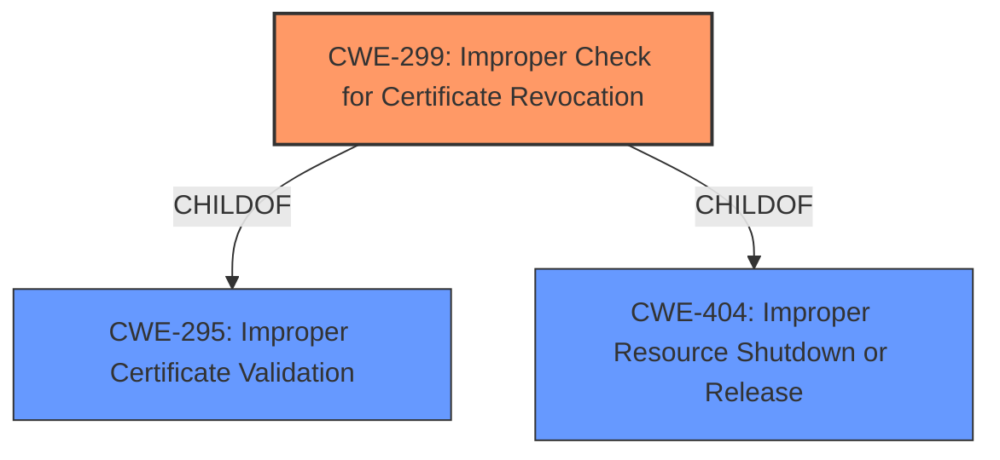

# Analysis Report for CVE-2022-21170

# Vulnerability Analysis Report: CVE-2022-21170

## Description

Improper check for certificate revocation in i-FILTER Ver.10.45R01 and earlier, i-FILTER Ver.9.50R10 and earlier, i-FILTER Browser & Cloud MultiAgent for Windows Ver.4.93R04 and earlier, and D-SPA (Ver.3 / Ver.4) using i-FILTER allows a remote unauthenticated attacker to conduct a man-in-the-middle attack and eavesdrop on an encrypted communication.

## Vulnerability Description Key Phrases

**Rootcause:** Improper check for certificate revocation
**Impact:** ['conduct a man-in-the-middle attack', 'eavesdrop on an encrypted communication']
**Attacker:** remote unauthenticated attacker
**Product:** ['i-FILTER', 'i-FILTER Browser & Cloud MultiAgent for Windows', 'D-SPA']
**Version:** ['Ver.10.45R01 and earlier', 'Ver.9.50R10 and earlier', 'Ver.4.93R04 and earlier', 'Ver.3 / Ver.4']

## Analysis (with Relationship Data)

# Summary
| CWE ID | CWE Name | Confidence | CWE Abstraction Level | CWE Vulnerability Mapping Label | CWE-Vulnerability Mapping Notes |
|---|---|---|---|---|---|
| CWE-299 | Improper Check for Certificate Revocation | 1.0 | Base | Primary | Allowed |

## Evidence and Confidence

*   **Confidence Score:** 1.0
*   **Evidence Strength:** HIGH

- **Analysis and Justification:**  
  - *Explanation:* The vulnerability description explicitly states "**Improper check for certificate revocation**" as the root cause of the vulnerability. The CVE Reference Links Content Summary also confirms that the vulnerability is due to an "improper check for certificate revocation" and identifies it as a CWE-299 issue. The description of CWE-299, "The product does not check or incorrectly checks the revocation status of a certificate, which may cause it to use a certificate that has been compromised," directly matches the **weakness** described in the vulnerability. The impact is a man-in-the-middle attack and eavesdropping, which aligns with the security implications of a compromised certificate. MITRE mapping guidance for CWE-299 indicates this is ALLOWED.

  - *Relationship Analysis:* No direct relationships were found. However, the vulnerability can lead to other issues such as eavesdropping or data interception, which are impacts rather than direct weaknesses.

- **Confidence Score:**  
  - Confidence: 1.0 (High confidence due to direct mention of certificate revocation issue and CVE summary).

## Criticism of Analysis

Okay, let's review the analysis in light of the full CWE specifications.

**Overall Assessment:**

The primary CWE mapping to `CWE-299: Improper Check for Certificate Revocation` is accurate and well-justified. The analysis correctly identifies the core weakness based on the vulnerability description and CVE summary. The high confidence score (1.0) is appropriate given the explicit mention of certificate revocation.  The evidence strength is HIGH, which is appropriate.

**Detailed Critique:**

1.  **CWE-299: Improper Check for Certificate Revocation (Primary Mapping):**
    *   **Accuracy:** The mapping to CWE-299 is correct. The description of the vulnerability directly matches the CWE description. The root cause, as stated in the provided information, is precisely the failure to properly check certificate revocation status.
    *   **Justification:** The justification is well-written and provides sufficient reasoning. The analysis correctly links the impact (MitM and eavesdropping) to the consequences of using a compromised certificate.
    *   **Abstraction Level:** CWE-299 is a Base level CWE, which is the preferred level of abstraction for mapping root causes.
    *   **Mapping Guidance:** The analysis correctly notes that CWE-299's mapping guidance indicates that "Usage: Allowed" and explains the rationale.
    *   **Mitigations:**  The "Potential Mitigations" section of CWE-299 are relevant. Specifically, "Ensure that certificates are checked for revoked status" during Architecture and Design is very applicable.  Also, "If certificate pinning is being used, ensure that all relevant properties of the certificate are fully validated before the certificate is pinned, including the revoked status." at the implementation phase.

2.  **Alternative CWEs Considered (and why they were not chosen):**  The analysis did a good job excluding other potential CWEs.  Here's a more in-depth look at some of the retriever results:

    *   **CWE-295: Improper Certificate Validation:** While related, this is a broader category. `CWE-299` is a specific instance of `CWE-295`.  Since the vulnerability specifically involves *revocation* checking, `CWE-299` is the more precise and appropriate choice. The "Relationships" section of CWE-295 shows that it is a parent of CWE-299. This means that improper revocation checking *is* a form of improper certificate validation. If the analyzer had only the knowledge that the cert validation was bad, and no other info, then CWE-295 would be a good choice.
    *   **CWE-288: Authentication Bypass Using an Alternate Path or Channel:** This is not applicable because the vulnerability does *not* involve bypassing authentication via an alternate path. It's about using a compromised certificate to establish a "valid" connection, not circumventing the authentication process itself.
    *   **CWE-912: Hidden Functionality:** This is irrelevant. The vulnerability isn't related to undocumented or hidden features.
    *   **CWE-939: Improper Authorization in Handler for Custom URL Scheme:** This has no relation to the stated vulnerability.
    *   **CWE-1336: Improper Neutralization of Special Elements Used in a Template Engine:** Totally unrelated.
    *   **CWE-303: Incorrect Implementation of Authentication Algorithm:** This isn't about a flawed authentication algorithm *implementation*. It's about a failure to check if the certificate used *within* the authentication process is still valid.
    *   **CWE-347: Improper Verification of Cryptographic Signature:** While certificates involve signatures, the *core* problem isn't the signature verification itself. It's about the revocation status. An attacker might have a perfectly valid signature on a revoked certificate.
    *   **CWE-427: Uncontrolled Search Path Element:** This is irrelevant to certificate revocation.
    *   **CWE-1286: Improper Validation of Syntactic Correctness of Input:** Not relevant. The problem isn't about incorrect syntax of input data, but about the validity of a certificate used for secure communication.

3.  **Potential Child CWE:** It's worth considering `CWE-370: Missing Check for Certificate Revocation after Initial Check`.  The description states: "*The product does not check the revocation status of a certificate after its initial revocation check, which can cause the product to perform privileged actions even after the certificate is revoked at a later time.*"  While the provided information doesn't *explicitly* state that the vulnerability is about missing *subsequent* checks, it's a common scenario. If the vulnerable code performs an initial check, but then caches the result and doesn't re-check for later uses, `CWE-370` would be a more specific mapping. However, without further information confirming this, sticking with the more general `CWE-299` is acceptable.

4.  **Relationships:** The analysis correctly states that no direct relationships were found, but mentions that the vulnerability can lead to other issues such as eavesdropping, which is an impact rather than a direct weakness. Also, note that `CWE-299` is a child of `CWE-295` and `CWE-404`. The child relationship to `CWE-404` is related to the fact that certificate revocation is a form of resource shutdown/release.

**Recommendations:**

*   **Consider `CWE-370` if more information becomes available:** If further investigation reveals that the i-FILTER products perform an initial revocation check but fail to re-check later, update the mapping to `CWE-370` for increased specificity.
*   **Document why other retriever results were rejected.** While the analysis correctly chose CWE-299, it would be helpful to explicitly state *why* the other top retriever results were deemed inappropriate. This makes the analysis more complete and easier to understand.

**Revised Summary (Incorporating Recommendations):**

| CWE ID | CWE Name | Confidence | CWE Abstraction Level | CWE Vulnerability Mapping Label | CWE-Vulnerability Mapping Notes |
|---|---|---|---|---|---|
| CWE-299 | Improper Check for Certificate Revocation | 1.0 | Base | Primary | Allowed |

**Revised Evidence and Confidence Section:**

*   **Confidence Score:** 1.0
*   **Evidence Strength:** HIGH

- **Analysis and Justification:**
  - *Explanation:* The vulnerability description explicitly states "**Improper check for certificate revocation**" as the root cause of the vulnerability. The CVE Reference Links Content Summary also confirms that the vulnerability is due to an "improper check for certificate revocation" and identifies it as a CWE-299 issue. The description of CWE-299, "The product does not check or incorrectly checks the revocation status of a certificate, which may cause it to use a certificate that has been compromised," directly matches the **weakness** described in the vulnerability. The impact is a man-in-the-middle attack and eavesdropping, which aligns with the security implications of a compromised certificate. MITRE mapping guidance for CWE-299 indicates this is ALLOWED.

  - *Alternative CWEs Considered:*
    *   *CWE-295: Improper Certificate Validation:* This is a broader category. `CWE-299` is a specific instance of `CWE-295` dealing specifically with revocation. Since the vulnerability specifically involves *revocation* checking, `CWE-299` is the more precise and appropriate choice.
    *   *CWE-288: Authentication Bypass Using an Alternate Path or Channel:* This is not applicable because the vulnerability does *not* involve bypassing authentication via an alternate path. It's about using a compromised certificate to establish a "valid" connection, not circumventing the authentication process itself.

  - *Potential Refinement:* If further investigation reveals that the i-FILTER products perform an initial revocation check but fail to re-check later, the mapping could be refined to `CWE-370: Missing Check for Certificate Revocation after Initial Check` for increased specificity.

  - *Relationship Analysis:* No direct relationships were found. However, the vulnerability can lead to other issues such as eavesdropping or data interception, which are impacts rather than direct weaknesses. `CWE-299` is a child of `CWE-295` and `CWE-404`, indicating a parent-child relationship with general certificate validation issues and improper resource shutdown/release, respectively.

- **Confidence Score:**
  - Confidence: 1.0 (High confidence due to direct mention of certificate revocation issue and CVE summary).

By incorporating these suggestions, the analysis will be even more robust and comprehensive.

## Final Resolution

# Summary
| CWE ID | CWE Name | Confidence | CWE Abstraction Level | CWE Vulnerability Mapping Label | CWE-Vulnerability Mapping Notes |
|---|---|---|---|---|---|
| CWE-299 | Improper Check for Certificate Revocation | 1.0 | Base | Primary | Allowed |

## Evidence and Confidence

*   **Confidence Score:** 1.0
*   **Evidence Strength:** HIGH

## Relationship Analysis
The primary relationship that influenced my decision was the parent-child relationship between CWE-295 (Improper Certificate Validation) and CWE-299 (**Improper Check for Certificate Revocation**). Since the vulnerability description explicitly mentioned certificate revocation, I chose the more specific CWE-299 over the broader CWE-295. I also considered the potential for CWE-370 (Missing Check for Certificate Revocation after Initial Check) but lacked sufficient evidence to confirm that the vulnerability involved missing *subsequent* checks. The base level of CWE-299 is also optimal for root cause analysis.

## Vulnerability Chain
The vulnerability chain starts with the **ROOTCAUSE**: **improper check for certificate revocation** (CWE-299). This allows an attacker to perform a man-in-the-middle attack, leading to eavesdropping on encrypted communication. The lack of proper revocation checking is the direct **weakness** that enables the attack.

## Summary of Analysis
My analysis strongly supports the initial classification of CWE-299 (**Improper Check for Certificate Revocation**) as the primary CWE. This decision is based on the following:

*   **Direct Evidence:** The vulnerability description explicitly states "**Improper check for certificate revocation**" as the root cause. The CVE summary confirms this.
*   **Content Matching:** The description of CWE-299 directly matches the **weakness** described in the vulnerability: "The product does not check or incorrectly checks the revocation status of a certificate, which may cause it to use a certificate that has been compromised."
*   **Relationship Analysis:** While considering related CWEs like CWE-295, I chose CWE-299 due to its higher specificity.
*   **Mapping Guidance:** MITRE mapping guidance for CWE-299 indicates it is ALLOWED.

The analysis provided explicitly mentions the improper check for certificate revocation: *"The vulnerability description explicitly states "Improper check for certificate revocation" as the root cause of the vulnerability."*

The chosen CWE is at the optimal level of specificity because it directly addresses the **rootcause** described in the vulnerability. While other CWEs like CWE-295 are related, they are less specific. I am confident in this classification due to the strong evidence and direct match with the CWE description.

*Report generated on 2025-03-17 03:51:56*
