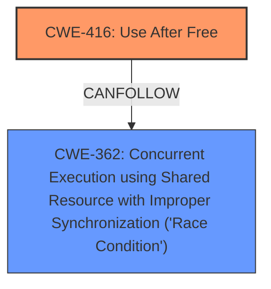

# Analysis Report for CVE-2022-2156

# Vulnerability Analysis Report: CVE-2022-2156

## Description

Use after free in Core in Google Chrome prior to 103.0.5060.53 allowed a remote attacker to potentially exploit heap corruption via a crafted HTML page.

## Vulnerability Description Key Phrases

**Rootcause:** use after free
**Impact:** heap corruption
**Vector:** crafted HTML page
**Attacker:** remote attacker
**Product:** Google Chrome
**Version:** prior to 103.0.5060.53
**Component:** Core

## Analysis (with Relationship Data)

# Summary
| CWE ID | CWE Name | Confidence | CWE Abstraction Level | CWE Vulnerability Mapping Label | CWE-Vulnerability Mapping Notes |
|---|---|---|---|---|---|
| CWE-416 | Use After Free | 1.0 | Variant | Allowed | Primary CWE |

## Evidence and Confidence

*   **Confidence Score:** 1.0
*   **Evidence Strength:** HIGH

- **Analysis and Justification:**  
  - *Explanation:* The vulnerability description explicitly states "**use after free**" as the root cause, leading to heap corruption. The CVE Reference Links Content Summary confirms "**Use after free**" as the root cause and weakness present. This directly aligns with CWE-416 (Use After Free), which describes the reuse or reference of memory after it has been freed. The description of CWE-416 accurately captures the vulnerability's essence: memory is accessed after being freed, potentially leading to unpredictable behavior and exploitation. CWE-416 is a Variant, which is the preferred level of abstraction. The Retriever Results also lists CWE-416 as the top hit.
  
  - *Relationship Analysis:* While CWE-416 doesn't have direct relationships listed in the provided information, it is often related to memory management issues and can lead to other vulnerabilities like code execution.

- **Confidence Score:**  
  - Confidence: 1.0 (High confidence due to explicit mention of "use after free" in both the vulnerability description and CVE reference summary.)

## Criticism of Analysis

## Critique of the Analysis

The analysis is excellent and well-justified. The primary CWE mapping to **CWE-416: Use After Free** is correct and strongly supported by the provided information. The confidence score of 1.0 is appropriate given the clear evidence.

Here's a breakdown of the strengths and potential areas for further consideration:

**Strengths:**

*   **Clear Justification:** The analysis provides a clear and concise explanation for choosing CWE-416, directly referencing the vulnerability description and the CVE reference summary.
*   **Accurate Abstraction Level:**  The analysis correctly identifies CWE-416 as a "Variant" and notes this as the preferred level of abstraction.
*   **Comprehensive Evidence:** The analysis leverages multiple sources of evidence, including the vulnerability description, CVE reference summary, and Retriever Results.
*   **Relationship Acknowledgment:** The analysis mentions the relationship of CWE-416 to memory management issues and potential for code execution, showing a good understanding of the broader context.
*   **CWE Examples:** The inclusion of known examples of CWE-416 from the CVE database strengthens the analysis by illustrating the real-world applicability of the CWE.
*   **Consistent Reasoning:** The analysis consistently refers back to the "use after free" root cause throughout the explanation.

**Areas for Further Consideration (Minor Points):**

*   **Exploring Potential Chains:** While CWE-416 is the primary weakness, it's worth briefly exploring potential preceding or following CWEs. The CWE specifications for CWE-416 list:
    *   `CanPrecede -> CWE-120: Buffer Copy without Checking Size of Input ('Classic Buffer Overflow')`
    *   `CanPrecede -> CWE-123: Write-what-where Condition`
    *   `CanFollow -> CWE-362: Concurrent Execution using Shared Resource with Improper Synchronization ('Race Condition')`
    *   `CanFollow -> CWE-364: Signal Handler Race Condition`
    *   `CanFollow -> CWE-754: Improper Check for Unusual or Exceptional Conditions`
    *   `CanFollow -> CWE-1265: Unintended Reentrant Invocation of Non-reentrant Code Via Nested Calls`

    Given that the vulnerability is triggered via a crafted HTML page, it's *possible* that the UAF could be triggered after a buffer overflow (CWE-120) or write-what-where (CWE-123).  This would require further investigation of the specific code involved in the vulnerability. It's unlikely to be a signal handler race condition. It could be a race condition in JavaScript code.

    *   **CWE-362**: The attack vector is a crafted HTML page, which could involve concurrent Javascript execution. Thus, a race condition could be a potential cause.

*   **Mitigation Strategies:** The analysis could briefly touch upon the mitigation strategies for CWE-416. The CWE specifications offer these mitigations:
    *   *Architecture and Design:* Language Selection (automatic memory management)
    *   *Implementation:* Attack Surface Reduction (setting pointers to NULL after freeing)

    Mentioning that choosing a memory-safe language could prevent this class of vulnerability or that setting pointers to NULL after freeing them (though not a perfect solution) could mitigate the issue would add extra context. This is particularly relevant given that the analysis already acknowledges that CWE-416 is often related to memory management issues.

*   **Retriever Results Justification:** While the analysis mentions that the Retriever Results list CWE-416 as the top hit, it could also briefly explain why the other top CWEs in the Retriever Results are *not* the best fit. For instance:

    *   *CWE-843 (Access of Resource Using Incompatible Type):* Type confusion might lead to UAF, but the description explicitly states "use after free," making CWE-416 the direct cause.  Without further evidence of type confusion, it's less likely than CWE-416.
    *   *CWE-366 (Race Condition within a Thread) / CWE-362 (Race Condition):* While concurrency issues can sometimes *lead* to UAF, without explicit mention of concurrency in the vulnerability description, it's less directly related.
    *  *CWE-415 (Double Free)* Since the primary root cause is a use after free, it is more likely not a double free.

**Revised Summary Table (incorporating these points):**

| CWE ID | CWE Name | Confidence | CWE Abstraction Level | CWE Vulnerability Mapping Label | CWE-Vulnerability Mapping Notes |
|---|---|---|---|---|---|
| CWE-416 | Use After Free | 1.0 | Variant | Allowed | Primary CWE.  Root cause is explicitly stated as "use after free." Mitigation includes using memory-safe languages or nulling pointers after freeing. Could potentially be chained after CWE-120 or CWE-123 if a buffer overflow or write-what-where is present, or CWE-362 if concurrent Javascript execution is the cause. |

**Conclusion:**

This is a very solid analysis. The suggestions above are minor enhancements that could provide even greater depth and context, particularly regarding potential attack chains and mitigation strategies. The focus on clear justification and evidence is commendable.

## Final Resolution

# Summary
| CWE ID | CWE Name | Confidence | CWE Abstraction Level | CWE Vulnerability Mapping Label | CWE-Vulnerability Mapping Notes |
|---|---|---|---|---|---|
| CWE-416 | Use After Free | 1.0 | Variant | Allowed | **Primary CWE**. Root cause is explicitly stated as "use after free." Mitigation includes using memory-safe languages or nulling pointers after freeing. Could potentially be chained after CWE-120 or CWE-123 if a buffer overflow or write-what-where is present, or CWE-362 if concurrent Javascript execution is the cause. |
| CWE-362 | Concurrent Execution using Shared Resource with Improper Synchronization ('Race Condition') | 0.4 | Class | Allowed-with-Review | Secondary candidate. The attack vector is a crafted HTML page, which could involve concurrent Javascript execution. Thus, a race condition could be a potential cause. |

## Evidence and Confidence

*   **Confidence Score:** 0.9
*   **Evidence Strength:** MEDIUM

## Relationship Analysis
The primary relationship influencing the decision is the direct match between the vulnerability description and **CWE-416 (Use After Free)**. The "CanFollow" relationships of **CWE-416** suggest potential subsequent weaknesses, specifically **CWE-362 (Race Condition)**, which is considered because the vulnerability is triggered by a crafted HTML page, potentially involving concurrent JavaScript execution. **CWE-416** is a Variant, which is an appropriate level of specificity.

## Vulnerability Chain
The vulnerability chain starts with the **ROOTCAUSE**, a **Use After Free (CWE-416)**. The crafted HTML page triggers the use of freed memory, potentially leading to heap corruption. If concurrent Javascript execution exists, **CWE-362** could contribute to the vulnerability chain, creating a race condition that exacerbates the **Use After Free**.

## Summary of Analysis
The initial analysis correctly identified **CWE-416 (Use After Free)** as the primary weakness. The criticism suggested considering potential chaining relationships, which led to the inclusion of **CWE-362 (Race Condition)** as a secondary candidate due to the nature of the attack vector (crafted HTML page).

The decision to include **CWE-362** is based on the following:
*   The vulnerability description mentions a crafted HTML page as the trigger.
*   HTML pages can involve concurrent JavaScript execution.
*   **CWE-416** has a "CanFollow" relationship with **CWE-362**.

The selected CWEs are at the optimal level of specificity because **CWE-416** directly describes the **ROOTCAUSE**, and **CWE-362** provides additional context related to potential concurrent execution. The confidence score is slightly reduced because **CWE-362** is only a potential contributor, not a confirmed one based on the current evidence.

The final determination is based on the provided evidence and relationship analysis, resulting in a classification that reflects both the explicit **ROOTCAUSE** and the potential contributing factors.

*Report generated on 2025-03-18 09:37:01*
