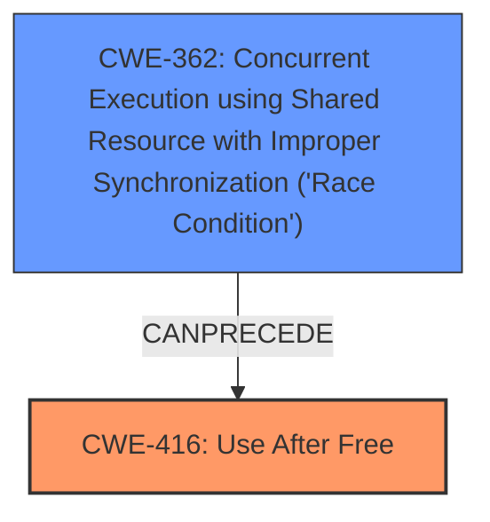

# Final Resolution for CVE-2022-2157

# Summary
| CWE ID | CWE Name | Confidence | CWE Abstraction Level | CWE Vulnerability Mapping Label | CWE-Vulnerability Mapping Notes |
|---|---|---|---|---|---|
| CWE-416 | Use After Free | 1.0 | Variant | Allowed | Primary CWE |
| CWE-362 | Concurrent Execution using Shared Resource with Improper Synchronization ('Race Condition') | 0.6 | Class | Allowed-with-Review | Secondary Candidate |

## Evidence and Confidence

*   **Confidence Score:** 0.9
*   **Evidence Strength:** MEDIUM

## Relationship Analysis
The primary CWE, **CWE-416 (Use After Free)**, stands alone as a root cause, but the criticism brings up the possibility of a race condition contributing to the vulnerability. While there's no explicit mention of a race condition in the description, the concurrent nature of "Interest groups" and the potential for heap corruption suggest a possible race. **CWE-362 (Race Condition)** can precede **CWE-416**, indicating a potential chain. I am including **CWE-362** as a secondary candidate with a lower confidence score.

## Vulnerability Chain
The vulnerability chain starts with a potential **CWE-362 (Race Condition)**, where concurrent access to shared resources is not properly synchronized. This leads to **CWE-416 (Use After Free)**, where memory is accessed after it has been freed. The consequence is potential heap corruption, allowing a remote attacker to exploit the system.

## Summary of Analysis
The initial analysis correctly identified **CWE-416 (Use After Free)** as the primary **WEAKNESS**, based on the explicit mention of "use after free" in the vulnerability description. The criticism suggested considering other CWEs, particularly those related to race conditions. While the provided evidence doesn't explicitly state a race condition, the nature of the affected component ("Interest groups") and the potential for heap corruption warrant considering **CWE-362 (Race Condition)** as a contributing factor.

The final decision is to include **CWE-362** as a secondary CWE with a lower confidence score (0.6). This acknowledges the potential role of a race condition in triggering the **USE AFTER FREE**, while still prioritizing **CWE-416** as the primary **ROOTCAUSE**. The selection of **CWE-416** is justified by direct evidence from the vulnerability description, while the inclusion of **CWE-362** is based on contextual reasoning and relationship analysis.

The selected CWEs are at the optimal level of specificity, with **CWE-416** being a Variant and **CWE-362** being a Class. While more specific variants of race conditions exist, **CWE-362** provides a suitable balance between generality and specificity given the available evidence.