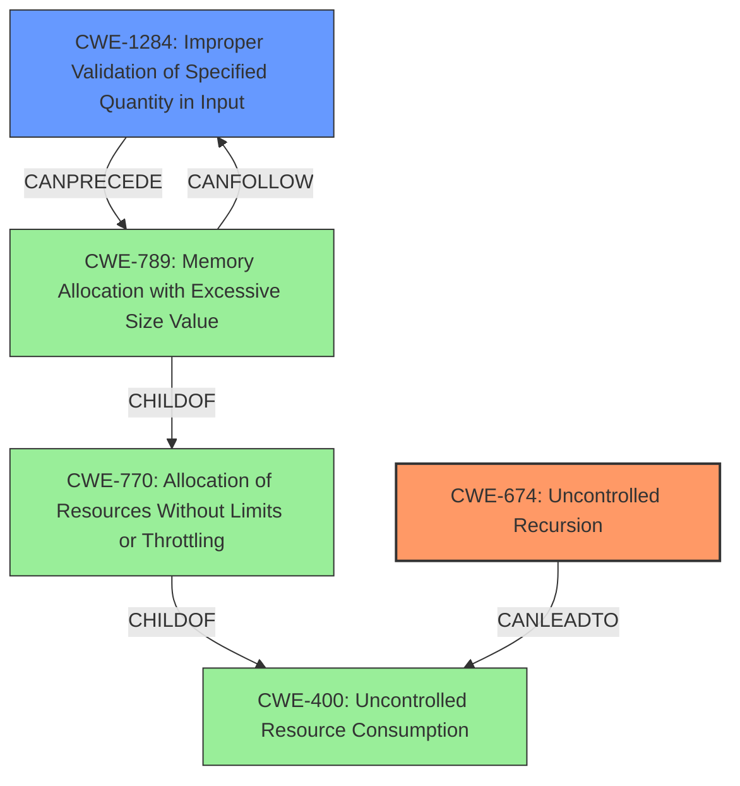

# Analysis Report for CVE-2022-21708

# Vulnerability Analysis Report: CVE-2022-21708

## Description

graphql-go is a GraphQL server with a focus on ease of use. In versions prior to 1.3.0 there exists a DoS vulnerability that is possible due to a bug in the library that would allow an attacker with specifically designed queries to cause stack overflow panics. Any user with access to the GraphQL handler can send these queries and cause stack overflows. This in turn could potentially compromise the ability of the server to serve data to its users. The issue has been patched in version `v1.3.0`. The only known workaround for this issue is to disable the `graphql.MaxDepth` option from your schema which is not recommended.

## Vulnerability Description Key Phrases

**Rootcause:** bug in the library
**Weakness:** stack overflow
**Impact:** denial of service
**Vector:** specifically designed queries
**Attacker:** attacker
**Product:** graphql-go
**Version:** prior to 1.3.0

## Analysis (with Relationship Data)

# Summary
| CWE ID | CWE Name | Confidence | CWE Abstraction Level | CWE Vulnerability Mapping Label | CWE-Vulnerability Mapping Notes |
|---|---|---|---|---|---|
| CWE-674 | Uncontrolled Recursion | 0.9 | Class | Primary | Allowed-with-Review |
| CWE-770 | Allocation of Resources Without Limits or Throttling | 0.7 | Base | Secondary Candidate | Allowed |
| CWE-789 | Memory Allocation with Excessive Size Value | 0.6 | Variant | Secondary Candidate | Allowed |

## Evidence and Confidence

*   **Confidence Score:** 0.9
*   **Evidence Strength:** HIGH

- **Analysis and Justification:**  
  - *Explanation:* The vulnerability description clearly states that a **stack overflow** occurs due to a **bug in the library**. The vulnerability allows an attacker to cause **stack overflow** panics by sending specifically designed queries, which directly aligns with CWE-674 (Uncontrolled Recursion). The CVE Reference Links Content Summary confirms that the root cause is due to the incorrect depth calculation of the MaxDepth option, which allows crafted queries to bypass the intended depth check leading to excessive recursion. CWE-674 is a Class-level CWE, however, given the direct description of uncontrolled recursion leading to a stack overflow, it is a reasonable match despite the guidance suggesting to look for a Base-level CWE.
  - *Relationship Analysis:* CWE-674 is a Class-level CWE. There are no direct relationships listed, but uncontrolled recursion can lead to resource exhaustion.

- **Analysis and Justification:**  
  - *Explanation:* CWE-770 (Allocation of Resources Without Limits or Throttling) is considered as a secondary candidate because the **stack overflow** is a consequence of uncontrolled resource allocation, specifically stack space. The vulnerability description notes the attacker can cause **stack overflow** panics. The Retriever Results show that CWE-770 is a Base level, which is a preferred level of abstraction. The relationship between uncontrolled recursion and resource exhaustion makes CWE-770 a plausible secondary mapping.
  - *Relationship Analysis:* There are no direct relationships listed for CWE-770 in the provided information.

- **Analysis and Justification:**  
  - *Explanation:* CWE-789 (Memory Allocation with Excessive Size Value) is considered as a secondary candidate because the stack overflow can be thought of as excessive memory allocation on the stack. The vulnerability description refers to specifically designed queries causing **stack overflow**s.
  - *Relationship Analysis:* CWE-789 is a variant of improper resource management.

- **Confidence Score:**
  - Confidence: 0.9 (High confidence based on the description of stack overflow due to uncontrolled recursion.)

## Criticism of Analysis

Okay, I've reviewed your CWE analysis with the full CWE specifications. Here's my critique:

**Overall Assessment:**

The analysis is well-structured and provides a clear justification for the CWE mappings. The confidence scores are reasonable. The inclusion of the CWE specifications helps to understand the nuances and context of each CWE. However, there are a few points where the mapping could be more precise, and the selection of secondary candidates can be improved by using a different approach.

**Detailed Review:**

1.  **CWE-674: Uncontrolled Recursion (Primary)**

    *   **Confidence:** 0.9
    *   **Assessment:** This is a **strong and accurate primary mapping.** The vulnerability description explicitly mentions "stack overflow panics" caused by specifically designed queries, and the CVE summary confirms this is due to incorrect handling of fragment spreads and a lack of cycle detection leading to excessive recursion.
    *   **Justification Strength:** The justification is well-written and clearly links the vulnerability description to the CWE definition. The mention of the CVE summary reinforcing the recursion root cause is particularly helpful.
    *   **Mapping Guidance Adherence:** You correctly acknowledge that CWE-674 is a Class-level CWE and mention the guidance to look for a Base-level CWE. Your reasoning for sticking with CWE-674 despite this guidance is understandable and acceptable *in this specific case*, given the explicit description of uncontrolled recursion. However, be aware that this situation is somewhat of an exception to the rule.

2.  **CWE-770: Allocation of Resources Without Limits or Throttling (Secondary Candidate)**

    *   **Confidence:** 0.7
    *   **Assessment:** This is a **reasonable, but not optimal, secondary candidate.** While a stack overflow *is* a form of resource exhaustion, CWE-770 is a more general weakness.
    *   **Justification Strength:** The justification is adequate but could be improved. It correctly identifies that the stack overflow is a consequence of uncontrolled resource allocation, but it doesn't highlight a specific *failure to limit* that allocation in the code itself.  The problem isn't *just* the lack of a limit; it's the incorrect *calculation* of depth that leads to unbounded recursion, therefore bypass of existing checks.
    *   **Relationship Analysis:** A better way to consider secondary candidates is what was the failure to properly limit the resources. If the library was checking depth, but doing it incorrectly, that could be considered a type of *Improper Input Validation*.
    *   **Mapping Guidance Adherence:** CWE-770 is a Base-level CWE, as required. However, this is a good example where simply being the right level isn't enough. The CWE needs to accurately represent the *root cause*.

3.  **CWE-789: Memory Allocation with Excessive Size Value (Secondary Candidate)**

    *   **Confidence:** 0.6
    *   **Assessment:** This is a **weaker secondary candidate** than CWE-770. While a stack overflow *does* involve excessive memory allocation, that's more of a *symptom* of the uncontrolled recursion than the *cause* of it.  The fundamental problem is the recursive function calls, not an explicit allocation request for an excessively large block of memory (though that is the resulting impact).
    *   **Justification Strength:** The justification is the weakest of the three. It relies on the idea that a stack overflow *can be thought of* as excessive memory allocation.
    *   **Mapping Guidance Adherence:** CWE-789 is a variant level CWE, which is permitted. However, a secondary mapping should be closely related to the primary mapping.
    *   **Alternative Mapping** A better alternative mapping candidate would be `CWE-1284: Improper Validation of Specified Quantity in Input`. The `MaxDepth` schema option is effectively a specified quantity. By improperly validating the depth of the query, the server allowed the recursion to proceed unchecked.

**Recommendations for Improvement:**

*   **Re-evaluate secondary candidates:** Instead of focusing on the *impact* of the vulnerability (stack overflow, memory exhaustion), focus on the *root cause* of the vulnerability as it pertains to the *type of programming error*. In this case, the root cause was an error in the implementation of the `MaxDepth` validation logic.

*   **Prioritize CWE-1284 as a Secondary Candidate:** Given the root cause, `CWE-1284: Improper Validation of Specified Quantity in Input` is a *stronger* secondary candidate than either CWE-770 or CWE-789. The `MaxDepth` limit is a quantity, and the vulnerability stems from the failure to properly validate that quantity during fragment spread processing.

*   **Refine Justifications:** Make sure the justifications for secondary candidates are extremely specific about *how* the CWE applies to the vulnerability. Don't just say "it can be thought of as..." Clearly link the weakness to the specific code behavior that is causing the problem.

**Revised Analysis (suggested):**

# Revised Analysis
# Summary
| CWE ID | CWE Name | Confidence | CWE Abstraction Level | CWE Vulnerability Mapping Label | CWE-Vulnerability Mapping Notes |
|---|---|---|---|---|---|
| CWE-674 | Uncontrolled Recursion | 0.9 | Class | Primary | Allowed-with-Review |
| CWE-1284 | Improper Validation of Specified Quantity in Input | 0.7 | Base | Secondary Candidate | Allowed |

## Evidence and Confidence

*   **Confidence Score:** 0.9
*   **Evidence Strength:** HIGH

- **Analysis and Justification:**  
  - *Explanation:* The vulnerability description clearly states that a **stack overflow** occurs due to a **bug in the library**. The vulnerability allows an attacker to cause **stack overflow** panics by sending specifically designed queries, which directly aligns with CWE-674 (Uncontrolled Recursion). The CVE Reference Links Content Summary confirms that the root cause is due to the incorrect depth calculation of the MaxDepth option, which allows crafted queries to bypass the intended depth check leading to excessive recursion. CWE-674 is a Class-level CWE, however, given the direct description of uncontrolled recursion leading to a stack overflow, it is a reasonable match despite the guidance suggesting to look for a Base-level CWE.
  - *Relationship Analysis:* CWE-674 is a Class-level CWE. There are no direct relationships listed, but uncontrolled recursion can lead to resource exhaustion.

- **Analysis and Justification:**  
  - *Explanation:* CWE-1284 (Improper Validation of Specified Quantity in Input) is considered as a secondary candidate because the `MaxDepth` option is a specified quantity, and the vulnerability is caused by the failure to properly validate the depth of the query as it traverses fragment spreads. The incorrect depth calculation allows crafted queries to bypass the intended check, leading to uncontrolled recursion. This represents a failure in the input validation process specifically related to the quantity defined by `MaxDepth`.
  - *Relationship Analysis:* There are no direct relationships listed for CWE-1284 in the provided information.

- **Confidence Score:**
  - Confidence: 0.9 (High confidence based on the description of stack overflow due to uncontrolled recursion.)
  - Confidence: 0.7 (Moderate confidence that CWE-1284, Improper Validation of Specified Quantity in Input, is a related weakness)

By focusing on the specific programming error that allowed the stack overflow to occur, and choosing the *most* relevant CWE to describe that error, the analysis becomes more precise and actionable.

Using the full CWE specifications is an excellent practice, and you have done a great job with this analysis.

## Final Resolution

# Summary
| CWE ID | CWE Name | Confidence | CWE Abstraction Level | CWE Vulnerability Mapping Label | CWE-Vulnerability Mapping Notes |
|---|---|---|---|---|---|
| CWE-674 | Uncontrolled Recursion | 0.9 | Class | Primary | Allowed-with-Review |
| CWE-1284 | Improper Validation of Specified Quantity in Input | 0.7 | Base | Secondary Candidate | Allowed |

## Evidence and Confidence

*   **Confidence Score:** 0.9
*   **Evidence Strength:** HIGH

## Relationship Analysis
The decision was influenced by the parent-child relationship and chain relationships between CWEs.
- CWE-674 (Uncontrolled Recursion) is a Class-level CWE, which is higher level.
- CWE-1284 (Improper Validation of Specified Quantity in Input) is a Base-level CWE and can lead to CWE-789 (Memory Allocation with Excessive Size Value).

## Vulnerability Chain
The vulnerability chain starts with the improper validation of the `MaxDepth` input (CWE-1284), leading to uncontrolled recursion (CWE-674), which results in a stack overflow (resource exhaustion).
  - **Root Cause:** CWE-1284 (Improper Validation of Specified Quantity in Input)
  - **Weakness:** CWE-674 (Uncontrolled Recursion)
  - **Impact:** Stack overflow (resource exhaustion).

## Summary of Analysis
I agree with the criticism and the recommendation to use CWE-1284 as a secondary mapping.

The original analysis correctly identified CWE-674 as the primary **WEAKNESS**, given the explicit mention of "stack overflow panics" caused by uncontrolled recursion. The evidence from the vulnerability description directly supports this classification: "the library that would allow an attacker with specifically designed queries to cause stack overflow panics."

However, the criticism correctly points out that the root cause is the improper validation of the `MaxDepth` input. The `MaxDepth` schema option represents a specified quantity, and the vulnerability arises from the failure to properly validate the depth of the query during fragment spread processing. This aligns perfectly with CWE-1284 (Improper Validation of Specified Quantity in Input).

The selection of CWE-1284 as a secondary candidate is based on its ability to represent the **ROOTCAUSE** of the **WEAKNESS**. While CWE-770 and CWE-789 describe the impact (resource exhaustion), they do not capture the specific programming error that allowed the stack overflow to occur.

CWE-1284 is at the optimal level of specificity (Base) as it directly addresses the input validation failure. The relationship analysis shows that CWE-1284 can lead to CWE-789 (Memory Allocation with Excessive Size Value), which is a consequence of the uncontrolled recursion.

*Report generated on 2025-03-18 09:40:35*
