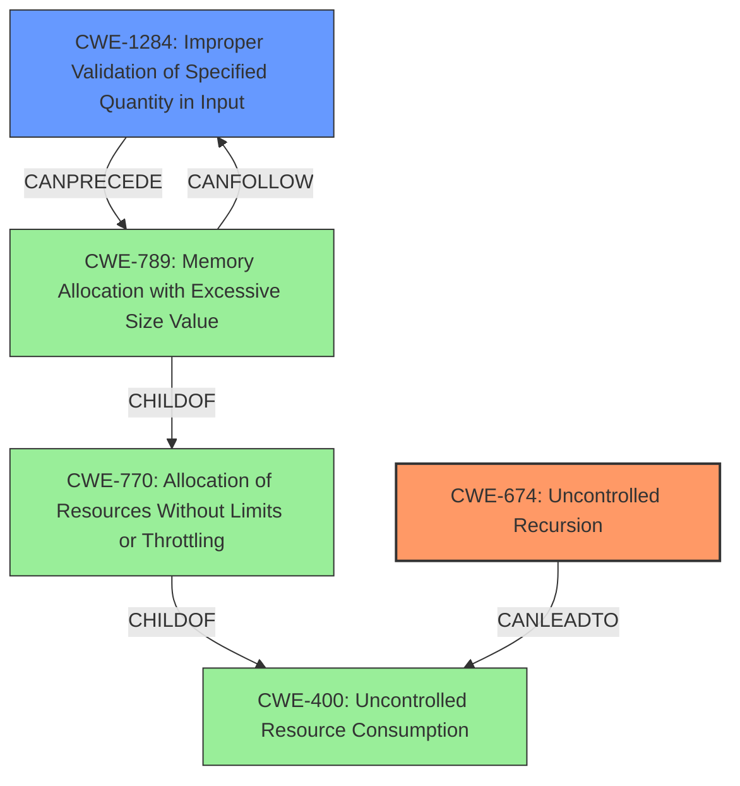

# Final Resolution for CVE-2022-21708

# Summary
| CWE ID | CWE Name | Confidence | CWE Abstraction Level | CWE Vulnerability Mapping Label | CWE-Vulnerability Mapping Notes |
|---|---|---|---|---|---|
| CWE-674 | Uncontrolled Recursion | 0.9 | Class | Primary | Allowed-with-Review |
| CWE-1284 | Improper Validation of Specified Quantity in Input | 0.7 | Base | Secondary Candidate | Allowed |

## Evidence and Confidence

*   **Confidence Score:** 0.9
*   **Evidence Strength:** HIGH

## Relationship Analysis
The decision was influenced by the parent-child relationship and chain relationships between CWEs.
- CWE-674 (Uncontrolled Recursion) is a Class-level CWE, which is higher level.
- CWE-1284 (Improper Validation of Specified Quantity in Input) is a Base-level CWE and can lead to CWE-789 (Memory Allocation with Excessive Size Value).

## Vulnerability Chain
The vulnerability chain starts with the improper validation of the `MaxDepth` input (CWE-1284), leading to uncontrolled recursion (CWE-674), which results in a stack overflow (resource exhaustion).
  - **Root Cause:** CWE-1284 (Improper Validation of Specified Quantity in Input)
  - **Weakness:** CWE-674 (Uncontrolled Recursion)
  - **Impact:** Stack overflow (resource exhaustion).

## Summary of Analysis
I agree with the criticism and the recommendation to use CWE-1284 as a secondary mapping.

The original analysis correctly identified CWE-674 as the primary **WEAKNESS**, given the explicit mention of "stack overflow panics" caused by uncontrolled recursion. The evidence from the vulnerability description directly supports this classification: "the library that would allow an attacker with specifically designed queries to cause stack overflow panics."

However, the criticism correctly points out that the root cause is the improper validation of the `MaxDepth` input. The `MaxDepth` schema option represents a specified quantity, and the vulnerability arises from the failure to properly validate the depth of the query during fragment spread processing. This aligns perfectly with CWE-1284 (Improper Validation of Specified Quantity in Input).

The selection of CWE-1284 as a secondary candidate is based on its ability to represent the **ROOTCAUSE** of the **WEAKNESS**. While CWE-770 and CWE-789 describe the impact (resource exhaustion), they do not capture the specific programming error that allowed the stack overflow to occur.

CWE-1284 is at the optimal level of specificity (Base) as it directly addresses the input validation failure. The relationship analysis shows that CWE-1284 can lead to CWE-789 (Memory Allocation with Excessive Size Value), which is a consequence of the uncontrolled recursion.