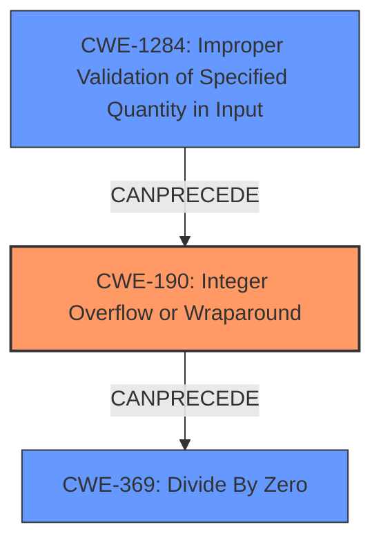

# Analysis Report for CVE-2022-21729

# Vulnerability Analysis Report: CVE-2022-21729

## Description

Tensorflow is an Open Source Machine Learning Framework. The implementation of `UnravelIndex` is vulnerable to a division by zero caused by an integer overflow bug. The fix will be included in TensorFlow 2.8.0. We will also cherrypick this commit on TensorFlow 2.7.1, TensorFlow 2.6.3, and TensorFlow 2.5.3, as these are also affected and still in supported range.

## Vulnerability Description Key Phrases

**Weakness:** integer overflow
**Impact:** division by zero
**Product:** Tensorflow
**Version:** 2.8.0
**Component:** UnravelIndex

## Analysis (with Relationship Data)

# Summary
| CWE ID | CWE Name | Confidence | CWE Abstraction Level | CWE Vulnerability Mapping Label | CWE-Vulnerability Mapping Notes |
|---|---|---|---|---|---|
| CWE-190 | Integer Overflow or Wraparound | 0.95 | Base | Allowed | Primary CWE |
| CWE-369 | Divide By Zero | 0.75 | Base | Allowed-with-Review | Secondary Candidate |

## Evidence and Confidence

*   **Confidence Score:** 0.90
*   **Evidence Strength:** HIGH

- **Analysis and Justification:**  
  - *Explanation:* The vulnerability description clearly states that the root cause is an **integer overflow** in the `UnravelIndex` implementation of Tensorflow, which leads to a division by zero. CWE-190 (Integer Overflow or Wraparound) directly addresses this type of weakness, where a calculation produces a value that exceeds the maximum allowable integer value. The **integer overflow** leads to a zero value used in a division operation, triggering CWE-369 (Divide By Zero). CWE-190 is more specific as it captures the root cause, while CWE-369 is a consequence of the **integer overflow**. The CVE Reference Links Content Summary confirms that the **lack of proper handling for potential integer overflows** when calculating the product of dimensions is the core issue.
  
  - *Relationship Analysis:* CWE-190 is a Base level weakness and is related to CWE-369 through a CanPrecede relationship, where an **integer overflow** can lead to a division by zero. The chain of events clearly shows the **integer overflow** as the primary weakness leading to the division by zero error, making CWE-190 the primary CWE.

- **Confidence Score:**  
  - Confidence: 0.95 (High evidence from technical description and CVE reference materials)

---

## Criticism of Analysis

Okay, here's a review of the provided analysis, incorporating the full CWE specifications:

**Overall Assessment:**

The analysis is generally strong, correctly identifying CWE-190 (Integer Overflow or Wraparound) as the primary weakness and CWE-369 (Divide By Zero) as a consequence. The justification is well-reasoned, and the high confidence score is appropriate. However, there are some areas where the analysis could be strengthened, particularly regarding alternative CWEs suggested by the retriever and considering the potential mitigations.

**Detailed Review:**

*   **CWE-190: Integer Overflow or Wraparound (Primary)**

    *   **Strength:**  Excellent identification and justification. The analysis clearly explains how the integer overflow leads to a zero value, setting the stage for the division by zero. The link to the vulnerability description and CVE content summary is solid.
    *   **Mapping Guidance Compliance:** The analysis correctly uses the "Allowed" mapping guidance for CWE-190, as it is a Base level of abstraction and appropriately represents the root cause.
    *   **Mitigation Considerations:** The provided mitigations for CWE-190 are relevant:
        *   **Requirements:**  Ensuring strict protocol definitions would help in some contexts, but it's not a *direct* mitigation for this specific vulnerability.
        *   **Language Selection:** Choosing languages or compilers with automatic bounds checking is a good general practice.
        *   **Libraries or Frameworks:** Using safe integer handling libraries (SafeInt, IntegerLib) is a very effective mitigation.  The analysis could explicitly mention the importance of using such libraries in this case.
    *   **Improvement Suggestion:**  While the analysis mentions that CWE-191 (Integer Underflow) is *not* appropriate, briefly explaining *why* it's not relevant would strengthen the justification.  In this case, the result is exceeding the *maximum* value, not going below the minimum.
    *    **Observed Examples:** The analysis could benefit from the CVE examples to provide context.

*   **CWE-369: Divide By Zero (Secondary Candidate)**

    *   **Strength:** Correctly identified as a consequence of the integer overflow. The analysis understands the relationship between the two CWEs.
    *   **Mapping Guidance Compliance:** The analysis correctly assigns "Allowed-with-Review" as it is a Base level CWE, but it is a consequence of a root cause, meaning that it is not the primary weakness.
    *   **Mitigation Considerations:** Mitigating CWE-369 directly often involves checking for a zero divisor *before* the division operation. While technically correct, this is a symptomatic fix rather than addressing the root cause (the integer overflow). The patch commit addresses the integer overflow; therefore, the root cause.
    *   **Improvement Suggestion:** Emphasize that mitigating CWE-190 is the *preferred* approach here, as it prevents the divisor from becoming zero in the first place. If you check for zero at the division, you are treating the symptom and not the cause.
    *   **Observed Examples:** The analysis could benefit from the CVE examples to provide context.

*   **Retriever Results Analysis:**

    *   The Retriever Results provide useful context, especially for future analysis. It's important to investigate why the top combined results are not always the most accurate. This could be due to noise in the data, or patterns that the retriever has picked up on that are not necessarily indicative of the specific vulnerability.
    *   Let's look at some of the top combined results in the context of this analysis:
        *   **CWE-824: Access of Uninitialized Pointer:** This is unlikely and not supported by the analysis. There is no evidence of an uninitialized pointer.
        *   **CWE-681: Incorrect Conversion between Numeric Types:** This *could* be distantly related if the dimensions were being converted between types, but the core issue is the *overflow* during multiplication, not the conversion itself. Conversion could contribute, but the information provided doesn't suggest that's a root cause.
        *   **CWE-1284: Improper Validation of Specified Quantity in Input:** *This is a relevant weakness*. The vulnerability is caused because of the *improper validation of the input dimensions*.  The analysis could benefit from including this CWE to explain why it is or isn't related, and if it is not, then to explain what would be needed to make it the primary CWE.
        *   **CWE-125: Out-of-bounds Read:** This is unlikely and not supported by the analysis. There is no evidence of an out-of-bounds read.
        *   **CWE-1287: Improper Validation of Specified Type of Input:** This is unlikely and not supported by the analysis. There is no evidence of an improper validation of a specified type.
        *   **CWE-476: NULL Pointer Dereference:** This is unlikely and not supported by the analysis. There is no evidence of a NULL pointer dereference.
        *   **CWE-787: Out-of-bounds Write:** This is unlikely and not supported by the analysis. There is no evidence of an out-of-bounds write.
        *   **CWE-190: Integer Overflow or Wraparound:** This is the correct primary CWE.
        *   **CWE-617: Reachable Assertion:** This is unlikely and not supported by the analysis. There is no evidence of a reachable assertion.
        *   **CWE-193: Off-by-one Error:** This is unlikely and not supported by the analysis. There is no evidence of an off-by-one error.
        *   **CWE-20: Improper Input Validation:** This could be considered a higher level weakness, but it is more appropriate to select CWE-1284.

**Recommendations:**

1.  **Explicitly Address Alternative CWEs (Especially CWE-1284):** Discuss why other CWEs suggested by the retriever are *not* the primary issue, even if briefly. In particular, consider discussing CWE-1284.
2.  **Enhance Mitigation Discussion:** Go beyond simply listing potential mitigations for CWE-190 and CWE-369.  Explain which mitigations are *most effective* and *most appropriate* for this specific scenario. Emphasize the importance of libraries and input validation.
3.  **Contextualize Mitigations:**  Relate the mitigations back to the vulnerable code in `unravel_index_op.cc`. How would SafeInt have prevented the overflow? What input validation could have been added?
4.  **Add CVE Examples:** Add a selection of the CVE examples to enrich the analysis.
5.  **Mapping Guidance:** Ensure that the analysis addresses the mapping guidance for each CWE.

By incorporating these suggestions, the analysis will be more robust and provide a more complete understanding of the vulnerability and its potential solutions.

## Final Resolution

# Summary
| CWE ID | CWE Name | Confidence | CWE Abstraction Level | CWE Vulnerability Mapping Label | CWE-Vulnerability Mapping Notes |
|---|---|---|---|---|---|
| CWE-190 | Integer Overflow or Wraparound | 0.95 | Base | Allowed | Primary CWE |
| CWE-1284 | Improper Validation of Specified Quantity in Input | 0.80 | Base | Allowed | Secondary Candidate |
| CWE-369 | Divide By Zero | 0.75 | Base | Allowed-with-Review | Secondary Candidate |

## Evidence and Confidence

*   **Confidence Score:** 0.90
*   **Evidence Strength:** HIGH

## Relationship Analysis
The primary relationship that impacted the decision was the chain relationship between **CWE-190 (Integer Overflow or Wraparound)** and **CWE-369 (Divide By Zero)**. The **integer overflow** directly leads to the division by zero, solidifying CWE-190 as the root cause.
**CWE-1284 (Improper Validation of Specified Quantity in Input)** is added as a secondary candidate since the vulnerability arises from the lack of validation of input dimensions, which then leads to the **integer overflow**. This shows a progression from lack of validation to overflow to division by zero.
The abstraction levels influenced the decision by prioritizing Base level CWEs like CWE-190, CWE-1284 and CWE-369, as they provide the most specific and actionable information.

## Vulnerability Chain
The vulnerability chain starts with the **lack of proper input validation (CWE-1284)** for the dimensions, which allows for potentially large or malicious values. This leads to an **integer overflow during the calculation of the product of dimensions (CWE-190)**. The overflow results in a zero value, which is then used as the divisor in a division operation, leading to a **divide-by-zero error (CWE-369)**. The final impact is a crash or unexpected behavior in the Tensorflow application.
  - Map the sequence from initial flaw to final impact: Improper Input Validation -> Integer Overflow -> Divide By Zero -> Application Crash
  - Identify which CWEs represent root causes vs. impacts: **CWE-1284** and **CWE-190** are root causes, **CWE-369** is the impact.
  - Note any missing links in the chain based on relationship data: The chain is complete, with clear relationships between the weaknesses.

## Summary of Analysis
The initial analysis correctly identified **CWE-190 (Integer Overflow or Wraparound)** and **CWE-369 (Divide By Zero)** as the primary and secondary weaknesses, respectively. However, considering the retriever results and the criticism, **CWE-1284 (Improper Validation of Specified Quantity in Input)** is a relevant weakness and should be included as a secondary candidate.

The vulnerability description states "The implementation of `UnravelIndex` is vulnerable to a division by zero caused by an **integer overflow** bug." This directly supports the selection of **CWE-190** as the primary weakness. The criticism suggests looking at input validation: The input dimensions are not validated allowing for the **integer overflow**.

The graph relationships influenced the final selection by highlighting the chain of events leading to the vulnerability. The progression from **improper input validation to integer overflow to division by zero** is clear and well-supported by the evidence.

The selected CWEs are at the optimal level of specificity because they accurately represent the root cause and the resulting impact of the vulnerability. **CWE-190** is a Base level weakness that directly addresses the **integer overflow**, while **CWE-369** captures the consequence of the overflow. **CWE-1284** identifies the lack of validation.

*Report generated on 2025-03-18 09:41:31*
