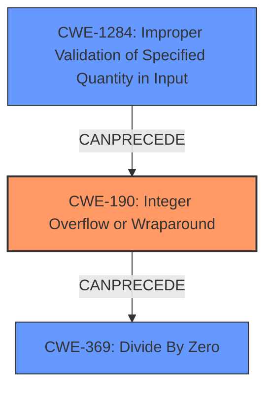

# Final Resolution for CVE-2022-21729

# Summary
| CWE ID | CWE Name | Confidence | CWE Abstraction Level | CWE Vulnerability Mapping Label | CWE-Vulnerability Mapping Notes |
|---|---|---|---|---|---|
| CWE-190 | Integer Overflow or Wraparound | 0.95 | Base | Allowed | Primary CWE |
| CWE-1284 | Improper Validation of Specified Quantity in Input | 0.80 | Base | Allowed | Secondary Candidate |
| CWE-369 | Divide By Zero | 0.75 | Base | Allowed-with-Review | Secondary Candidate |

## Evidence and Confidence

*   **Confidence Score:** 0.90
*   **Evidence Strength:** HIGH

## Relationship Analysis
The primary relationship that impacted the decision was the chain relationship between **CWE-190 (Integer Overflow or Wraparound)** and **CWE-369 (Divide By Zero)**. The **integer overflow** directly leads to the division by zero, solidifying CWE-190 as the root cause.
**CWE-1284 (Improper Validation of Specified Quantity in Input)** is added as a secondary candidate since the vulnerability arises from the lack of validation of input dimensions, which then leads to the **integer overflow**. This shows a progression from lack of validation to overflow to division by zero.
The abstraction levels influenced the decision by prioritizing Base level CWEs like CWE-190, CWE-1284 and CWE-369, as they provide the most specific and actionable information.

## Vulnerability Chain
The vulnerability chain starts with the **lack of proper input validation (CWE-1284)** for the dimensions, which allows for potentially large or malicious values. This leads to an **integer overflow during the calculation of the product of dimensions (CWE-190)**. The overflow results in a zero value, which is then used as the divisor in a division operation, leading to a **divide-by-zero error (CWE-369)**. The final impact is a crash or unexpected behavior in the Tensorflow application.
  - Map the sequence from initial flaw to final impact: Improper Input Validation -> Integer Overflow -> Divide By Zero -> Application Crash
  - Identify which CWEs represent root causes vs. impacts: **CWE-1284** and **CWE-190** are root causes, **CWE-369** is the impact.
  - Note any missing links in the chain based on relationship data: The chain is complete, with clear relationships between the weaknesses.

## Summary of Analysis
The initial analysis correctly identified **CWE-190 (Integer Overflow or Wraparound)** and **CWE-369 (Divide By Zero)** as the primary and secondary weaknesses, respectively. However, considering the retriever results and the criticism, **CWE-1284 (Improper Validation of Specified Quantity in Input)** is a relevant weakness and should be included as a secondary candidate.

The vulnerability description states "The implementation of `UnravelIndex` is vulnerable to a division by zero caused by an **integer overflow** bug." This directly supports the selection of **CWE-190** as the primary weakness. The criticism suggests looking at input validation: The input dimensions are not validated allowing for the **integer overflow**.

The graph relationships influenced the final selection by highlighting the chain of events leading to the vulnerability. The progression from **improper input validation to integer overflow to division by zero** is clear and well-supported by the evidence.

The selected CWEs are at the optimal level of specificity because they accurately represent the root cause and the resulting impact of the vulnerability. **CWE-190** is a Base level weakness that directly addresses the **integer overflow**, while **CWE-369** captures the consequence of the overflow. **CWE-1284** identifies the lack of validation.