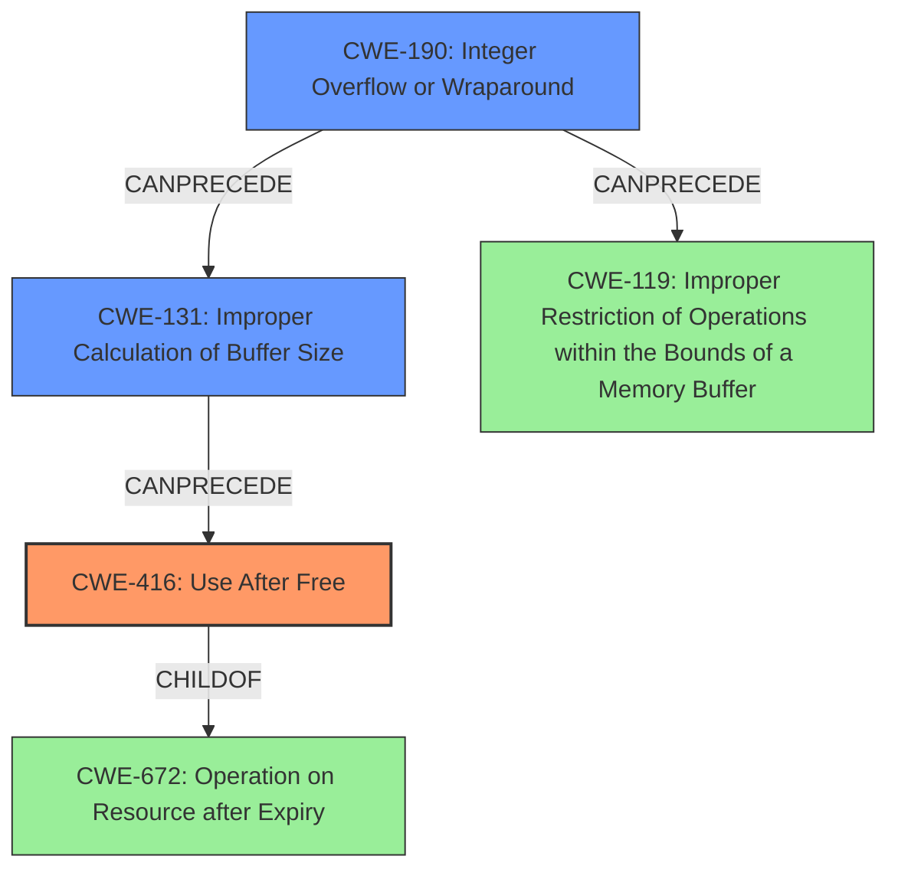

# Final Resolution for CVE-2022-21743

# Summary
| CWE ID | CWE Name | Confidence | CWE Abstraction Level | CWE Vulnerability Mapping Label | CWE-Vulnerability Mapping Notes |
|---|---|---|---|---|---|
| CWE-416 | Use After Free | 0.95 | Variant | Primary CWE | Allowed |
| CWE-190 | Integer Overflow or Wraparound | 0.85 | Base | Secondary CWE | Allowed |
| CWE-131 | Improper Calculation of Buffer Size | 0.70 | Base | Contributing CWE | Allowed |

## Evidence and Confidence

*   **Confidence Score:** 0.92
*   **Evidence Strength:** HIGH

## Relationship Analysis
The primary weakness is **CWE-416 (Use After Free)**, which is triggered due to a prior **integer overflow (CWE-190)** that leads to an incorrect buffer size calculation. The **CWE-131 (Improper Calculation of Buffer Size)** further contributes to the vulnerability by exacerbating the conditions for a **use after free**. **CWE-416** is a variant of **CWE-672**, indicating a broader class of resource management errors. The **CWE-190** can precede **CWE-119 (Improper Restriction of Operations within the Bounds of a Memory Buffer)** if the overflowed value is used in memory allocation. The combination of these weaknesses creates a vulnerability chain, where the integer overflow leads to incorrect buffer handling and ultimately a **use after free** condition. The abstraction levels (Variant for **CWE-416**, Base for **CWE-190** and **CWE-131**) provide appropriate specificity for mapping the vulnerability.

## Vulnerability Chain
The vulnerability chain starts with an **integer overflow (CWE-190)**. This overflow leads to an **improper calculation of buffer size (CWE-131)**. The incorrect buffer size results in memory corruption, leading to a **use after free (CWE-416)** condition. The prerequisite is the integer overflow, and the consequence is the ability to access memory that has already been freed, potentially leading to arbitrary code execution or privilege escalation. The missing link in the chain, which is inferred, is the memory corruption due to the incorrect buffer size calculation.

## Summary of Analysis
The initial analysis correctly identified **CWE-416 (Use After Free)** as the primary weakness and **CWE-190 (Integer Overflow or Wraparound)** as a contributing factor. The criticism highlighted the need for more detail about how the integer overflow leads to the **use after free**, consideration of other potential CWEs such as **CWE-131 (Improper Calculation of Buffer Size)**, and a more explicit chain of causality.

The vulnerability description states, "In ion, there is a possible **use after free** due to an **integer overflow**." This statement directly supports the selection of **CWE-416** and **CWE-190**.

Based on the criticism, I have included **CWE-131** as a contributing CWE because the **integer overflow (CWE-190)** likely results in an incorrect buffer size, which exacerbates the **use after free (CWE-416)** condition. The graph relationships influenced my decision by highlighting the potential chain of events from integer overflow to buffer corruption to **use after free**. The selected CWEs are at the optimal level of specificity because they accurately reflect the root cause (**CWE-190** and **CWE-131**) and the resulting vulnerability (**CWE-416**).