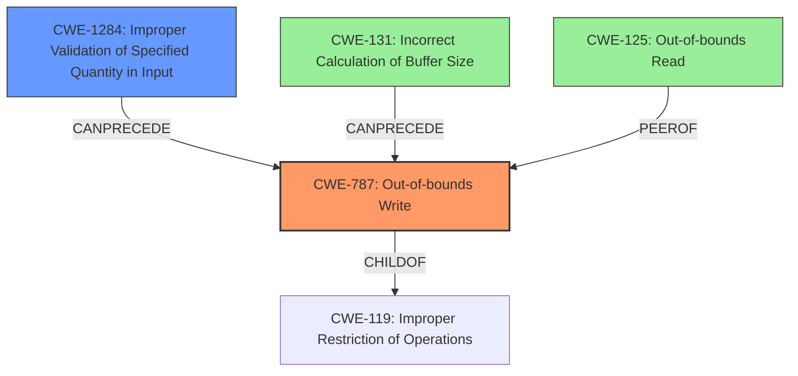

# Final Resolution for CVE-2022-21765

# Summary
| CWE ID | CWE Name | Confidence | CWE Abstraction Level | CWE Vulnerability Mapping Label | CWE-Vulnerability Mapping Notes |
|---|---|---|---|---|---|
| CWE-787 | Out-of-bounds Write | 1.0 | Base | Primary | Allowed |
| CWE-1284 | Improper Validation of Specified Quantity in Input | 0.6 | Base | Secondary Candidate | Allowed |
| CWE-131 | Incorrect Calculation of Buffer Size | 0.4 | Base | Secondary Candidate | Allowed |
| CWE-125 | Out-of-bounds Read | 0.3 | Base | Secondary Candidate | Allowed |

## Evidence and Confidence

*   **Confidence Score:** 0.9
*   **Evidence Strength:** MEDIUM

## Relationship Analysis
The primary relationship is the hierarchical link between CWE-787 (**Out-of-bounds Write**) and its parent, CWE-119 (Improper Restriction of Operations within the Bounds of a Memory Buffer). The vulnerability description explicitly mentions a missing bounds check, which is directly related to CWE-1284 (**Improper Validation of Specified Quantity in Input**). A potential, but less likely, root cause could be CWE-131 (**Incorrect Calculation of Buffer Size**). While CWE-125 (**Out-of-bounds Read**) is often associated with CWE-787, there's no specific mention of read operations in the description, making it a less relevant secondary candidate.

## Vulnerability Chain
The vulnerability chain starts with a **missing bounds check** (CWE Other), which leads to an **out-of-bounds write** (CWE-787), and ultimately results in local escalation of privilege. CWE-1284 (**Improper Validation of Specified Quantity in Input**) or CWE-131 (**Incorrect Calculation of Buffer Size**) could be potential root causes contributing to the missing bounds check.

## Summary of Analysis
The initial analysis correctly identifies CWE-787 (**Out-of-bounds Write**) as the primary weakness, supported by the explicit mention of "out of bounds write" in the vulnerability description. The criticism highlights the need for more specific justifications for secondary CWEs. Based on the criticism and the retriever results, I have made the following changes:

*   CWE-1284 (**Improper Validation of Specified Quantity in Input**) has its confidence increased to 0.6. The missing bounds check directly implies that some quantity related to the input (e.g., its size) was not properly validated.
*   CWE-131 (**Incorrect Calculation of Buffer Size**) remains a secondary candidate, but its confidence is lowered to 0.4. While a buffer size miscalculation could be a root cause, the description emphasizes the missing bounds check more strongly.
*   CWE-125 (**Out-of-bounds Read**) confidence is lowered to 0.3. There's no specific evidence to support an out-of-bounds read.
I agree that it is important to consider if pointer-related CWEs are a better match but in this case, the vulnerability description doesn't mention anything specific about how pointers are used.

The final CWE selections are at the optimal level of specificity because they are base-level CWEs that directly reflect the technical details described in the vulnerability description.
The evidence for this is in the vulnerability description: "In CCCI, there is a possible **out of bounds write** due to a **missing bounds check**."