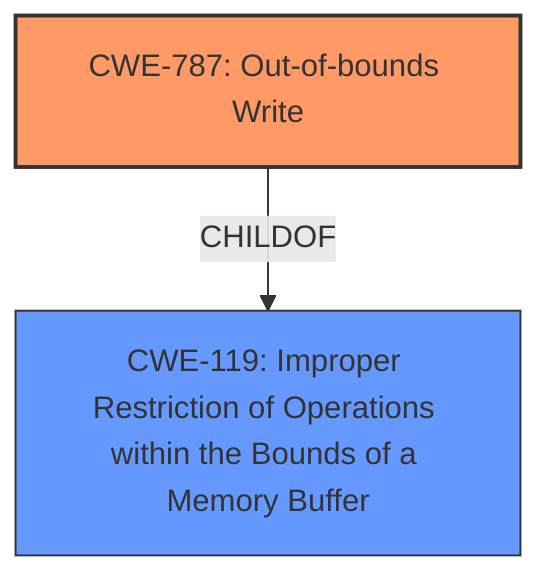

# Final Resolution for CVE-2022-21766

# Summary
| CWE ID | CWE Name | Confidence | CWE Abstraction Level | CWE Vulnerability Mapping Label | CWE-Vulnerability Mapping Notes |
|---|---|---|---|---|---|
| CWE-787 | **Out-of-bounds Write** | 1.0 | Base | Primary CWE | Allowed |
| CWE-119 | Improper Restriction of Operations within the Bounds of a Memory Buffer | 0.7 | Class | Secondary Candidate CWE | Allowed-with-Review |

## Evidence and Confidence

*   **Confidence Score:** 0.95
*   **Evidence Strength:** HIGH

## Relationship Analysis
The primary relationship impacting the decision is the parent-child relationship between CWE-119 (Improper Restriction of Operations within the Bounds of a Memory Buffer) and CWE-787 (**Out-of-bounds Write**). While CWE-119 is a broader class, the vulnerability description clearly indicates an **out-of-bounds write**, making CWE-787 the more specific and appropriate choice as the primary **WEAKNESS**.

## Vulnerability Chain
The vulnerability chain starts with a **missing bounds check** (the **ROOTCAUSE**), which leads to an **out-of-bounds write** (CWE-787), ultimately resulting in a local escalation of privilege.

## Summary of Analysis
The initial analysis correctly identified CWE-787 as the primary **WEAKNESS**. The vulnerability description explicitly states "**out of bounds write** due to a **missing bounds check**," providing strong evidence for this classification.

The criticism suggested adding specifics about how the privilege escalation occurs and the location of the **out-of-bounds write**. While this information would be valuable, its absence does not invalidate the CWE-787 classification. The suggestion to rule out integer overflows is also valid, as these were flagged by the retriever.

The graph relationships confirm that CWE-787 is a child of CWE-119, but the specificity of the vulnerability description warrants the selection of the base-level CWE-787.

The selected CWE is at the optimal level of specificity because the vulnerability description directly describes an **out-of-bounds write**. More general CWEs like CWE-119 would not capture the specific nature of the **WEAKNESS**. Including CWE-119 as a secondary CWE acknowledges the broader class to which this vulnerability belongs.