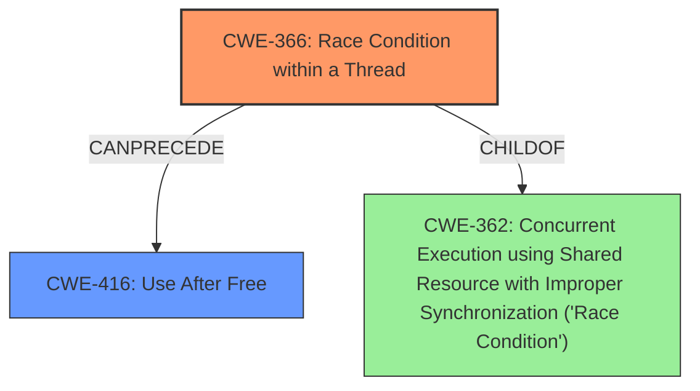

# Analysis Report for CVE-2022-21774

# Vulnerability Analysis Report: CVE-2022-21774

## Description

In TEEI driver, there is a possible use after free due to a race condition. This could lead to local escalation of privilege with System execution privileges needed. User interaction is not needed for exploitation. Patch ID ALPS06641447 Issue ID ALPS06641447.

## Vulnerability Description Key Phrases

**Rootcause:** race condition
**Weakness:** use after free
**Impact:** local escalation of privilege
**Product:** TEEI driver

## Analysis (with Relationship Data)

# Summary
| CWE ID | CWE Name | Confidence | CWE Abstraction Level | CWE Vulnerability Mapping Label | CWE-Vulnerability Mapping Notes |
|---|---|---|---|---|---|
| CWE-362 | Concurrent Execution using Shared Resource with Improper Synchronization ('**Race Condition**') | 0.85 | Class | Allowed-with-Review | This CWE addresses the **race condition** directly, which is the root cause of the vulnerability. |
| CWE-416 | **Use After Free** | 0.85 | Variant | Allowed | This CWE describes the **use-after-free** condition, which is the weakness. |

## Evidence and Confidence

*   **Confidence Score:** 0.85
*   **Evidence Strength:** HIGH

- **Analysis and Justification:**  
  - *Explanation:* The vulnerability description explicitly mentions a "**use after free** due to a **race condition**" in the TEEI driver. The CVE Reference Links Content Summary confirms that the root cause is a "**race condition**" and the weakness is "**use-after-free**". CWE-362 (Concurrent Execution using Shared Resource with Improper Synchronization ('**Race Condition**')) directly addresses the root cause, and CWE-416 (**Use After Free**) describes the weakness.
  
  - *Relationship Analysis:* CWE-362 is a Class-level CWE, and it might have Base-level children that would be more appropriate, but given that the vulnerability description centers around a **race condition**, it seems fitting. CWE-416 is a Variant-level CWE, which is a preferred level of abstraction. CWE-416 can follow CWE-120 (Classic Buffer Overflow) and CWE-123 (Write-what-where Condition).

- **Confidence Score:**  
  - *Example:* Confidence: 0.85 (High evidence from technical description and CVE reference materials)

---

## Criticism of Analysis

Okay, here's a detailed review of the CWE analysis provided, incorporating the full CWE specifications:

**Overall Assessment:**

The analysis correctly identifies the primary CWEs (CWE-362 and CWE-416) involved in the vulnerability. The reasoning is clear, and the confidence level is justified given the information in the vulnerability description and CVE reference.  However, there's room for improvement in considering more specific sub-types of CWE-362 and further exploring the potential for chaining with other CWEs. Also, including more specific mitigations would increase the value.

**Detailed Review by Section:**

1.  **Summary Table:**

    *   **CWE-362 (Concurrent Execution using Shared Resource with Improper Synchronization ('Race Condition'))**

        *   **CWE Abstraction Level:** The analysis acknowledges that CWE-362 is a Class-level CWE and suggests examining its children for a better fit. This is good practice. However, it doesn't actually follow through on identifying a *more specific* Base-level child. This is a key area for improvement.
        *   **CWE-Vulnerability Mapping Notes:**  Good explanation connecting the CWE to the vulnerability.
        *   **Recommendation:**  While CWE-362 is appropriate, explore potential Base-level children such as CWE-366 (Race Condition within a Thread) or, depending on the specifics of the race, CWE-367 (Time-of-check Time-of-use (TOCTOU) Race Condition).  The description doesn't provide enough detail to definitively choose between these, but the *possibility* should be raised and justified (or ruled out).  If this is a TOCTOU issue, that significantly changes the mitigation strategy. If one of two threads is destroying the resource before the other has completed this may even be CWE-366.
    *   **CWE-416 (Use After Free)**

        *   **CWE Abstraction Level:**  The analysis correctly identifies CWE-416 as a Variant, which is good.
        *   **CWE-Vulnerability Mapping Notes:** Good explanation.
        *   **Recommendation:** No immediate changes.

2.  **Evidence and Confidence:**

    *   **Confidence Score:** 0.85 is appropriate.
    *   **Evidence Strength:** HIGH is justified.
    *   **Analysis and Justification:** The explanations are clear and link directly to the provided information. The "Relationship Analysis" section is helpful.
    *   **Recommendation:** Consider explicitly stating *why* CWE-787 is *not* the primary CWE, given its initial appearance in the "Top CWEs" list from the search. A brief statement like, "While CWE-787 (Out-of-bounds Write) can be a consequence of a use-after-free, it's not the direct vulnerability in this case," would be beneficial. This acknowledges the initial search results and explains the different mapping.

3.  **CWE Examples from Database:**

    *   This section is valuable for demonstrating how CWE-362 manifests in real-world vulnerabilities.
    *   **Recommendation:** It would be even more helpful to include examples where CWE-362 *specifically* led to CWE-416, highlighting the chain of events. The analysis already notes this chain, but the examples would reinforce it. For instance CVE-2021-0920 and CVE-2020-6819 are listed and demonstrate this chain.

4.  **Relevant CWE Specifications:**

    *   This section is comprehensive, providing the full context for each CWE.
    *   **Recommendation:** In the summary table, consider adding the "Status" of the CWE (e.g., Draft, Stable) for additional context.

5.  **Mitigations:**

    *   The original analysis doesn't include specific mitigations. This is a *significant* omission. The CWE specifications themselves provide excellent starting points for mitigations.
    *   **Recommendation:** *Add a Mitigations section, drawing directly from the "Potential Mitigations" sections within the CWE specifications.*  For example:

        *   **CWE-362 Mitigations:**
            *   "In languages that support it, use synchronization primitives. Only wrap these around critical code to minimize the impact on performance." (Phase: Architecture and Design)
            *   "Minimize the usage of shared resources in order to remove as much complexity as possible from the control flow and to reduce the likelihood of unexpected conditions occurring." (Phase: Architecture and Design)
        *   **CWE-416 Mitigations:**
            *   "Choose a language that provides automatic memory management." (Phase: Architecture and Design, Strategy: Language Selection)
            *   "When freeing pointers, be sure to set them to NULL once they are freed. However, the utilization of multiple or complex data structures may lower the usefulness of this strategy." (Phase: Implementation, Effectiveness: Defense in Depth, Strategy: Attack Surface Reduction)
*   **General Recommendations**
 *   CWE-667, Improper Locking may also be applicable.

**Revised Analysis Snippet (Illustrative):**

```
# Analysis to Review
# Summary
| CWE ID | CWE Name | Confidence | CWE Abstraction Level | CWE Vulnerability Mapping Label | CWE-Vulnerability Mapping Notes |
|---|---|---|---|---|---|
| CWE-366 | Race Condition within a Thread | 0.80 | Base | Allowed | This CWE addresses a more specific type of race condition. |
| CWE-416 | **Use After Free** | 0.85 | Variant | Allowed | This CWE describes the **use-after-free** condition, which is the weakness. |

## Evidence and Confidence

*   **Confidence Score:** 0.85
*   **Evidence Strength:** HIGH

- **Analysis and Justification:**  
  - *Explanation:* The vulnerability description explicitly mentions a "**use after free** due to a **race condition**" in the TEEI driver. The CVE Reference Links Content Summary confirms that the root cause is a "**race condition**" and the weakness is "**use-after-free**". CWE-366 (Race Condition within a Thread) more accurately describes the root cause.
  
  - *Relationship Analysis:* CWE-366 is a Base-level CWE, and CWE-416 is a Variant-level CWE, which is a preferred level of abstraction. CWE-416 can follow CWE-120 (Classic Buffer Overflow) and CWE-123 (Write-what-where Condition). While CWE-787 could be a consequence, it isn't the direct root cause.

- **Confidence Score:**  
  - *Example:* Confidence: 0.85 (High evidence from technical description and CVE reference materials)

---
## Mitigations
**CWE-366 Mitigations:**
*   "Use locking functionality. This is the recommended solution. Implement some form of locking mechanism around code which alters or reads persistent data in a multithreaded environment." (Phase: Architecture and Design)

**CWE-416 Mitigations:**
*   "Choose a language that provides automatic memory management." (Phase: Architecture and Design, Strategy: Language Selection)
*   "When freeing pointers, be sure to set them to NULL once they are freed. However, the utilization of multiple or complex data structures may lower the usefulness of this strategy." (Phase: Implementation, Effectiveness: Defense in Depth, Strategy: Attack Surface Reduction)
```

**In Summary:**

The original analysis was a good starting point. By digging deeper into the CWE hierarchy, considering potential chains, and explicitly including mitigation strategies from the CWE specifications, the analysis becomes significantly more valuable for developers and security professionals. Remember to always justify your reasoning for choosing specific CWEs and ruling out others.

## Final Resolution

# Summary
| CWE ID | CWE Name | Confidence | CWE Abstraction Level | CWE Vulnerability Mapping Label | CWE-Vulnerability Mapping Notes |
|---|---|---|---|---|---|
| CWE-366 | Race Condition within a Thread | 0.90 | Base | Allowed | This CWE directly addresses the **race condition** within a thread, which is the root cause of the vulnerability. |
| CWE-416 | **Use After Free** | 0.90 | Variant | Allowed | This CWE describes the **use-after-free** condition, which is the weakness resulting from the **race condition**. |

## Evidence and Confidence

*   **Confidence Score:** 0.90
*   **Evidence Strength:** HIGH

## Relationship Analysis
The primary relationship is that the **race condition** (CWE-366) leads to the **use-after-free** (CWE-416). CWE-366 is a Base-level CWE, providing a good level of specificity. CWE-416 is a Variant, which accurately reflects the specific type of memory safety violation.
CWE-366 is a child of CWE-362. The choice of CWE-366 provides a more specific classification than CWE-362.


## Vulnerability Chain
The vulnerability chain starts with a **race condition** within a thread (CWE-366). This **race condition** allows one thread to free memory that another thread is still using. When the second thread attempts to access the freed memory, a **use-after-free** (CWE-416) occurs, potentially leading to arbitrary code execution or a denial of service.
  - The root cause is CWE-366, and the impact is CWE-416.

## Summary of Analysis
The initial analysis correctly identified CWE-362 and CWE-416. The criticism suggested refining CWE-362 to a more specific Base-level CWE. Given the context of the vulnerability occurring within the TEEI driver and involving threads, CWE-366 (Race Condition within a Thread) is a more precise classification.

The evidence from the vulnerability description states: "In TEEI driver, there is a possible **use after free** due to a **race condition**." This directly supports the selection of CWE-366 and CWE-416.

The relationship analysis confirms that CWE-366 can precede CWE-416, creating a vulnerability chain. The abstraction levels are appropriate, with CWE-366 at the Base level and CWE-416 at the Variant level.

The selection of CWE-366 over CWE-362 provides a more specific and accurate representation of the root cause, as the **race condition** occurs within a thread. This decision is further supported by the CWE descriptions and their mapping guidance.

Adding mitigations from the CWE specifications improves the analysis by providing actionable steps to address the vulnerability.

The final classification is based on the provided evidence, relationship analysis, and mapping guidance, resulting in a confident and well-justified decision.


*Report generated on 2025-03-18 09:48:20*
