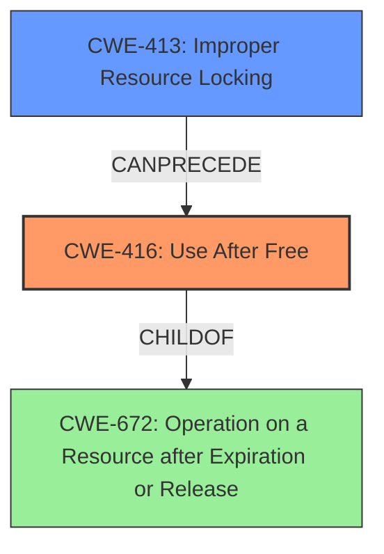

# Analysis Report for CVE-2022-21775

# Vulnerability Analysis Report: CVE-2022-21775

## Description

In sched driver, there is a possible use after free due to improper locking. This could lead to local escalation of privilege with System execution privileges needed. User interaction is not needed for exploitation. Patch ID ALPS06479032 Issue ID ALPS06479032.

## Vulnerability Description Key Phrases

**Rootcause:** use after free
**Impact:** local escalation of privilege
**Component:** sched driver

## Analysis (with Relationship Data)

# Summary
| CWE ID | CWE Name | Confidence | CWE Abstraction Level | CWE Vulnerability Mapping Label | CWE-Vulnerability Mapping Notes |
|---|---|---|---|---|---|
| CWE-416 | Use After Free | 1.0 | Variant | Allowed | Primary CWE |
| CWE-413 | Improper Resource Locking | 0.7 | Base | Allowed | Secondary Candidate |

## Evidence and Confidence

*   **Confidence Score:** 0.9
*   **Evidence Strength:** HIGH

- **Analysis and Justification:**  
  - *Explanation:* The vulnerability description explicitly states a "**use after free**" condition due to improper locking in the sched driver. The "CVE Reference Links Content Summary" confirms this, identifying "**Use-after-free**" and "Improper Synchronization" as weaknesses. CWE-416 (Use After Free) directly addresses the **root cause** where memory is accessed after it has been freed. It is a Variant level CWE, which is a preferred level of abstraction. CWE-413 (Improper Resource Locking) is a potential contributing factor, as improper locking is cited as the cause of the use-after-free.
  
  - *Relationship Analysis:* CWE-416 is a variant and its parent is CWE-672 (Operation on a Resource after Expiration or Release). It can be preceded by other weaknesses like CWE-364 (Signal Handler Race Condition) or CWE-1265 (Unintended Reentrant Invocation of Non-reentrant Code Via Nested Calls) or CWE-413 (Improper Resource Locking).

- **Confidence Score:**  
  - Confidence: 1.0 (Direct evidence of use-after-free and improper locking from the vulnerability description and CVE reference)

---

## Criticism of Analysis

Okay, here's a detailed review of the provided CWE analysis, incorporating the full CWE specifications and paying attention to mapping guidance and potential mitigations.

**Overall Assessment:**

The analysis is strong and well-justified. The primary CWE selection of CWE-416 (Use After Free) is correct, given the information available. The inclusion of CWE-413 (Improper Resource Locking) as a secondary candidate is also sensible as a contributing factor to the UAF. The confidence score of 1.0 for CWE-416 is appropriately high. The explanations are clear, and the justification for the relationships between the weaknesses is sound.

**Detailed Review:**

**1. CWE-416: Use After Free (Primary CWE)**

*   **Correctness:** The selection of CWE-416 is accurate. The vulnerability description and the CVE summary directly state the presence of a "use-after-free" condition.  CWE-416's description aligns perfectly: "The product reuses or references memory after it has been freed."
*   **Abstraction Level:** The Variant level of abstraction is ideal. The analysis correctly notes this is a preferred level.
*   **Mapping Guidance:**  The analysis follows the guidance: "Carefully read both the name and description to ensure that this mapping is an appropriate fit."  It correctly identifies that the description matches the known issue.
*   **Relationships:** The analysis correctly identifies that CWE-416's parent is CWE-672 (Operation on a Resource after Expiration or Release), and that CWE-413 (Improper Resource Locking) can precede CWE-416.
*   **Mitigations:** The provided analysis doesn't delve into mitigations, but it's worth noting some key ones from the CWE specification:
    *   **Architecture and Design (Language Selection):** Choosing a language with automatic memory management is a strong preventative measure.
    *   **Implementation (Attack Surface Reduction):** Setting pointers to NULL after freeing them is a common, though not foolproof, defense.
*   **Observed Examples:** The analysis includes several CVE examples demonstrating chains involving CWE-416, including CVE-2022-20141, which specifically cites a chain where "an operating system kernel has insufficient resource locking (CWE-413) leading to a use after free (CWE-416)." This further strengthens the selection of both CWEs.

**2. CWE-413: Improper Resource Locking (Secondary Candidate)**

*   **Correctness:** Including CWE-413 as a secondary CWE is appropriate. The analysis correctly points out that "improper locking is cited as the cause of the use-after-free."  CWE-413's description fits: "The product does not lock or does not correctly lock a resource when the product must have exclusive access to the resource."
*   **Abstraction Level:** The Base level of abstraction is suitable for this secondary role, as it represents a contributing factor.
*   **Mapping Guidance:** The analysis adheres to the guidance, recognizing the fit based on the problem description.
*   **Relationships:**  The analysis acknowledges that CWE-413 is a child of CWE-667 (Improper Locking).  The examples provided also point to CWE-413's relationship with CWE-416.
*   **Mitigations:** Key mitigations for CWE-413 include:
    *   **Architecture and Design:**  Using a non-conflicting privilege scheme can reduce the need for complex locking.
    *   **Architecture and Design, Implementation:** Using synchronization primitives (mutexes, semaphores, etc.) to properly control access to shared resources.
*   **Observed Examples:** As mentioned, CVE-2022-20141 from the observed examples explicitly demonstrates this relationship.

**3. Weaknesses Identified by Retrievers (But Not Selected):**

The analysis correctly rejected the other CWEs suggested by the retrievers. Let's examine why:

*   **CWE-131 (Incorrect Calculation of Buffer Size):** This is irrelevant. UAF is a memory corruption problem where a pointer refers to freed memory, not about allocating insufficient memory.
*   **CWE-908 (Use of Uninitialized Resource):** While uninitialized data can lead to unpredictable behavior, this vulnerability is specifically about *freed* memory, not uninitialized memory.
*   **CWE-366 (Race Condition within a Thread) / CWE-362 (Concurrent Execution using Shared Resource with Improper Synchronization):** While concurrency issues (like race conditions) can *cause* UAF vulnerabilities (and are related to improper locking), the core problem here *is* the UAF condition itself, making CWE-416 the more direct mapping. CWE-362 and CWE-366 are too general. If more details were available to pinpoint the specific nature of the race condition, then including a CWE related to race conditions may be useful.
*   **CWE-415 (Double Free):**  A double-free is a related, but distinct, vulnerability. This analysis correctly focuses on the *use* after the free, not the freeing itself.
*   **CWE-190 (Integer Overflow or Wraparound):** No indication of integer overflows in the description.
*   **CWE-667 (Improper Locking) / CWE-662 (Improper Synchronization):** CWE-413 is a more specific child of CWE-667, which is a more specific child of CWE-662. Because the root cause is directly related to improper locking, CWE-413 is more appropriate.

**Suggestions for Improvement:**

1.  **Explicitly State Rejection Rationale:** While the analysis implicitly rejects the other CWEs, adding a brief statement for each explaining *why* they weren't selected would strengthen the analysis. For example, "CWE-362 was considered but rejected as the core issue is the memory access after deallocation, not the race condition itself, though the race condition might be the cause of the UAF."
2.  **Mitigation Discussion:** While not strictly required, briefly mentioning relevant mitigations (even just a sentence or two) for CWE-416 and CWE-413 would make the analysis more actionable. For example, "Mitigations for CWE-416 include using languages with automatic memory management and ensuring pointers are set to NULL after being freed. Mitigations for CWE-413 include using proper synchronization mechanisms like mutexes."
3.  **Chain Elaboration:** Elaborating on how CWE-413 leads to CWE-416 in the specific context of the "sched driver" would be helpful. For instance: "Improper locking in the sched driver allows concurrent access to scheduling data structures.  A race condition could occur where one thread frees a task's scheduling information while another thread is still referencing it, leading to a use-after-free when the second thread attempts to access the freed memory."

**Conclusion:**

This is a well-reasoned and accurate CWE analysis. The primary CWE selection is correct, the inclusion of a secondary CWE is justified, and the analysis demonstrates a good understanding of the CWE specifications. Incorporating the suggestions above would make the analysis even more comprehensive and useful.

## Final Resolution

# Summary
| CWE ID | CWE Name | Confidence | CWE Abstraction Level | CWE Vulnerability Mapping Label | CWE-Vulnerability Mapping Notes |
|---|---|---|---|---|---|
| CWE-416 | Use After Free | 1.0 | Variant | Allowed | Primary CWE |
| CWE-413 | Improper Resource Locking | 0.8 | Base | Allowed | Secondary Candidate |

## Evidence and Confidence

*   **Confidence Score:** 0.95
*   **Evidence Strength:** HIGH

## Relationship Analysis
The primary relationship is the potential for **CWE-413 (Improper Resource Locking)** to precede **CWE-416 (Use After Free)**. **CWE-416 (Use After Free)** is a variant of **CWE-672 (Operation on a Resource after Expiration or Release)**, representing the specific case where freed memory is accessed. The base CWE, **CWE-413 (Improper Resource Locking)**, contributes to creating the conditions where memory can be prematurely freed, leading to the use-after-free. The abstraction levels are appropriate, with **CWE-416 (Use After Free)** being a variant and **CWE-413 (Improper Resource Locking)** being a base.

## Vulnerability Chain
The vulnerability chain starts with **CWE-413 (Improper Resource Locking)**, which allows for concurrent access to shared resources. This lack of proper locking can lead to a race condition where a resource is freed by one thread while another thread still holds a reference to it. This leads directly to **CWE-416 (Use After Free)** when the second thread attempts to access the now-freed memory, resulting in a local escalation of privilege.

## Summary of Analysis
The initial analysis and the criticism are both very strong. The vulnerability description explicitly mentions a "**use after free**" condition caused by improper locking. The selection of **CWE-416 (Use After Free)** as the primary **WEAKNESS** is justified as it directly describes the core issue. **CWE-413 (Improper Resource Locking)** is a valid secondary **WEAKNESS**, as the vulnerability description specifically states that the use-after-free is due to improper locking.

The relationship analysis confirms that **CWE-413 (Improper Resource Locking)** can indeed lead to **CWE-416 (Use After Free)**. The abstraction levels of the selected CWEs are appropriate.

The evidence provided in the vulnerability description ("In sched driver, there is a possible use after free due to improper locking.") and the retriever scores support this classification.

The final decision is to classify this vulnerability as **CWE-416 (Use After Free)**, with **CWE-413 (Improper Resource Locking)** as a contributing factor. This is at the optimal level of specificity because **CWE-416 (Use After Free)** directly describes the vulnerability, and **CWE-413 (Improper Resource Locking)** explains the **ROOTCAUSE**.

*Report generated on 2025-03-18 09:49:07*
