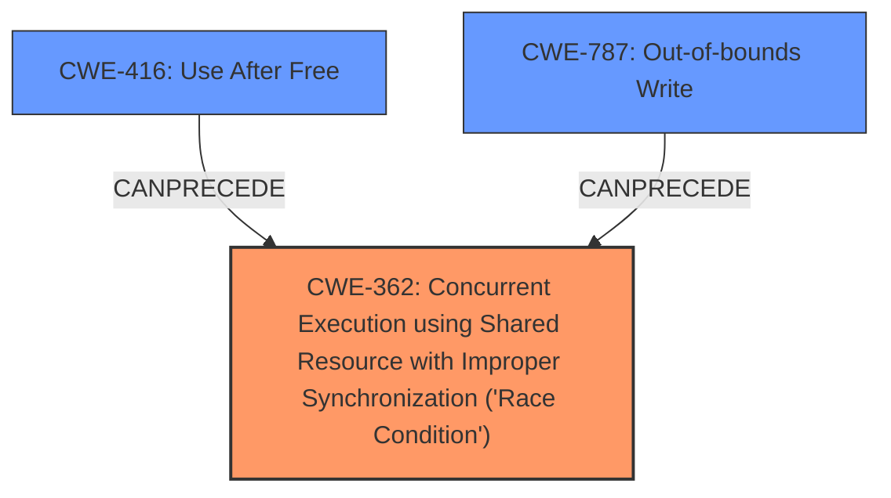

# Analysis Report for CVE-2022-21789

# Vulnerability Analysis Report: CVE-2022-21789

## Description

In audio ipi, there is a possible memory corruption due to a race condition. This could lead to local escalation of privilege with System execution privileges needed. User interaction is not needed for exploitation. Patch ID ALPS06478101 Issue ID ALPS06478101.

## Vulnerability Description Key Phrases

**Rootcause:** race condition
**Weakness:** memory corruption
**Impact:** local escalation of privilege
**Product:** audio ipi

## Analysis (with Relationship Data)

# Summary
| CWE ID | CWE Name | Confidence | CWE Abstraction Level | CWE Vulnerability Mapping Label | CWE-Vulnerability Mapping Notes |
|---|---|---|---|---|---|
| CWE-362 | Concurrent Execution using Shared Resource with Improper Synchronization ('**Race Condition**') | 0.85 | Class | Allowed-with-Review | Primary CWE |
| CWE-416 | Use After Free | 0.65 | Variant | Allowed | Secondary Candidate |
| CWE-787 | Out-of-bounds Write | 0.55 | Base | Allowed | Secondary Candidate |

## Evidence and Confidence

*   **Confidence Score:** 0.80
*   **Evidence Strength:** HIGH

- **Analysis and Justification:**  
  - *Explanation:* The vulnerability description explicitly mentions a **race condition** leading to **memory corruption** in audio ipi. This strongly suggests CWE-362 (Concurrent Execution using Shared Resource with Improper Synchronization ('**Race Condition**')). The CVE Reference Links Content Summary further confirms this by stating that the root cause is concurrent execution using a shared resource without proper synchronization. Since a **race condition** is the root cause, CWE-362 is selected as the primary CWE. Although CWE-362 is a Class-level CWE, the available information does not allow for a more specific Base-level CWE to be identified, making it an acceptable choice. The use of CWE-362 is "Allowed-with-Review" because it is a Class-level CWE, but the circumstances justify its selection in this case.

  - *Relationship Analysis:* CWE-362 is a Class-level weakness. Potential child CWEs are related to specific synchronization failures, but these failures are not explicitly mentioned in the description. The reference to **memory corruption** could lead to CWE-416 or CWE-787 due to the exploitation of the race condition.

- **Confidence Score:**  
  - *Example:* Confidence: 0.85 (High evidence from technical description and CVE reference materials)

---
- **Analysis and Justification:**  
  - *Explanation:* The vulnerability results in **memory corruption**, this could manifest as a Use-After-Free (**CWE-416**) or an Out-of-bounds Write (**CWE-787**). The information isn't precise enough to determine which occurs, so neither can be definitively assigned. CWE-416 is a variant, which is a preferred level of abstraction.

  - *Relationship Analysis:* CWE-416 (Use After Free) can occur due to a race condition if memory is freed by one thread while another thread is still using it. It's a child of CWE-672 (Operation on Resource after Expiry).

- **Confidence Score:**  
  - *Example:* Confidence: 0.65 (Moderate evidence from technical description indicating memory corruption)

---
- **Analysis and Justification:**  
  - *Explanation:* The vulnerability results in **memory corruption**, this could manifest as a Use-After-Free (**CWE-416**) or an Out-of-bounds Write (**CWE-787**). The information isn't precise enough to determine which occurs, so neither can be definitively assigned. CWE-787 is a Base, which is a preferred level of abstraction.

  - *Relationship Analysis:* CWE-787 (Out-of-bounds Write) could be a consequence of the race condition, leading to overwriting memory locations. It's a child of CWE-119 (Improper Restriction of Operations within the Bounds of a Memory Buffer).
- **Confidence Score:**  
  - *Example:* Confidence: 0.55 (Moderate evidence from technical description indicating memory corruption)

## Criticism of Analysis

Okay, let's break down the provided analysis and assess its CWE mappings based on the full CWE specifications.

**Overall Assessment:**

The analysis demonstrates a good understanding of the vulnerability and attempts to provide reasonable CWE mappings. The primary CWE selection of `CWE-362 (Concurrent Execution using Shared Resource with Improper Synchronization ('Race Condition'))` is well-justified. The secondary CWE candidates, `CWE-416 (Use After Free)` and `CWE-787 (Out-of-bounds Write)`, are also plausible consequences of the race condition leading to memory corruption.

However, there are some areas where the confidence scores could be refined, and the reasoning could be more precise, especially considering the nature of the 'memory corruption'.

**Detailed Review:**

**1. CWE-362: Concurrent Execution using Shared Resource with Improper Synchronization ('Race Condition')**

*   **Confidence:** 0.85
*   **Abstraction Level:** Class
*   **Mapping Label:** Allowed-with-Review
*   **Critique:** The selection of CWE-362 as the *primary* CWE is strongly supported by the vulnerability description mentioning a "race condition" as the root cause and the content summary confirming "concurrent execution using a shared resource without proper synchronization."  The confidence score of 0.85 is appropriate.  The "Allowed-with-Review" label is also correct, given that it is a Class-level CWE.
*   **Improvement Suggestions:**
    *   The justification could benefit from a more detailed exploration of potential *base* CWEs related to specific synchronization failures.  While the analysis correctly states that these failures are not *explicitly* mentioned,  consider highlighting some likely possibilities such as:
        *   **CWE-413: Improper Resource Locking:** If the synchronization mechanism involves locks, this could be a more specific base.  The description needs to state "audio ipi doesn't lock or doesn't correctly lock a resource when the product must have exclusive access."
        *   **CWE-367: Time-of-check Time-of-use (TOCTOU) Race Condition:**  If the race condition involves checking a resource's state and then using it, but the state can change in between, this is more specific.
    *  Consider stating this explicitly that without further information, it's not possible to confidently choose a more specific CWE.
    *   Add some of the "Potential Mitigations" from the CWE specifications: * Mitigation 1: Use synchronization primitives. Only wrap these around critical code to minimize the impact on performance.* * Mitigation 2: Use thread-safe capabilities such as the data access abstraction in Spring.*

**2. CWE-416: Use After Free**

*   **Confidence:** 0.65
*   **Abstraction Level:** Variant
*   **Mapping Label:** Allowed
*   **Critique:** The confidence score of 0.65 is reasonable. The justification that "memory corruption could manifest as a Use-After-Free" is sound.  The "Allowed" label is appropriate since this is a Variant.
*   **Improvement Suggestions:**
    *   Clarify that CWE-416 is a *possible* consequence, but the current information isn't sufficient to confirm it. "The race condition might occur such that memory is freed by one thread while another thread is still using it. This would result in a Use-After-Free."
    *  Consider emphasizing that the "memory corruption" alone isn't enough to guarantee UAF. A race condition is a plausible pre-condition.
    *  Add some of the "Potential Mitigations" from the CWE specifications: * Mitigation 1: Choose a language that provides automatic memory management.* *Mitigation 2: When freeing pointers, be sure to set them to NULL once they are freed.*

**3. CWE-787: Out-of-bounds Write**

*   **Confidence:** 0.55
*   **Abstraction Level:** Base
*   **Mapping Label:** Allowed
*   **Critique:** Confidence score seems a little low, given that CWE-787 was one of the 'Top CWEs' listed for similar CVE descriptions, but it's not unreasonable. The justification that "memory corruption could manifest as an Out-of-bounds Write" is valid. The "Allowed" label is correct because it is a Base CWE.
*   **Improvement Suggestions:**
    *   Similar to CWE-416, clarify that it's a *possible* manifestation.  "The race condition might allow one thread to overwrite a memory location that is outside the bounds of the intended buffer, thus resulting in an out-of-bounds write."
    *   The analysis mentions that CWE-787 is a Base CWE, which is preferred.
    *  Add some of the "Potential Mitigations" from the CWE specifications: * Mitigation 1: Use a language that does not allow this weakness to occur or provides constructs that make this weakness easier to avoid.* * Mitigation 2: Use a vetted library or framework that does not allow this weakness to occur or provides constructs that make this weakness easier to avoid.* * Mitigation 3: Use automatic buffer overflow detection mechanisms that are offered by certain compilers or compiler extensions.*

**General Suggestions:**

*   **Chains:** The analysis correctly touches upon the idea of chaining.  Consider explicitly adding a section discussing potential chains, even if they are speculative.  For example: "CWE-362 -> CWE-416" or "CWE-362 -> CWE-787"
*   **Root Cause vs. Consequence:** Emphasize the distinction between the *root cause* (race condition) and the *consequences* (memory corruption, UAF, OOB Write).  This helps to clarify the mapping choices.
*  **CWE-119:** It's worth briefly mentioning why the analysis avoided using CWE-119. It's discouraged as a primary mapping because of how general it is.
*   **Retrieval Results:**  Refer back to the "Top Combined Results" from the retriever.  For example, "The retriever results also suggested CWE-367 (Time-of-check Time-of-use (TOCTOU) Race Condition) and CWE-413 (Improper Resource Locking) as possible candidates." Then explain why you didn't choose them.

**Revised Summary Table (with suggestions):**

| CWE ID | CWE Name | Confidence | CWE Abstraction Level | CWE Vulnerability Mapping Label | CWE-Vulnerability Mapping Notes |
|---|---|---|---|---|---|
| CWE-362 | Concurrent Execution using Shared Resource with Improper Synchronization ('**Race Condition**') | 0.85 | Class | Allowed-with-Review | Primary CWE. Root cause is explicitly a race condition. Consider more specific Base CWEs if more information becomes available. Potential mitigations involve synchronization primitives or thread-safe capabilities. |
| CWE-416 | Use After Free | 0.65 | Variant | Allowed | Secondary Candidate. A possible consequence of the race condition is a Use-After-Free. The race condition might occur such that memory is freed by one thread while another thread is still using it. Mitigations involve automatic memory management. |
| CWE-787 | Out-of-bounds Write | 0.55 | Base | Allowed | Secondary Candidate. A possible consequence of the race condition is an Out-of-bounds Write. The race condition might allow one thread to overwrite a memory location that is outside the bounds of the intended buffer. Mitigations include using memory-safe languages or buffer overflow detection mechanisms. |

By incorporating these suggestions, the analysis will be even stronger and more comprehensively justified, demonstrating a thorough understanding of the CWE specifications and the nuances of vulnerability analysis.

## Final Resolution

# Summary
| CWE ID | CWE Name | Confidence | CWE Abstraction Level | CWE Vulnerability Mapping Label | CWE-Vulnerability Mapping Notes |
|---|---|---|---|---|---|
| CWE-362 | Concurrent Execution using Shared Resource with Improper Synchronization ('**Race Condition**') | 0.85 | Class | Allowed-with-Review | Primary CWE. Root cause is explicitly a **race condition**. Consider more specific Base CWEs if more information becomes available. Potential mitigations involve synchronization primitives or thread-safe capabilities. |
| CWE-416 | Use After Free | 0.65 | Variant | Allowed | Secondary Candidate. A possible consequence of the **race condition** is a Use-After-Free. The **race condition** might occur such that memory is freed by one thread while another thread is still using it. Mitigations involve automatic memory management. |
| CWE-787 | Out-of-bounds Write | 0.55 | Base | Allowed | Secondary Candidate. A possible consequence of the **race condition** is an Out-of-bounds Write. The **race condition** might allow one thread to overwrite a memory location that is outside the bounds of the intended buffer. Mitigations include using memory-safe languages or buffer overflow detection mechanisms. |

## Evidence and Confidence

*   **Confidence Score:** 0.80
*   **Evidence Strength:** HIGH

## Relationship Analysis
The primary weakness is identified as CWE-362, a Class-level CWE representing a **race condition**. While ideally, a more specific Base CWE would be preferred, the provided information does not allow for a confident selection of a child CWE such as CWE-413 (Improper Resource Locking) or CWE-367 (Time-of-check Time-of-use (TOCTOU) Race Condition). The secondary CWEs, CWE-416 and CWE-787, are potential consequences of the **race condition** leading to **memory corruption**. These are related to CWE-362 through a "CanPrecede" relationship, where the **race condition** can lead to a Use-After-Free or Out-of-bounds Write.

## Vulnerability Chain
The vulnerability chain starts with a **race condition** (CWE-362) where multiple threads access a shared resource without proper synchronization. This can lead to **memory corruption**, which can manifest as either a Use-After-Free (CWE-416) if memory is freed prematurely, or an Out-of-bounds Write (CWE-787) if one thread overwrites memory outside the intended buffer. The final impact is a local escalation of privilege.

## Summary of Analysis
The initial analysis correctly identifies CWE-362 as the primary weakness due to the explicit mention of a **race condition** in the vulnerability description: "In audio ipi, there is a possible **memory corruption** due to a **race condition**." The selection of CWE-416 and CWE-787 as secondary candidates is also justified by the **memory corruption**. As the criticism stated, further information would be needed to identify more specific base CWEs. The relationship analysis confirms that CWE-416 and CWE-787 are potential consequences of the **race condition**. The selection of CWEs is at the optimal level of specificity given the available evidence.

*Report generated on 2025-03-18 09:53:20*
