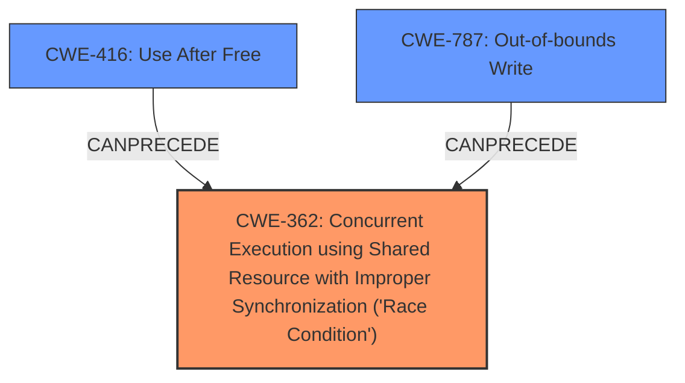

# Final Resolution for CVE-2022-21789

# Summary
| CWE ID | CWE Name | Confidence | CWE Abstraction Level | CWE Vulnerability Mapping Label | CWE-Vulnerability Mapping Notes |
|---|---|---|---|---|---|
| CWE-362 | Concurrent Execution using Shared Resource with Improper Synchronization ('**Race Condition**') | 0.85 | Class | Allowed-with-Review | Primary CWE. Root cause is explicitly a **race condition**. Consider more specific Base CWEs if more information becomes available. Potential mitigations involve synchronization primitives or thread-safe capabilities. |
| CWE-416 | Use After Free | 0.65 | Variant | Allowed | Secondary Candidate. A possible consequence of the **race condition** is a Use-After-Free. The **race condition** might occur such that memory is freed by one thread while another thread is still using it. Mitigations involve automatic memory management. |
| CWE-787 | Out-of-bounds Write | 0.55 | Base | Allowed | Secondary Candidate. A possible consequence of the **race condition** is an Out-of-bounds Write. The **race condition** might allow one thread to overwrite a memory location that is outside the bounds of the intended buffer. Mitigations include using memory-safe languages or buffer overflow detection mechanisms. |

## Evidence and Confidence

*   **Confidence Score:** 0.80
*   **Evidence Strength:** HIGH

## Relationship Analysis
The primary weakness is identified as CWE-362, a Class-level CWE representing a **race condition**. While ideally, a more specific Base CWE would be preferred, the provided information does not allow for a confident selection of a child CWE such as CWE-413 (Improper Resource Locking) or CWE-367 (Time-of-check Time-of-use (TOCTOU) Race Condition). The secondary CWEs, CWE-416 and CWE-787, are potential consequences of the **race condition** leading to **memory corruption**. These are related to CWE-362 through a "CanPrecede" relationship, where the **race condition** can lead to a Use-After-Free or Out-of-bounds Write.

## Vulnerability Chain
The vulnerability chain starts with a **race condition** (CWE-362) where multiple threads access a shared resource without proper synchronization. This can lead to **memory corruption**, which can manifest as either a Use-After-Free (CWE-416) if memory is freed prematurely, or an Out-of-bounds Write (CWE-787) if one thread overwrites memory outside the intended buffer. The final impact is a local escalation of privilege.

## Summary of Analysis
The initial analysis correctly identifies CWE-362 as the primary weakness due to the explicit mention of a **race condition** in the vulnerability description: "In audio ipi, there is a possible **memory corruption** due to a **race condition**." The selection of CWE-416 and CWE-787 as secondary candidates is also justified by the **memory corruption**. As the criticism stated, further information would be needed to identify more specific base CWEs. The relationship analysis confirms that CWE-416 and CWE-787 are potential consequences of the **race condition**. The selection of CWEs is at the optimal level of specificity given the available evidence.