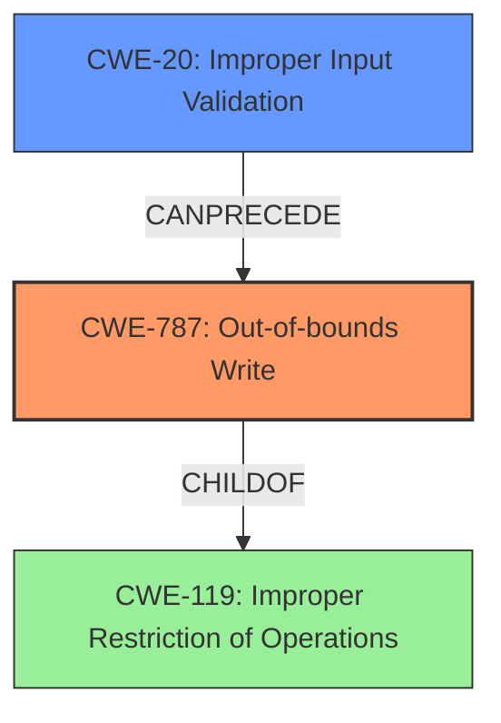

# Final Resolution for CVE-2022-21796

# Summary

| CWE ID | CWE Name | Confidence | CWE Abstraction Level | CWE Vulnerability Mapping Label | CWE-Vulnerability Mapping Notes |
|---|---|---|---|---|---|
| CWE-787 | Out-of-bounds Write | 0.9 | Base | Allowed | Acceptable-Use, Primary CWE |
| CWE-20 | Improper Input Validation | 0.7 | Class | Allowed-with-Review | Acceptable-Use, Contributing Factor |

## Evidence and Confidence

*   **Confidence Score:** 0.8
*   **Evidence Strength:** MEDIUM

## Relationship Analysis
The primary relationship is the chaining of **CWE-20 (Improper Input Validation)** leading to **CWE-787 (Out-of-bounds Write)**. The **improper input validation** allows for a crafted HTTP request to provide data that causes a write operation to occur outside the bounds of the intended buffer.
**CWE-787** is a child of **CWE-119 (Improper Restriction of Operations within the Bounds of a Memory Buffer)**, but **CWE-787** is more specific and accurately describes the vulnerability.

## Vulnerability Chain
The vulnerability chain starts with **CWE-20 (Improper Input Validation)**. The `parse_command_list` function does not properly validate the incoming HTTP request. This lack of validation allows an attacker to craft a request with parameters that cause data to be written outside the intended buffer, leading to **CWE-787 (Out-of-bounds Write)**.

## Summary of Analysis
The initial analysis correctly identified **CWE-787 (Out-of-bounds Write)** as the primary weakness, which is directly supported by the vulnerability description stating "A specially-crafted HTTP request can lead to an **out-of-bounds write**." The criticism correctly suggested adding a secondary CWE to represent the root cause leading to the out-of-bounds write. **CWE-20 (Improper Input Validation)** is a strong candidate because the HTTP request is not being properly validated.

The relationship analysis showed that **CWE-787** is a child of **CWE-119**, but **CWE-787** is more specific. The chain relationship shows that **CWE-20** can precede **CWE-787**, indicating that improper input validation can lead to an out-of-bounds write.

The final decision is to include both **CWE-787** and **CWE-20**. This provides a more complete picture of the vulnerability by identifying both the direct consequence (**out-of-bounds write**) and the root cause (**improper input validation**). The selected CWEs are at the optimal level of specificity based on the available evidence. The confidence score is 0.8 because while the **out-of-bounds write** is explicitly stated, the **improper input validation** is inferred, but highly likely based on the nature of the vulnerability.