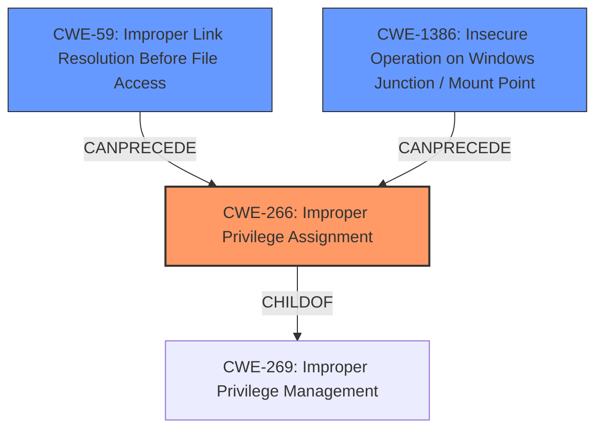

# Final Resolution for CVE-2022-21919

# Summary
| CWE ID | CWE Name | Confidence | CWE Abstraction Level | CWE Vulnerability Mapping Label | CWE-Vulnerability Mapping Notes |
|---|---|---|---|---|---|
| **CWE-266** | **Improper Privilege Assignment** | 0.6 | Base | Primary | Allowed |
| **CWE-59** | **Improper Link Resolution Before File Access ('Link Following')** | 0.4 | Base | Secondary | Allowed |
| **CWE-1386** | **Insecure Operation on Windows Junction / Mount Point** | 0.4 | Base | Secondary | Allowed |

## Evidence and Confidence

*   **Confidence Score:** 0.6
*   **Evidence Strength:** LOW

## Relationship Analysis
The initial assessment started with CWE-269 (Improper Privilege Management) which is a class-level CWE. The criticism correctly pointed out that CWE-269 is too broad and suggested exploring more specific child CWEs. I agree with this assessment. The decision to move to CWE-266 (Improper Privilege Assignment) is based on the fact that the vulnerability is an **Elevation of Privilege**, which suggests an incorrect assignment of privileges, which aligns better with CWE-266. The other secondary candidate CWEs CWE-59 and CWE-1386 were kept, since they could lead to the **Elevation of Privilege** if file access checks are not correctly performed.

## Vulnerability Chain
The vulnerability chain starts with an **Improper Privilege Assignment** (**CWE-266**) within the Windows User Profile Service. This could be due to incorrectly configured privileges or roles. This **ROOTCAUSE** then allows an attacker to potentially escalate privileges and gain unauthorized access to sensitive resources. The **Improper Link Resolution Before File Access ('Link Following')** (**CWE-59**) and **Insecure Operation on Windows Junction / Mount Point** (**CWE-1386**) act as contributing weaknesses that could be exploited to achieve this privilege escalation.

## Summary of Analysis
The initial analysis correctly identified a privilege management issue but settled on the overly broad CWE-269. The criticism highlighted the need for a more specific CWE and suggested several potential candidates. Based on the "Elevation of Privilege" description, and taking into account the criticism, I've selected CWE-266 (Improper Privilege Assignment) as the primary CWE. This is a more specific Base-level CWE that directly addresses the root cause of the vulnerability, which is an incorrect assignment of privileges. The confidence level remains relatively low (0.6) due to the limited information available in the vulnerability description. The inclusion of CWE-59 and CWE-1386 as secondary CWEs is maintained as they represent potential attack vectors that could lead to the privilege escalation. These CWEs are at the Base level of abstraction, which is appropriate for mapping the technical details of the vulnerability.