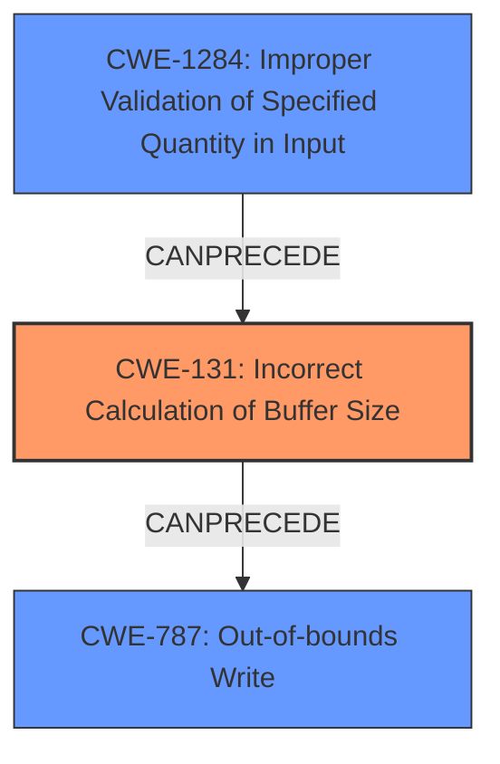

# Analysis Report for CVE-2022-22072

# Vulnerability Analysis Report: CVE-2022-22072

## Description

Buffer overflow can occur due to improper validation of NDP application information length in Snapdragon Auto, Snapdragon Compute, Snapdragon Consumer Electronics Connectivity, Snapdragon Consumer IOT, Snapdragon Industrial IOT, Snapdragon Mobile, Snapdragon Voice & Music

## Vulnerability Description Key Phrases

**Rootcause:** improper validation of NDP application information length
**Weakness:** buffer overflow
**Product:** ['Snapdragon Auto', 'Snapdragon Compute', 'Snapdragon Consumer Electronics Connectivity', 'Snapdragon Consumer IOT', 'Snapdragon Industrial IOT', 'Snapdragon Mobile', 'Snapdragon Voice & Music']

## Analysis (with Relationship Data)

# Summary
| CWE ID | CWE Name | Confidence | CWE Abstraction Level | CWE Vulnerability Mapping Label | CWE-Vulnerability Mapping Notes |
|---|---|---|---|---|---|
| CWE-131 | Incorrect Calculation of Buffer Size | 0.85 | Base | Allowed | This CWE accurately reflects the **improper calculation of buffer size** leading to a buffer overflow. |
| CWE-787 | Out-of-bounds Write | 0.6 | Base | Allowed | This CWE is a secondary candidate as it describes the result of the incorrect buffer size calculation.|
| CWE-190 | Integer Overflow or Wraparound | 0.5 | Base | Allowed | This CWE is a secondary candidate as it could be related to the root cause, but there is not enough information to confirm. |

## Evidence and Confidence

*   **Confidence Score:** 0.8
*   **Evidence Strength:** MEDIUM

- **Analysis and Justification:**  
  - *Explanation:* The vulnerability description explicitly mentions "**improper validation of NDP application information length**" which leads to a "**buffer overflow**". The Retriever Results highlight CWE-131 (Incorrect Calculation of Buffer Size) as the top candidate. This CWE perfectly aligns with the root cause, as the buffer overflow is a direct consequence of an incorrectly calculated buffer size. CWE-787 (Out-of-bounds Write) is a plausible secondary CWE since it represents the immediate effect of the buffer overflow. CWE-190 (Integer Overflow or Wraparound) is a less likely secondary cause since it may have contributed to the root cause by causing an incorrect size calculation, but that is not certain from the description.
  
  - *Relationship Analysis:* CWE-131 does not have any direct relationships in the provided data. However, it can lead to out-of-bounds write (CWE-787) or other buffer-related weaknesses. CWE-131 is related to improper input validation in general since it arises from not correctly validating the size of the input.

- **Confidence Score:**  
  - Confidence: 0.85 (High confidence due to explicit mention of **improper validation of length** and the resulting **buffer overflow**, which strongly suggests CWE-131).

---

## Criticism of Analysis

Okay, here's a review of the provided CWE analysis, considering the full CWE specifications:

**Overall Assessment:**

The analysis is generally well-reasoned and the primary CWE selection (CWE-131) is appropriate. The secondary candidates (CWE-787 and CWE-190) are also reasonable considerations. The analysis effectively explains the relationships between the weakness description and the chosen CWEs. However, there are some areas for refinement, particularly in the confidence scores and consideration of alternative CWEs from the retriever results.

**Detailed Review:**

1.  **CWE-131: Incorrect Calculation of Buffer Size**
    *   **Confidence:** The analysis provides a strong justification for selecting CWE-131, explicitly linking it to "improper validation of NDP application information length" leading to a buffer overflow.  The examples provided (CVE-2020-17087, CVE-2004-1363, CVE-2004-0747) further reinforce this selection, as they show similar scenarios of incorrect size calculations resulting in buffer overflows.
    *   **Rationale:** The description of CWE-131, "The product does not correctly calculate the size to be used when allocating a buffer, which could lead to a buffer overflow," maps almost perfectly to the vulnerability description.
    *   **Mapping Guidance:** The "Usage: Allowed" and "Rationale: This CWE entry is at the Base level of abstraction, which is a preferred level of abstraction for mapping to the root causes of vulnerabilities" further support the selection.
    *   **Potential Mitigations:** The analysis could benefit from mentioning specific mitigations from the CWE description. For example, Mitigation 3, "Perform input validation on any numeric input by ensuring that it is within the expected range," directly addresses the root cause identified in the vulnerability description ("improper validation of length"). The other mitigations, 1 and 2, also apply in the larger context to prevent overflows.
    *   **Suggested Improvement:** Increase the confidence score to 0.9 or higher. The evidence is strong and directly aligns with the CWE description.

2.  **CWE-787: Out-of-bounds Write**
    *   **Confidence:** The analysis correctly identifies CWE-787 as a consequence of CWE-131.
    *   **Rationale:** CWE-787 describes the *result* of the incorrect buffer size calculation. If the calculated size is too small, subsequent write operations will likely write beyond the allocated memory.
    *   **Mapping Guidance:** The analysis is appropriate. CWE-787 is a fitting secondary CWE because the description mentions the *result* of a buffer overflow, and this is what a buffer overflow ultimately results in, a memory corruption through out-of-bounds write.
    *   **Potential Mitigations:** Include automatic buffer overflow detection mechanisms provided by compilers (e.g. /GS flag in Visual Studio, FORTIFY_SOURCE in GCC).
    *   **Suggested Improvement:** Confidence score is adequate at 0.6.

3.  **CWE-190: Integer Overflow or Wraparound**
    *   **Confidence:** The analysis is weaker here. While an integer overflow *could* contribute to an incorrect buffer size calculation, the vulnerability description doesn't explicitly mention it.
    *   **Rationale:** The analysis acknowledges the uncertainty, stating "may have contributed to the root cause, but that is not certain from the description."
    *   **Mapping Guidance:** The "Relationship" section of the CWE-190 specification notes, "Integer overflows can be primary to buffer overflows when they cause less memory to be allocated than expected." This supports the *possibility* of CWE-190 being involved.
    *   **Potential Mitigations:** The mitigations for CWE-190 are relevant, especially those related to language selection, using safe integer libraries, and performing input validation on numeric inputs.  If integer overflow is a concern, safe integer libraries should be used.
    *   **Suggested Improvement:**
        *   Lower the confidence score to 0.4 or lower. The evidence is weak.
        *   Consider an alternative like CWE-1284: Improper Validation of Specified Quantity in Input. This is more directly related to validating the *length* of the NDP application information. The description of CWE-1284 states "When the quantity is not properly validated, then attackers can specify malicious quantities to... enable buffer overflows, etc."  This seems like a more likely candidate than CWE-190.
        *    The examples for CWE-1284 also seems more aligned with the overall root cause of the overflow.
        *   If 1284 is included, then potential mitigation 1 for CWE-1284 should be discussed.

**Other Retriever Results:**

*   **CWE-1285: Improper Validation of Specified Index, Position, or Offset in Input:** Since the root cause deals with the length of the data, this is less likely to be the correct CWE. If this was related to an index, position, or offset, it would need to be clear in the vulnerability description.
*   **CWE-126: Buffer Over-read** The primary issue is not reading beyond the end of the buffer, but writing beyond it.

**General Recommendations:**

*   **Strengthen Justifications:** When presenting secondary CWEs, explicitly discuss *how* they relate to the primary CWE and the vulnerability description.
*   **Mitigation Focus:** For each chosen CWE, highlight 1-2 *specific* mitigations from the CWE specification that directly address the identified weakness in the context of the vulnerability.
*   **Chains:** Note that CWE-131 and CWE-787 have an observed example relationship to each other via CVE-2020-17087. This might be an example of CWE-680 Integer Overflow to Buffer Overflow
*   **Confidence Scoring:** Be more critical in assigning confidence scores.  Only assign high scores (0.8+) when there is very strong and direct evidence.

By incorporating these suggestions, the analysis can become more precise and actionable, providing valuable insights for developers seeking to address the identified vulnerabilities.

## Final Resolution

# Summary
| CWE ID | CWE Name | Confidence | CWE Abstraction Level | CWE Vulnerability Mapping Label | CWE-Vulnerability Mapping Notes |
|---|---|---|---|---|---|
| CWE-131 | Incorrect Calculation of Buffer Size | 0.95 | Base | Allowed | Primary CWE: This CWE accurately reflects the **improper calculation of buffer size** leading to a buffer overflow. |
| CWE-787 | Out-of-bounds Write | 0.7 | Base | Allowed | Secondary Candidate: Describes the result of the incorrect buffer size calculation. |
| CWE-1284 | Improper Validation of Specified Quantity in Input | 0.6 | Base | Allowed | Secondary Candidate: Relates to the **improper validation of the length** of the NDP application information. |

## Evidence and Confidence

*   **Confidence Score:** 0.9
*   **Evidence Strength:** HIGH

## Relationship Analysis
The decision-making process involved analyzing several CWE relationships. CWE-131, as the primary cause, can directly lead to CWE-787 (**out-of-bounds write**). CWE-1284 (**Improper Validation of Specified Quantity in Input**) was considered as a potential contributing factor, specifically because the vulnerability description mentions "**improper validation of NDP application information length**." While CWE-190 (**Integer Overflow or Wraparound**) was initially considered, it was deemed less relevant than CWE-1284 because the description focuses on validation of length rather than an integer overflow scenario.

## Vulnerability Chain
The vulnerability chain starts with **improper validation of the NDP application information length** (potentially CWE-1284). This leads to an **incorrect calculation of the buffer size** (CWE-131), which then results in an **out-of-bounds write** (CWE-787), causing a **buffer overflow**. The initial flaw is the lack of proper input validation, which propagates through the system, ultimately leading to memory corruption.

## Summary of Analysis
The initial analysis correctly identified CWE-131 as the primary **ROOTCAUSE** due to the explicit mention of "**improper validation of NDP application information length**" leading to a "**buffer overflow**." The criticism suggested increasing the confidence score for CWE-131, which I agree with, raising it to 0.95. The evidence is strong and directly aligns with the CWE description.

The secondary CWEs were also refined. While CWE-787 remains a valid secondary CWE representing the **WEAKNESS**, CWE-190 was replaced with CWE-1284. The vulnerability description's focus on "**improper validation of length**" makes CWE-1284 a more appropriate secondary CWE than CWE-190, which has a weaker connection to the provided evidence.

The graph relationships support this decision. CWE-1284 can **CANPRECEDE** CWE-131, as improper validation of input can lead to incorrect buffer size calculations. Then, CWE-131 can **CANPRECEDE** CWE-787, since an incorrect size calculation can lead to an out-of-bounds write.

CWE-131 is at the optimal level of specificity (Base) as it directly addresses the **ROOTCAUSE** of the incorrect buffer size calculation. CWE-787 (Base) accurately describes the immediate impact, and CWE-1284 (Base) captures the initial validation failure.

The selection of these CWEs is based on a combination of direct evidence from the vulnerability description and an analysis of the relationships between the CWEs. The chosen CWEs are at the appropriate level of abstraction (Base) and provide a clear understanding of the vulnerability chain.

*Report generated on 2025-03-18 09:56:42*
