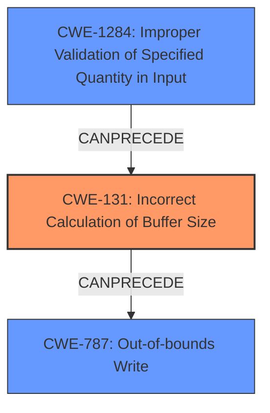

# Final Resolution for CVE-2022-22072

# Summary
| CWE ID | CWE Name | Confidence | CWE Abstraction Level | CWE Vulnerability Mapping Label | CWE-Vulnerability Mapping Notes |
|---|---|---|---|---|---|
| CWE-131 | Incorrect Calculation of Buffer Size | 0.95 | Base | Allowed | Primary CWE: This CWE accurately reflects the **improper calculation of buffer size** leading to a buffer overflow. |
| CWE-787 | Out-of-bounds Write | 0.7 | Base | Allowed | Secondary Candidate: Describes the result of the incorrect buffer size calculation. |
| CWE-1284 | Improper Validation of Specified Quantity in Input | 0.6 | Base | Allowed | Secondary Candidate: Relates to the **improper validation of the length** of the NDP application information. |

## Evidence and Confidence

*   **Confidence Score:** 0.9
*   **Evidence Strength:** HIGH

## Relationship Analysis
The decision-making process involved analyzing several CWE relationships. CWE-131, as the primary cause, can directly lead to CWE-787 (**out-of-bounds write**). CWE-1284 (**Improper Validation of Specified Quantity in Input**) was considered as a potential contributing factor, specifically because the vulnerability description mentions "**improper validation of NDP application information length**." While CWE-190 (**Integer Overflow or Wraparound**) was initially considered, it was deemed less relevant than CWE-1284 because the description focuses on validation of length rather than an integer overflow scenario.

## Vulnerability Chain
The vulnerability chain starts with **improper validation of the NDP application information length** (potentially CWE-1284). This leads to an **incorrect calculation of the buffer size** (CWE-131), which then results in an **out-of-bounds write** (CWE-787), causing a **buffer overflow**. The initial flaw is the lack of proper input validation, which propagates through the system, ultimately leading to memory corruption.

## Summary of Analysis
The initial analysis correctly identified CWE-131 as the primary **ROOTCAUSE** due to the explicit mention of "**improper validation of NDP application information length**" leading to a "**buffer overflow**." The criticism suggested increasing the confidence score for CWE-131, which I agree with, raising it to 0.95. The evidence is strong and directly aligns with the CWE description.

The secondary CWEs were also refined. While CWE-787 remains a valid secondary CWE representing the **WEAKNESS**, CWE-190 was replaced with CWE-1284. The vulnerability description's focus on "**improper validation of length**" makes CWE-1284 a more appropriate secondary CWE than CWE-190, which has a weaker connection to the provided evidence.

The graph relationships support this decision. CWE-1284 can **CANPRECEDE** CWE-131, as improper validation of input can lead to incorrect buffer size calculations. Then, CWE-131 can **CANPRECEDE** CWE-787, since an incorrect size calculation can lead to an out-of-bounds write.

CWE-131 is at the optimal level of specificity (Base) as it directly addresses the **ROOTCAUSE** of the incorrect buffer size calculation. CWE-787 (Base) accurately describes the immediate impact, and CWE-1284 (Base) captures the initial validation failure.

The selection of these CWEs is based on a combination of direct evidence from the vulnerability description and an analysis of the relationships between the CWEs. The chosen CWEs are at the appropriate level of abstraction (Base) and provide a clear understanding of the vulnerability chain.