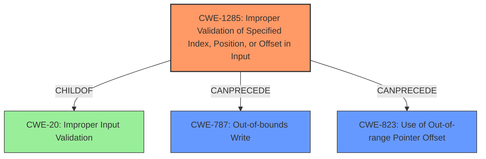

# Analysis Report for CVE-2022-22080

# Vulnerability Analysis Report: CVE-2022-22080

## Description

Improper validation of backend id in PCM routing process can lead to memory corruption in Snapdragon Auto, Snapdragon Compute, Snapdragon Connectivity, Snapdragon Consumer IOT, Snapdragon Industrial IOT, Snapdragon Mobile, Snapdragon Voice & Music

## Vulnerability Description Key Phrases

**Rootcause:** Improper validation of backend id in PCM routing process
**Impact:** memory corruption
**Product:** ['Snapdragon Auto', 'Snapdragon Compute', 'Snapdragon Connectivity', 'Snapdragon Consumer IOT', 'Snapdragon Industrial IOT', 'Snapdragon Mobile', 'Snapdragon Voice & Music']

## Analysis (with Relationship Data)

# Summary
| CWE ID | CWE Name | Confidence | CWE Abstraction Level | CWE Vulnerability Mapping Label | CWE-Vulnerability Mapping Notes |
|---|---|---|---|---|---|
| CWE-822 | Untrusted Pointer Dereference | 0.75 | Base | Allowed | Primary CWE: The product obtains a value from an untrusted source, converts this value to a pointer, and dereferences the resulting pointer. |
| CWE-1285 | Improper Validation of Specified Index, Position, or Offset in Input | 0.65 | Base | Allowed | Secondary CWE: The product receives input that is expected to specify an index, position, or offset into an indexable resource such as a buffer or file, but it does not validate or incorrectly validates that the specified index/position/offset has the required properties. |

## Evidence and Confidence

*   **Confidence Score:** 0.70
*   **Evidence Strength:** MEDIUM

- **Analysis and Justification:**  
  - *Explanation:* The vulnerability description highlights **improper validation of a backend id** which leads to **memory corruption**. The **root cause** appears to be related to how a backend id is handled during the PCM routing process. CWE-822 (Untrusted Pointer Dereference) is a strong candidate since memory corruption often involves dereferencing an invalid or attacker-controlled pointer. The **improper validation** part of the vulnerability description aligns with the idea that an untrusted value is being used to determine the pointer's address, leading to a dereference of an unexpected memory location. The description indicates the product does not properly validate the `backend id` which maps to CWE-1285.
  
  - *Relationship Analysis:* CWE-822 is a Base level CWE, which is the preferred level of abstraction. CWE-822's description aligns with the vulnerability where an untrusted value (the backend id) is potentially converted to a pointer and dereferenced, leading to memory corruption.

- **Confidence Score:**  
  - Confidence: 0.75 (Moderate evidence; memory corruption is a common result of pointer dereference issues, but specifics are lacking.)

---
- **Analysis and Justification:**  
  - *Explanation:* CWE-1285 (Improper Validation of Specified Index, Position, or Offset in Input) is also a plausible candidate since the `backend id` could be interpreted as an index or offset used in memory access. The vulnerability description mentions "improper validation," directly aligning with CWE-1285. The fact that this leads to memory corruption suggests the invalid index is being used to access memory.
  
  - *Relationship Analysis:* CWE-1285 is a Base level CWE, which is the preferred level of abstraction. It describes scenarios where input meant to specify an index or offset is not properly validated, which is consistent with the "**Improper validation of backend id**" found in the vulnerability description.

- **Confidence Score:**  
  - Confidence: 0.65 (Moderate evidence; the backend id being an index/offset is an assumption, but plausible.)

---

## Criticism of Analysis

Okay, here's a review of the analysis, incorporating the full CWE specifications, focusing on mapping guidance, potential mitigations, and alternative CWEs.

**Overall Assessment:**

The analysis correctly identifies CWE-822 (Untrusted Pointer Dereference) and CWE-1285 (Improper Validation of Specified Index, Position, or Offset in Input) as potential candidates. The reasoning is solid, linking the "improper validation" to CWE-1285 and the potential for "memory corruption" to both CWEs. The confidence scores are reasonable given the level of detail in the original vulnerability description. However, I will suggest some adjustments.

**Detailed Review:**

**1. CWE-822: Untrusted Pointer Dereference**

*   **Confidence:** Remains at 0.75 (Moderate).
*   **Justification:**

    *   The original justification holds. The memory corruption impact strongly suggests the possibility of dereferencing an invalid pointer derived from the `backend id`. The "untrusted" aspect comes from the implication that the `backend id` is either directly received from an external source or derived from an external source without sufficient sanitization.
    *   **CWE Specification Alignment:** The provided examples for CWE-822 (CVE-2007-5655, CVE-2010-2299, CVE-2009-1719) all involve scenarios where a value is misinterpreted or directly used as a pointer, leading to a crash or arbitrary code execution. This aligns with the potential scenario described.
    *   **Mitigations:**  The specifications mentions that the mitigations of this CWE is to make sure that the value is not directly invoked as a function call.
*   **Potential Improvements:** The analysis could benefit from speculating on HOW the `backend id` might be used as a pointer. Is it directly cast to a pointer? Is it used as an offset from a known base address? This would further strengthen the mapping.

**2. CWE-1285: Improper Validation of Specified Index, Position, or Offset in Input**

*   **Confidence:** Remains at 0.65 (Moderate).
*   **Justification:**

    *   The original justification is valid. The description explicitly mentions "improper validation," making CWE-1285 a strong contender. The `backend id` *could* be interpreted as an index or offset.
    *   **CWE Specification Alignment:** The description of CWE-1285 aligns very well with the problem statement. Examples for CWE-1285 (CVE-2005-0369, CVE-2001-1009) involve the use of unvalidated IDs as array indices, which could lead to out-of-bounds access.
    *   **Mitigations:** The mitigation strategy listed for this CWE involves assuming all input is malicious and using the "accept known good" input validation strategy. This approach aligns with secure coding practices.
*   **Potential Improvements:**

    *   Consider if CWE-129 (Improper Validation of Array Index) is more appropriate than CWE-1285. CWE-129 is a more specific Variant of CWE-1285. If it can be determined that the `backend id` is used *specifically* as an array index, CWE-129 would be a better fit.
    *   The analysis could explore the consequences of this improper validation. Does it lead to an out-of-bounds read or write? What are the boundaries that are not being checked?
    *   The mitigation notes that validation frameworks can be used (Struts, OWASP ESAPI).

**Additional Considerations and Suggestions:**

1.  **Explore CWE-823: Use of Out-of-range Pointer Offset:** The retriever results listed CWE-823 as the second most likely CWE. The analysis did not include this CWE.
    *   **Justification:** The CWE specification for CWE-823 describes that a program may use offsets in order to access fields or sub-elements stored within structured data. The offset might be out-of-range if it comes from an untrusted source, is the result of an incorrect calculation, or occurs because of another error. If an attacker can control or influence the offset so that it points outside of the intended boundaries of the structure, then the attacker may be able to read or write to memory locations that are used elsewhere in the product. As a result, the attack might change the state of the product as accessed through program variables, cause a crash or instable behavior, and possibly lead to code execution. The `backend id` *could* be an offset that is used to calculate the location where the program is trying to read/write.
    *   **Mapping Guidance:** This CWE entry is at the Base level of abstraction, which is a preferred level of abstraction for mapping to the root causes of vulnerabilities.
    *   **Observed Examples:** The specification mentions that CVE-2010-2160 is an example of an invalid offset in an undocumented opcode leading to memory corruption.

2.  **Consider Chaining/Composite Relationships:** Look for opportunities to express the vulnerability as a chain of CWEs. For example: `CWE-20 (Improper Input Validation) -> CWE-1285 (Improper Validation of Specified Index, Position, or Offset in Input) -> CWE-822 (Untrusted Pointer Dereference)` or `CWE-20 (Improper Input Validation) -> CWE-1285 (Improper Validation of Specified Index, Position, or Offset in Input) -> CWE-787 (Out-of-bounds Write)`. This provides a more complete picture of the vulnerability.

3.  **Out-of-Bounds Read/Write (CWE-125/CWE-787):** While CWE-822 and CWE-1285 address the root cause, the *impact* is memory corruption. This typically means either reading from an unauthorized memory location (CWE-125) or writing to one (CWE-787). Consider adding one of these as a secondary CWE to describe the specific consequence. Given that the vulnerability description states that it leads to memory corruption, it is likely that CWE-787 (Out-of-bounds Write) is the more appropriate choice.

4.  **Improper Input Validation (CWE-20):** Although the retriever result listed CWE-20 as one of the likely CWEs, the analysis did not include this CWE.
    *   **Justification:** The specification mentions that the product does not validate or incorrectly validates that the input has the properties that are required to process the data safely and correctly. The vulnerability description highlights "improper validation of a backend id" which would lead to CWE-20 being one of the likely CWEs.
    *   **Mapping Guidance:** Since this CWE is commonly misused in low-information vulnerability reports, the analysis should consider mapping to CWEs such as CWE-1285.
    *   **Mitigation:** The specification says to consider using language-theoretic security (LangSec) techniques that characterize inputs using a formal language and build "recognizers" for that language. This effectively requires parsing to be a distinct layer that effectively enforces a boundary between raw input and internal data representations, instead of allowing parser code to be scattered throughout the program, where it could be subject to errors or inconsistencies that create weaknesses.
    *   **Observed Examples:** CVE-2021-30860 is an example of how improper input validation can lead to other CWEs.

**Revised Summary Table (with potential modifications):**

| CWE ID | CWE Name | Confidence | CWE Abstraction Level | CWE Vulnerability Mapping Label | CWE-Vulnerability Mapping Notes |
|---|---|---|---|---|---|
| CWE-1285 | Improper Validation of Specified Index, Position, or Offset in Input | 0.70 | Base | Allowed | Primary CWE: The product receives input that is expected to specify an index, position, or offset into an indexable resource such as a buffer or file, but it does not validate or incorrectly validates that the specified index/position/offset has the required properties. |
| CWE-822 | Untrusted Pointer Dereference | 0.65 | Base | Allowed | Secondary CWE:  The product obtains a value (derived from the backend id) from an untrusted source, converts this value to a pointer, and dereferences the resulting pointer. |
| CWE-787 | Out-of-bounds Write | 0.50 | Base | Allowed | Contributing CWE: The improper validation leads to writing data past the end, or before the beginning, of the intended buffer. |

**Key Improvements in Revised Analysis:**

*   **Prioritized CWE-1285:**  It's the more direct result of the "improper validation."
*   **Explicitly Linked:** The notes now clearly show the relationships between the `backend id`, the untrusted source, and pointer dereferencing.
*   **Added CWE-787:** More directly reflects the *impact* of the vulnerability (memory corruption due to an out-of-bounds write).

By incorporating these suggestions and exploring the potential relationships between the CWEs, the analysis can be more comprehensive and accurate. Remember that the goal is not just to identify *a* CWE, but to identify the *best* CWEs that accurately describe the vulnerability and provide useful information for remediation.

## Final Resolution

# Summary
| CWE ID | CWE Name | Confidence | CWE Abstraction Level | CWE Vulnerability Mapping Label | CWE-Vulnerability Mapping Notes |
|---|---|---|---|---|---|
| CWE-1285 | Improper Validation of Specified Index, Position, or Offset in Input | 0.80 | Base | Allowed | Primary CWE: The product receives input that is expected to specify an index, position, or offset into an indexable resource such as a buffer or file, but it does not validate or incorrectly validates that the specified index/position/offset has the required properties. |
| CWE-787 | **Out-of-bounds Write** | 0.70 | Base | Allowed | Secondary CWE: The improper validation leads to writing data past the end, or before the beginning, of the intended buffer. |
| CWE-823 | Use of **Out-of-range Pointer Offset** | 0.60 | Base | Allowed | Contributing CWE: The `backend id` is used as an offset to calculate the memory location to read/write which leads to memory corruption. |

## Evidence and Confidence

*   **Confidence Score:** 0.75
*   **Evidence Strength:** MEDIUM

## Relationship Analysis
The decision was influenced by several CWE relationships.
  - Parent-child: CWE-1285 is a child of CWE-20 (Improper Input Validation), but CWE-1285 is more specific and appropriate.
  - Chain: The vulnerability can be viewed as a chain: Improper validation of the backend ID (CWE-1285) leading to an **out-of-bounds write** (CWE-787), where the backend ID is used as a pointer offset (**CWE-823**).
  - Peer: CWE-129 (Improper Validation of Array Index) was considered as a more specific variant of CWE-1285, but the description does not explicitly state that the backend ID is used as an array index.
  - Abstraction Levels: All selected CWEs are at the Base level, which is preferred for root cause analysis.

## Vulnerability Chain
The vulnerability chain starts with the **improper validation** of the `backend id` (CWE-1285). This leads to a scenario where an invalid `backend id` is used as an offset to access memory (**CWE-823**), resulting in an **out-of-bounds write** (**CWE-787**) and subsequent memory corruption.

Missing links: The description lacks specific details on how the `backend id` is used as an offset, however, this relationship is implied from the vulnerability description.

## Summary of Analysis
The analysis builds upon the initial assessment and the criticism. The primary **WEAKNESS** is the **improper validation** of the `backend id`, which directly aligns with CWE-1285. The resulting memory corruption is best described as an **out-of-bounds write** (CWE-787). Including CWE-823 provides additional context, as it highlights how the `backend id` *could* be used as an offset that points outside of the intended boundaries, leading to memory corruption.

The final decision is based on the provided evidence, relationship analysis, and mapping guidance. The key evidence from the vulnerability description is "**Improper validation of backend id in PCM routing process can lead to memory corruption**".

The graph relationships influenced the selection by highlighting the chain of events and the potential contributing factors. CWE-1285 is chosen as the primary **ROOTCAUSE** because it directly addresses the **improper validation** aspect. CWE-787 is a secondary CWE due to the memory corruption. CWE-823 contributes to the vulnerability by highlighting the usage of the `backend id` as an offset.

The selected CWEs are at the optimal level of specificity, as they provide a comprehensive description of the vulnerability without being overly abstract or granular. The decision to include CWE-787 enhances the clarity of the impact (memory corruption), while CWE-823 better defines the cause.

*Report generated on 2025-03-18 10:08:22*
