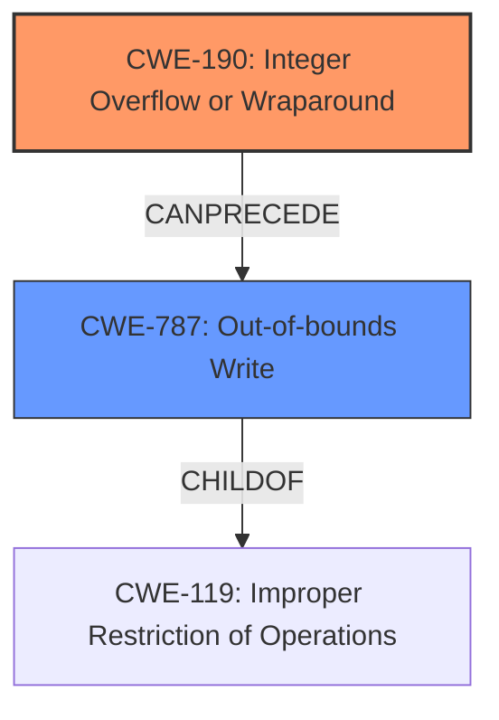

# Analysis Report for CVE-2022-22081

# Vulnerability Analysis Report: CVE-2022-22081

## Description

Memory corruption in audio module due to integer overflow in Snapdragon Auto, Snapdragon Connectivity, Snapdragon Mobile, Snapdragon Wearables

## Vulnerability Description Key Phrases

**Rootcause:** integer overflow
**Weakness:** memory corruption
**Product:** Snapdragon Auto, Snapdragon Connectivity, Snapdragon Mobile, Snapdragon Wearables
**Component:** audio module

## Analysis (with Relationship Data)

# Summary
| CWE ID | CWE Name | Confidence | CWE Abstraction Level | CWE Vulnerability Mapping Label | CWE-Vulnerability Mapping Notes |
|---|---|---|---|---|---|
| CWE-190 | Integer Overflow or Wraparound | 0.9 | Base | Allowed | Primary CWE |
| CWE-119 | Improper Restriction of Operations within the Bounds of a Memory Buffer | 0.6 | Class | Allowed-with-Review | Secondary CWE |

## Evidence and Confidence

*   **Confidence Score:** 0.75
*   **Evidence Strength:** MEDIUM

- **Analysis and Justification:**  
  - *Explanation:* The vulnerability description explicitly states that the root cause is an **integer overflow** in the audio module of Snapdragon products, leading to **memory corruption**. This directly aligns with the description of CWE-190 (Integer Overflow or Wraparound), where a calculation produces an integer overflow or wraparound. Since the overflow leads to **memory corruption**, it can be inferred that the overflowed value is then used in a context that leads to out-of-bounds memory access. While the description doesn't provide the exact mechanism of how the overflow leads to memory corruption, the presence of memory corruption suggests an issue related to memory buffer handling, making CWE-119 a possible secondary weakness. However, without more information, it is difficult to be more specific.
  
  - *Relationship Analysis:* CWE-190 is a Base level CWE. CWE-119 is a parent of several buffer overflow variants, however, is still a more general Class level CWE.

- **Confidence Score:**  
  - Confidence: 0.9 (High confidence due to the explicit mention of "integer overflow" as the root cause.)

---

## Criticism of Analysis

Okay, I've reviewed the analysis against the provided CWE specifications. Here's a breakdown of my critique:

**Overall Assessment:**

The analysis is generally good, and the primary CWE-190 assignment is correct. The justification is logical. The addition of CWE-119 is also reasonable, given the indication of memory corruption, but could be more precise. The Confidence score of 0.9 for CWE-190 seems appropriate given the explicit mention of "integer overflow".

**Detailed Critique:**

*   **CWE-190: Integer Overflow or Wraparound**

    *   **Assessment:** This is the correct primary weakness. The vulnerability description mentions "integer overflow" as the root cause.
    *   **Confidence:** Justified at 0.9.
    *   **Mapping Guidance:** The analysis correctly follows the guidance for CWE-190, noting that it is a Base-level CWE and appropriate for mapping to root causes.  The terminology note is also important, as "overflow" can be ambiguous.
    *   **Mitigations:** The analysis does not mention mitigations, but this is not required. However, it is worth noting that mitigations for CWE-190 often involve careful input validation, range checking, and using safer integer handling libraries.
    *   **Observed Examples:** Good that the analyst provided Observed Examples.

*   **CWE-119: Improper Restriction of Operations within the Bounds of a Memory Buffer**

    *   **Assessment:** As stated previously, a reasonable secondary CWE. However, CWE-119 is a very broad Class-level CWE. While memory corruption *implies* some kind of out-of-bounds memory access, this could be made more specific. It would be better to map to one of CWE-119's children, *if* the information is available. Given that we are only told that there is "memory corruption", it's difficult to be more specific.
    *   **Confidence:** The confidence score of 0.6 reflects the indirect evidence.
    *   **Mapping Guidance:** The analysis correctly notes that CWE-119 is a higher-level CWE and that lower-level CWEs *should* be used.
    *   **Mitigations:** The analysis does not mention mitigations, but this is not required.
    *   **Possible alternatives/children of CWE-119:** Given the information, if we had to choose a child, it'd likely be CWE-787: Out-of-bounds Write or CWE-125: Out-of-bounds Read. CWE-131: Incorrect Calculation of Buffer Size is also a possibility, though less likely given the direct mention of Integer Overflow.

**Recommendations for Improvement:**

1.  **Specificity of Secondary CWE:** While CWE-119 is not *incorrect*, it would be beneficial to investigate if a more specific child of CWE-119 can be determined.  This would involve asking questions like:
    *   Is the memory corruption due to writing beyond the buffer (overflow) or reading beyond it (overread)?
    *   Is the buffer on the heap or the stack?
    *   Is there a calculation of the buffer size that is incorrect?
    In the absence of this detail, CWE-119 is acceptable, but a note indicating the *attempt* to find a more specific CWE would be valuable.

2.  **Chain Considerations:** The analysis could explicitly state that the vulnerability likely involves a *chain* of weaknesses: CWE-190 *leading to* (likely) CWE-787, CWE-125, or other memory corruption issues.

3.  **Consider "CWE-680: Integer Overflow to Buffer Overflow"**: This is a Composite CWE that describes the combination of CWE-190 leading to a buffer overflow more precisely. However, it is a discouraged CWE, so the analysis is correct in not using it.

4.  **Consider other retrievers' results:** Look at the other CWEs suggested by the retriever results and see if any of them might be a better fit for the secondary CWE. For example:

    *   CWE-822: Untrusted Pointer Dereference - Is the overflow being caused by a pointer being dereferenced outside of its valid location due to the integer overflow?
    *   CWE-131: Incorrect Calculation of Buffer Size - Did the integer overflow lead to an incorrect calculation of the size of the buffer, which caused the overflow?
    *   CWE-823: Use of Out-of-range Pointer Offset - Is the integer overflow causing the offset of a pointer to be out of range?
    *   CWE-1285: Improper Validation of Specified Index, Position, or Offset in Input - Is a user-provided index, position, or offset not validated, which causes an out-of-bounds write when combined with the integer overflow?
    *   CWE-367: Time-of-check Time-of-use (TOCTOU) Race Condition - This is unlikely, but was suggested. There's no indication of a race condition here.
    *   CWE-787: Out-of-bounds Write - If the memory corruption is caused by writing outside of allocated memory, this would be a better fit than CWE-119.
    *   CWE-126: Buffer Over-read - If the memory corruption is caused by *reading* outside of allocated memory, this would be a better fit than CWE-119.
    *   CWE-1314: Missing Write Protection for Parametric Data Values - This is unlikely, but was suggested. There's no indication of missing write protection.
    *   CWE-122: Heap-based Buffer Overflow - If the overflow happened on the heap, this could be used, but its usage is discouraged if CWE-787 (more general) applies.

**Revised Summary Table (with potential improvements)**

| CWE ID | CWE Name | Confidence | CWE Abstraction Level | CWE Vulnerability Mapping Label | CWE-Vulnerability Mapping Notes |
|---|---|---|---|---|---|
| CWE-190 | Integer Overflow or Wraparound | 0.9 | Base | Allowed | Primary CWE |
| CWE-787 | Out-of-bounds Write | 0.6 | Base | Allowed-with-Review | Secondary CWE, caused by overflow. Review needed if it's a read instead of a write |
|CWE-119|Improper Restriction of Operations within the Bounds of a Memory Buffer| 0.4 | Class | Allowed-with-Review|Alternative Secondary CWE (only if R/W is not known). General memory corruption|

**In conclusion,** the analysis is sound, but could benefit from greater specificity in the secondary CWE assignment, if possible. A more thorough investigation of the mechanism by which the integer overflow leads to memory corruption would allow for a more precise classification. Also, consider the implications of the top combined results from the Retriever, but remember to only use the CWEs that apply.

## Final Resolution

# Summary
| CWE ID | CWE Name | Confidence | CWE Abstraction Level | CWE Vulnerability Mapping Label | CWE-Vulnerability Mapping Notes |
|---|---|---|---|---|---|
| CWE-190 | Integer Overflow or Wraparound | 0.9 | Base | Allowed | Primary CWE |
| CWE-787 | Out-of-bounds Write | 0.7 | Base | Allowed | Secondary CWE |

## Evidence and Confidence

*   **Confidence Score:** 0.8
*   **Evidence Strength:** MEDIUM

## Relationship Analysis
The primary weakness is **CWE-190 (Integer Overflow or Wraparound)**, a Base level CWE. The secondary weakness is **CWE-787 (Out-of-bounds Write)**, also a Base level CWE. **CWE-787** is a child of **CWE-119 (Improper Restriction of Operations within the Bounds of a Memory Buffer)**. The relationship between **CWE-190** and **CWE-787** is that an integer overflow can *CanPrecede* an out-of-bounds write. This chain relationship is important in understanding how the vulnerability manifests.

## Vulnerability Chain
The vulnerability chain starts with **CWE-190 (Integer Overflow or Wraparound)**, where a calculation results in a value exceeding the maximum allowed, leading to wraparound. This overflowed value is then used, without proper validation, as an index or size parameter in a memory operation, leading to **CWE-787 (Out-of-bounds Write)**, which results in memory corruption. The root cause is the integer overflow, and the impact is memory corruption via an out-of-bounds write.

## Summary of Analysis
The initial analysis correctly identified **CWE-190 (Integer Overflow or Wraparound)** as the primary **ROOTCAUSE**. The criticism suggested that **CWE-119 (Improper Restriction of Operations within the Bounds of a Memory Buffer)**, the secondary CWE, was too general and that a more specific child of **CWE-119** would be preferable.

The vulnerability description states: "Memory corruption in audio module due to integer overflow".

Given that the overflow directly leads to memory corruption, it is reasonable to infer that the overflowed value is used in a memory access operation. The criticism correctly points out that **CWE-787 (Out-of-bounds Write)** is a more specific and appropriate choice than **CWE-119**. While the description doesn't specify whether it's a read or write, the term "corruption" suggests a write operation. Therefore, **CWE-787** is chosen as the secondary CWE.

**CWE-680 (Integer Overflow to Buffer Overflow)** was considered but rejected because it is a discouraged CWE.

The final decision is to classify the vulnerability as **CWE-190** leading to **CWE-787**. This provides a more accurate and specific representation of the vulnerability based on the available evidence and the relationships between the CWEs. The confidence score is slightly increased to 0.7 for CWE-787 due to the stronger inference that an out-of-bounds write is occurring based on the term "memory corruption." The overall confidence is 0.8.

*Report generated on 2025-03-18 10:09:06*
