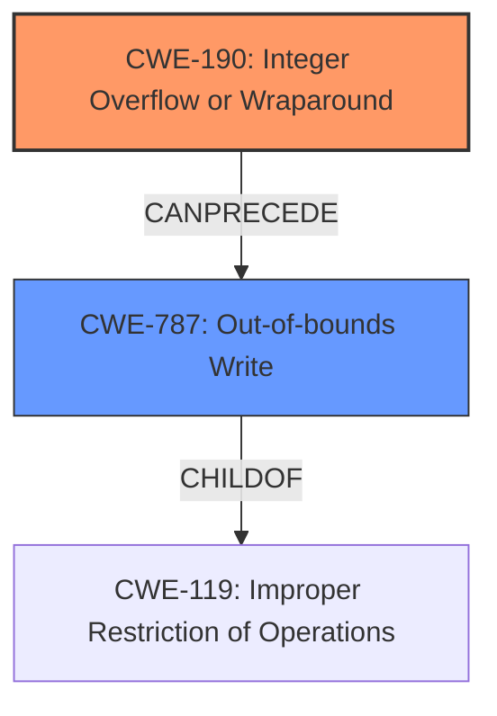

# Final Resolution for CVE-2022-22081

# Summary
| CWE ID | CWE Name | Confidence | CWE Abstraction Level | CWE Vulnerability Mapping Label | CWE-Vulnerability Mapping Notes |
|---|---|---|---|---|---|
| CWE-190 | Integer Overflow or Wraparound | 0.9 | Base | Allowed | Primary CWE |
| CWE-787 | Out-of-bounds Write | 0.7 | Base | Allowed | Secondary CWE |

## Evidence and Confidence

*   **Confidence Score:** 0.8
*   **Evidence Strength:** MEDIUM

## Relationship Analysis
The primary weakness is **CWE-190 (Integer Overflow or Wraparound)**, a Base level CWE. The secondary weakness is **CWE-787 (Out-of-bounds Write)**, also a Base level CWE. **CWE-787** is a child of **CWE-119 (Improper Restriction of Operations within the Bounds of a Memory Buffer)**. The relationship between **CWE-190** and **CWE-787** is that an integer overflow can *CanPrecede* an out-of-bounds write. This chain relationship is important in understanding how the vulnerability manifests.

## Vulnerability Chain
The vulnerability chain starts with **CWE-190 (Integer Overflow or Wraparound)**, where a calculation results in a value exceeding the maximum allowed, leading to wraparound. This overflowed value is then used, without proper validation, as an index or size parameter in a memory operation, leading to **CWE-787 (Out-of-bounds Write)**, which results in memory corruption. The root cause is the integer overflow, and the impact is memory corruption via an out-of-bounds write.

## Summary of Analysis
The initial analysis correctly identified **CWE-190 (Integer Overflow or Wraparound)** as the primary **ROOTCAUSE**. The criticism suggested that **CWE-119 (Improper Restriction of Operations within the Bounds of a Memory Buffer)**, the secondary CWE, was too general and that a more specific child of **CWE-119** would be preferable.

The vulnerability description states: "Memory corruption in audio module due to integer overflow".

Given that the overflow directly leads to memory corruption, it is reasonable to infer that the overflowed value is used in a memory access operation. The criticism correctly points out that **CWE-787 (Out-of-bounds Write)** is a more specific and appropriate choice than **CWE-119**. While the description doesn't specify whether it's a read or write, the term "corruption" suggests a write operation. Therefore, **CWE-787** is chosen as the secondary CWE.

**CWE-680 (Integer Overflow to Buffer Overflow)** was considered but rejected because it is a discouraged CWE.

The final decision is to classify the vulnerability as **CWE-190** leading to **CWE-787**. This provides a more accurate and specific representation of the vulnerability based on the available evidence and the relationships between the CWEs. The confidence score is slightly increased to 0.7 for CWE-787 due to the stronger inference that an out-of-bounds write is occurring based on the term "memory corruption." The overall confidence is 0.8.