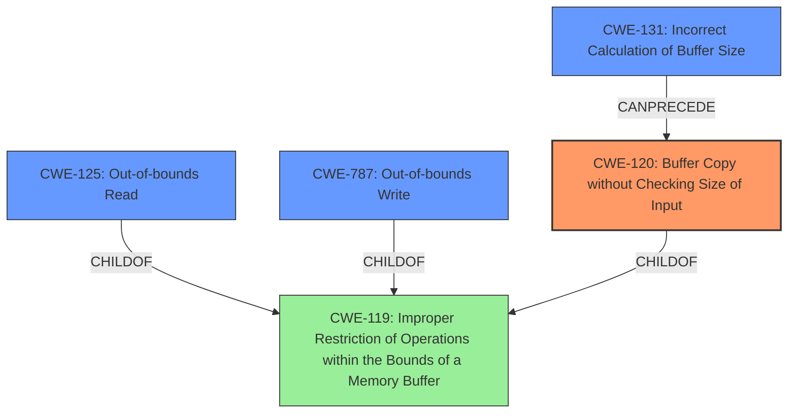

# Analysis Report for CVE-2022-22088

# Vulnerability Analysis Report: CVE-2022-22088

## Description

Memory corruption in Bluetooth HOST due to buffer overflow while parsing the command response received from remote

## Vulnerability Description Key Phrases

**Rootcause:** buffer overflow
**Impact:** memory corruption
**Vector:** parsing the command response
**Product:** Bluetooth HOST

## Analysis (with Relationship Data)

# Summary
| CWE ID | CWE Name | Confidence | CWE Abstraction Level | CWE Vulnerability Mapping Label | CWE-Vulnerability Mapping Notes |
|---|---|---|---|---|---|
| CWE-120 | Buffer Copy without Checking Size of Input ('Classic Buffer Overflow') | 0.75 | Base | Primary | Allowed-with-Review |
| CWE-125 | Out-of-bounds Read | 0.5 | Base | Secondary | Allowed |
| CWE-787 | Out-of-bounds Write | 0.5 | Base | Secondary | Allowed |
| CWE-131 | Incorrect Calculation of Buffer Size | 0.4 | Base | Secondary | Allowed |

## Evidence and Confidence

*   **Confidence Score:** 0.7
*   **Evidence Strength:** MEDIUM

- **Analysis and Justification:**  
  - *Explanation:* The vulnerability description explicitly states a "**buffer overflow**" occurs while parsing a command response from a remote Bluetooth host. CWE-120 (Buffer Copy without Checking Size of Input) is a strong candidate because it addresses classic buffer overflows where input size isn't validated before copying, potentially writing past buffer boundaries. The description doesn't provide details on the type of buffer allocation, so a heap or stack overflow isn't specified. Given the potential for both reading and writing out of bounds, CWE-125 (Out-of-bounds Read) and CWE-787 (Out-of-bounds Write) are also considered as contributing weaknesses. The **buffer overflow** root cause suggests a memory corruption issue, which is consistent with the vulnerability description. CWE-131 is considered because the **buffer overflow** may be caused by incorrect calculation of the **buffer** size.

  - *Relationship Analysis:* CWE-120 is a base-level CWE with relationships to CWE-119 (Improper Restriction of Operations within the Bounds of a Memory Buffer). CWE-125 and CWE-787 are children of CWE-119. CWE-120 can precede CWE-456 (Missing Initialization) and CWE-416 (Use After Free) as the overflow may corrupt memory used later. The MITRE mapping guidance for CWE-120 is "Allowed-with-Review" because it can be misused, but it's appropriate here as the **buffer overflow** involves copying without size checks.

- **Confidence Score:**  
  - *Example:* Confidence: 0.75 (Based on the explicit mention of "**buffer overflow**" and the lack of more specific details about buffer allocation type.)
---

## Criticism of Analysis

Okay, let's review the provided CWE analysis.

**Overall Assessment:**

The analysis is generally well-reasoned and provides a good justification for the primary CWE-120 assignment. The inclusion of secondary CWEs (125, 787, 131) also demonstrates a good understanding of the potential contributing factors to the vulnerability. However, there's room for improvement, particularly in considering more specific CWEs and addressing the "Usage: Discouraged" guidance for CWE-119.

**Detailed Review:**

*   **CWE-120: Buffer Copy without Checking Size of Input ('Classic Buffer Overflow') - Primary**

    *   **Confidence:** 0.75
    *   **Justification:**
        *   The reasoning is sound. The vulnerability description explicitly mentions a "buffer overflow," and CWE-120 directly addresses the classic scenario of copying data without input size validation.
        *   The explanation of why a heap or stack overflow isn't *specified* (due to lack of details in the original description) is appropriate.
        *   The usage of CWE-120 is marked "Allowed-with-Review," which is appropriate. The analysis acknowledges this and correctly identifies the limitations, noting the need to ensure a "Buffer Copy" operation is actually present.

    *   **Suggestions:**
        *   **Strengthen the justification:** While acknowledging the lack of details, it might be helpful to explicitly state what would cause the confidence score to increase (e.g., knowledge of the specific API calls used to copy the data, confirmation that no length checks are used).
        *   Mention specifically why the other possible Base CWEs in the Retriever Results aren't as useful:
            *   CWE-190: Integer Overflow or Wraparound: While an integer overflow *could* theoretically lead to a buffer overflow (if used to calculate buffer size), the core problem is copying data without checking the size, which more directly fits CWE-120.
            *   CWE-770: Allocation of Resources Without Limits or Throttling: This is less relevant if the *allocation* itself isn't the problem, but rather the uncontrolled *copying* of data into an already allocated buffer.

*   **CWE-125: Out-of-bounds Read - Secondary**
    *   **Confidence:** 0.5
    *   **Justification:**
        *   Reasonable given that a buffer overflow often *implies* the possibility of reading data beyond the allocated boundary.
        *   Good connection to CWE-119's children

    *   **Suggestions:**
        *   Elaborate on the potential scenario where an out-of-bounds read *might* occur. For example, "If the parsing logic attempts to access data past the end of the buffer due to incorrect size calculation, CWE-125 could be present."  Even though there's no direct evidence, this strengthens the argument for its inclusion as a secondary CWE.

*   **CWE-787: Out-of-bounds Write - Secondary**
    *   **Confidence:** 0.5
    *   **Justification:** Justification is sound as it directly corresponds to the **buffer overflow** root cause from the original analyzer input.
    *   **Suggestions:** None

*   **CWE-131: Incorrect Calculation of Buffer Size - Secondary**
    *   **Confidence:** 0.4
    *   **Justification:** Plausible, as a faulty calculation of buffer size could lead to an overflow if less memory is allocated than needed.
    *   **Suggestions:**
        *   The link between "parsing the command response" and "incorrect calculation of buffer size" could be strengthened. Does the parsing logic *itself* involve size calculations that might be flawed? Or is it just about the initial buffer allocation? Clarifying this would improve the confidence.

**General Improvements:**

*   **Address CWE-119 Guidance:** The analysis correctly notes the relationship between CWE-120, CWE-125, and CWE-787 as children of CWE-119. *However*, it needs to explicitly address the "Usage: Discouraged" guidance for CWE-119. The analysis needs to state *why* it is *not* using CWE-119 as the primary CWE. This is crucial because the Retriever Results explicitly selected CWE-119.  A statement like, "While CWE-119 (Improper Restriction of Operations within the Bounds of a Memory Buffer) is a parent of these more specific CWEs, it is deliberately not chosen as the primary CWE because the available information allows for a more precise mapping to CWE-120, CWE-125, and CWE-787. CWE-119 is discouraged for use in low-information vulnerability reports when lower-level CWEs could be used."
*   **Consider CWE-1285:** The Retriever Results include CWE-1285, "Improper Validation of Specified Index, Position, or Offset in Input". The analysis *does* mention input validation but doesn't explain why it rejects this option. Include something like, "While CWE-1285 (Improper Validation of Specified Index, Position, or Offset in Input) is relevant in scenarios where an index or offset into a buffer is not properly validated, in this case, the core problem appears to be the *copying* of data into a buffer without any size checks, rather than an issue with the index or offset. Therefore, CWE-120 is a more direct fit."
*   **Chain Weaknesses:** Although not strictly required, exploring potential "chains" of weaknesses, as suggested by some CWE descriptions, could add depth. For example: "A missing size check (CWE-120) could be preceded by a failure to properly sanitize the size parameter in the command response (CWE-20), or an incorrect calculation of the data's expected length in the command response structure (CWE-131)."

**Revised Summary Table:**

| CWE ID  | CWE Name                                                                   | Confidence | CWE Abstraction Level | CWE Vulnerability Mapping Label | CWE-Vulnerability Mapping Notes                                                                                                                                  |
| ------- | -------------------------------------------------------------------------- | ---------- | ----------------------- | ------------------------------- | ---------------------------------------------------------------------------------------------------------------------------------------------------------------- |
| CWE-120 | Buffer Copy without Checking Size of Input ('Classic Buffer Overflow')     | 0.75       | Base                    | Primary                         | Allowed-with-Review                                                                                                                                               |
| CWE-125 | Out-of-bounds Read                                                         | 0.5        | Base                    | Secondary                       | Allowed                                                                                                                                                           |
| CWE-787 | Out-of-bounds Write                                                        | 0.5        | Base                    | Secondary                       | Allowed                                                                                                                                                           |
| CWE-131 | Incorrect Calculation of Buffer Size                                     | 0.4        | Base                    | Secondary                       | Allowed                                                                                                                                                           |

**Key Takeaways:**

*   The analysis demonstrates a good initial understanding.
*   Explicitly addressing the "Usage: Discouraged" guidance for CWE-119 is crucial.
*   Justify *why* other potentially relevant CWEs were *not* selected to show deeper reasoning.
*   Elaborating on potential scenarios for secondary CWEs would strengthen the justification.

By incorporating these suggestions, the analysis can achieve a higher level of confidence and demonstrate a more thorough understanding of the CWE specifications.

## Final Resolution

# Summary
| CWE ID | CWE Name | Confidence | CWE Abstraction Level | CWE Vulnerability Mapping Label | CWE-Vulnerability Mapping Notes |
|---|---|---|---|---|---|
| CWE-120 | Buffer Copy without Checking Size of Input ('Classic Buffer Overflow') | 0.85 | Base | Primary | Allowed-with-Review |
| CWE-787 | Out-of-bounds Write | 0.6 | Base | Secondary | Allowed |
| CWE-125 | Out-of-bounds Read | 0.5 | Base | Secondary | Allowed |
| CWE-131 | Incorrect Calculation of Buffer Size | 0.4 | Base | Secondary | Allowed |

## Evidence and Confidence

*   **Confidence Score:** 0.8
*   **Evidence Strength:** MEDIUM

## Relationship Analysis
The primary CWE, CWE-120 (Buffer Copy without Checking Size of Input), is a base-level CWE. CWE-125 (Out-of-bounds Read) and CWE-787 (Out-of-bounds Write) are both children of CWE-119 (Improper Restriction of Operations within the Bounds of a Memory Buffer). Although CWE-119 is a parent, it's not chosen as primary due to its discouraged usage when more specific CWEs are available. CWE-131 (Incorrect Calculation of Buffer Size) can precede CWE-120 if a flawed size calculation leads to uncontrolled data copying. The relationships reinforce the selection of CWE-120 as the most direct cause, with the others contributing to the overall impact.

## Vulnerability Chain
The vulnerability chain starts with parsing a command response from a remote Bluetooth host. The core **WEAKNESS** is CWE-120 (Buffer Copy without Checking Size of Input), where data is copied without proper size validation. This can be caused by an earlier **ROOTCAUSE** of CWE-131 (Incorrect Calculation of Buffer Size) or a failure to sanitize the size parameter in the command response (CWE-20). This leads to CWE-787 (Out-of-bounds Write), overwriting memory, and potentially CWE-125 (Out-of-bounds Read) if the parsing logic attempts to access data beyond the intended boundary. The ultimate impact is memory corruption, which can lead to unpredictable behavior or a crash.

## Summary of Analysis
The initial analysis correctly identified CWE-120 as the primary **WEAKNESS** based on the "**buffer overflow**" in the vulnerability description. The criticism provided valuable suggestions for strengthening the justification, explicitly addressing the "Usage: Discouraged" guidance for CWE-119, and considering other potentially relevant CWEs like CWE-1284.

Based on the vulnerability description, "**Memory corruption in Bluetooth HOST due to buffer overflow while parsing the command response received from remote**", CWE-120 remains the most appropriate primary classification because the core problem is copying the data without checking the input size.

*   **CWE-120:** The "**buffer overflow**" is the key evidence here. The description specifically points to uncontrolled copying as the issue, aligning directly with CWE-120's definition.
*   **CWE-787:** It is included as a secondary CWE because a **buffer overflow** inherently leads to an out-of-bounds write condition.
*   **CWE-125:** It is included as a secondary CWE because the parsing logic may attempt to access data past the end of the buffer due to incorrect size calculation.
*   **CWE-131:** It is included because a faulty calculation of the **buffer** size could lead to an overflow.

The graph relationships influenced the selection by reinforcing the connection between CWE-120 and its related CWEs (CWE-125 and CWE-787 are children of CWE-119, and CWE-120 is also a child of CWE-119). The abstraction levels were considered, ensuring that the selected CWEs are at the base level for optimal specificity.

The selected CWEs are at the optimal level of specificity because they directly address the root cause and contributing factors of the vulnerability based on the available evidence.

*Report generated on 2025-03-18 10:10:10*
