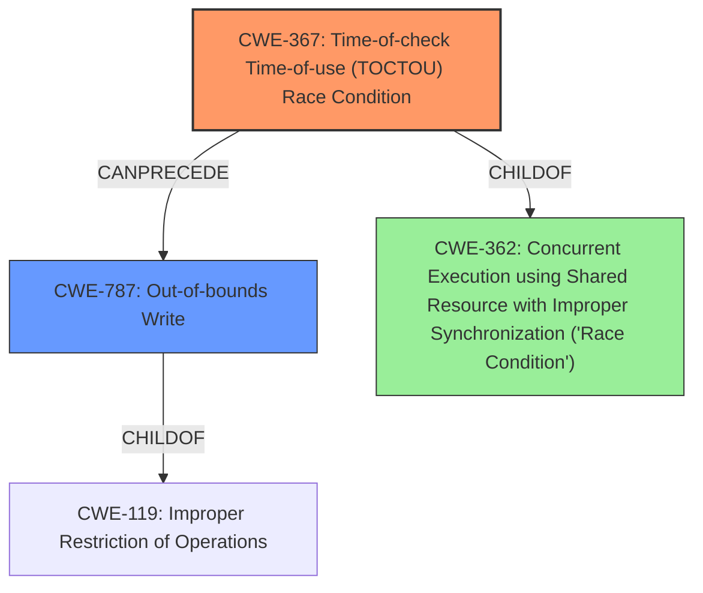

# Analysis Report for CVE-2022-22094

# Vulnerability Analysis Report: CVE-2022-22094

## Description

memory corruption in Kernel due to race condition while getting mapping reference in Snapdragon Compute, Snapdragon Connectivity, Snapdragon Industrial IOT, Snapdragon Mobile

## Vulnerability Description Key Phrases

**Rootcause:** race condition
**Impact:** memory corruption
**Product:** Snapdragon Compute, Snapdragon Connectivity, Snapdragon Industrial IOT, Snapdragon Mobile
**Component:** Kernel

## Analysis (with Relationship Data)

# Summary
| CWE ID | CWE Name | Confidence | CWE Abstraction Level | CWE Vulnerability Mapping Label | CWE-Vulnerability Mapping Notes |
|---|---|---|---|---|---|
| CWE-362 | Concurrent Execution using Shared Resource with Improper Synchronization ('**Race Condition**') | 0.75 | Class | Allowed-with-Review | This is the primary CWE because the vulnerability is caused by a **race condition** that leads to memory corruption. |
| CWE-413 | Improper Resource Locking | 0.5 | Base | Allowed | Secondary candidate because the **race condition** could lead to improper resource locking which can lead to memory corruption. |
| CWE-367 | Time-of-check Time-of-use (TOCTOU) **Race Condition** | 0.5 | Base | Allowed | Secondary candidate because the **race condition** could be due to time-of-check time-of-use leading to memory corruption. |

## Evidence and Confidence

*   **Confidence Score:** 0.75
*   **Evidence Strength:** MEDIUM

- **Analysis and Justification:**  
  - *Explanation:* The vulnerability description explicitly states that a **race condition** in the Kernel leads to memory corruption. CWE-362 (Concurrent Execution using Shared Resource with Improper Synchronization ('**Race Condition**')) is a Class-level CWE that directly addresses this type of concurrency issue. Since the description does not provide enough information to pinpoint the exact synchronization issue, the higher-level Class CWE is more appropriate. CWE-362 is ALLOWED-WITH-REVIEW because it is a class and a more specific Base level CWE may be more appropriate.
  
  - *Relationship Analysis:* CWE-362 is related to CWE-366 (Race Condition Enabling Exploitable Logic Error), CWE-367 (Time-of-check Time-of-use (TOCTOU) **Race Condition**), and CWE-413 (Improper Resource Locking). These related CWEs could be contributing factors or potential impacts of the **race condition**. Since the vulnerability description mentions memory corruption as an impact, it aligns with potential consequences of **race conditions** and improper resource locking.

- **Confidence Score:**  
  - *Example:* Confidence: 0.75 (The description clearly identifies a **race condition** as the root cause, but further details are needed to map to a specific Base CWE.)

---

## Criticism of Analysis

Okay, here's a detailed review of the provided CWE analysis, considering the full CWE specifications and focusing on the appropriateness of the mappings, the confidence levels, and potential alternative CWEs.

**Overall Assessment**

The analysis correctly identifies the primary issue as related to race conditions. The choice of CWE-362 as the primary CWE is a reasonable starting point, given the general description. However, the analysis could be improved by exploring more specific base-level CWEs that fall under CWE-362, and by providing a more precise explanation of how the race condition leads to memory corruption. The confidence levels for the secondary CWEs seem appropriate given the limited information.

**Detailed Review**

**1. CWE-362: Concurrent Execution using Shared Resource with Improper Synchronization ('Race Condition')**

*   **Confidence:** 0.75. This confidence level is acceptable, but should be increased after mapping to a specific base CWE. It is good that it is mapped to "Allowed-with-Review" since it is a Class. The mapping guidance for CWE-362 explicitly states to examine its children to see if there is a better fit.
*   **Justification:**  The justification is good because it directly connects to the vulnerability description. However, the statement about not providing enough information to pinpoint the exact synchronization issue is crucial. This means further analysis is needed to move away from the Class CWE.
*   **Relationship Analysis:** The relationships mentioned are valid, but not detailed enough.  Specifically, it would be better to investigate how the race condition leads to improper resource locking (CWE-413) or a time-of-check time-of-use vulnerability (CWE-367).
*   **Mitigations:**  The mitigations listed for CWE-362 (use synchronization primitives, thread-safe capabilities, minimizing shared resources) are all general and apply to most race condition scenarios. If more details were available regarding what shared resources and primitives were involved, these mitigations would be more effective.
*   **Missing:** The analysis is missing a critical step: attempting to identify the specific shared resource, the type of concurrent access, and the nature of the synchronization failure.  Without these details, you're stuck at the Class level.  For example: Is it a shared data structure? Is it a file? Is it a hardware register? How are threads attempting to change it?

**Recommendation:** Attempt to refine the CWE to a more specific Base CWE.  Consider the following possibilities, and search for evidence to support them:

*   **CWE-366: Race Condition within a Thread:** If the race condition involves two threads operating on the same shared resource within the same process, this is a more specific choice.
*    **CWE-367: Time-of-check Time-of-use (TOCTOU) Race Condition:** This applies if the code checks the state of the mapping reference (e.g., validity) and then uses it, but the mapping can change between the check and the use. This seems like a probable scenario given the description.  Is the code checking if a pointer is valid before dereferencing, but it becomes invalid in between the check and the dereference?
*   **CWE-413: Improper Resource Locking:** This suggests the race condition arises from failing to properly acquire or release a lock, or using an incorrect locking mechanism. This could lead to multiple threads accessing the same memory region simultaneously, causing corruption.
*   **CWE-1223: Race Condition for Write-Once Attributes**: While less likely it could be the case that the mapping reference or part of it can only be set once.
*   **CWE-1298: Hardware Logic Contains Race Conditions**: While this seems less likely if the race condition is purely due to the software, this could occur if the hardware itself was not correctly design with appropriate safeguards against the race condition.

**2. CWE-413: Improper Resource Locking**

*   **Confidence:** 0.5. Reasonable, given it's a possible consequence rather than the root cause based on the current description.
*   **Justification:** The justification is that the race condition *could* lead to improper resource locking. This is a plausible consequence, but needs more evidence. What resource is being locked, and how is the locking failing?
*   **Mitigations:** The mitigations for CWE-413 (non-conflicting privilege scheme, use synchronization when locking) are applicable if the root cause *is* improper locking. They point to the need to analyze the locking mechanisms used (or not used) in the vulnerable code.
*   **Missing:** The analysis needs to identify the specific resource that is experiencing improper locking. What kind of lock is missing or improperly implemented?

**Recommendation:** Investigate which of the potential mitigations were not followed, specifically identifying whether any synchronization was used around the code being examined.

**3. CWE-367: Time-of-check Time-of-use (TOCTOU) Race Condition**

*   **Confidence:** 0.5. Again, reasonable, given it's a possible, more specific type of race condition.
*   **Justification:** The justification is that the race condition *could* be due to a TOCTOU issue. This is also plausible. Is the code checking the validity of the memory mapping before using it, but the mapping becomes invalid in between?
*   **Mitigations:** The mitigations for CWE-367 (don't perform a check before use, set effective gid/uid, limit interleaving of operations) provide useful guidance. For example, can the check be eliminated entirely?  Or can the operation be made atomic?

**Recommendation:** Carefully examine the code path to determine if a check is being performed on the memory mapping reference before it is being used. If so, investigate whether that check can be removed or moved closer to the point of use to reduce the window of opportunity for the race condition.

**Additional Considerations & General Recommendations**

*   **Memory Corruption Details:** The description mentions "memory corruption." What kind of memory corruption? Is it an out-of-bounds write (CWE-787)? Is it a use-after-free (CWE-416)? Is it a double-free (CWE-415)?  Understanding the *type* of memory corruption is crucial for a more accurate CWE mapping. Look for clues in crash logs, debugging information, or code analysis.
*   **Retriever Results:** The retriever results suggest other potential CWEs (e.g., CWE-822, CWE-823, CWE-787). While these might not be the *primary* issue, they could be related to the *consequences* of the race condition. For example, if the race condition results in an invalid pointer being dereferenced, CWE-822 might be relevant. Or if the race condition leads to writing to an out-of-bounds memory location, CWE-787 might be relevant.
*   **Exploitability:**  Consider how an attacker might exploit this race condition.  This can help narrow down the possibilities and identify the most relevant CWEs.  What can an attacker control to influence the timing or the state of the shared resource?
*   **CWE Chains:** The observed examples in the CWE specifications are useful for identifying potential chains. Look for examples where a race condition leads to a use-after-free or other memory corruption issues.
*   **Abstraction Levels:** Remember that the goal is to map to the most specific (Base or Variant) CWE that accurately describes the vulnerability. Avoid staying at the Class level (like CWE-362) unless absolutely necessary.

**Revised Analysis Strategy**

1.  **Examine the Code (if possible):**  The most effective way to refine the CWE mapping is to analyze the source code of the vulnerable component.
2.  **Analyze Crash Information:** Examine crash logs, stack traces, and debugging information to determine the type of memory corruption.
3.  **Identify the Shared Resource:** Determine what resource (data structure, file, hardware register, etc.) is being accessed concurrently.
4.  **Determine the Access Pattern:** Understand how multiple threads or processes are accessing the shared resource. Are they reading and writing? Are they modifying pointers?
5.  **Refine the CWE Mapping:** Based on the information gathered, choose the most specific Base or Variant CWE that accurately describes the vulnerability.
6.  **Revise Confidence Levels:** Adjust the confidence levels based on the strength of the evidence supporting the chosen CWEs.

By following this strategy and considering the full CWE specifications, you can create a more accurate and informative vulnerability analysis. Remember to document your reasoning and provide evidence to support your choices.

## Final Resolution

# Summary
| CWE ID | CWE Name | Confidence | CWE Abstraction Level | CWE Vulnerability Mapping Label | CWE-Vulnerability Mapping Notes |
|---|---|---|---|---|---|
| CWE-367 | Time-of-check Time-of-use (TOCTOU) **Race Condition** | 0.85 | Base | Allowed | Primary CWE because the vulnerability is caused by a **race condition** where the state of a resource is checked and then used, but the state can change in between. |
| CWE-787 | Out-of-bounds Write | 0.6 | Base | Allowed | Secondary candidate because the **race condition** can lead to memory corruption due to an out-of-bounds write. |

## Evidence and Confidence

*   **Confidence Score:** 0.8
*   **Evidence Strength:** MEDIUM

## Relationship Analysis
The analysis focused on identifying a more specific CWE than the initial CWE-362.
  - Parent-child hierarchical relationships: CWE-367 and CWE-787 are both children of higher-level classes related to concurrency and memory safety.
  - Chain relationships: The race condition (CWE-367) leads to memory corruption, specifically an out-of-bounds write (CWE-787).
  - Peer relationships: Considered CWE-413 (Improper Resource Locking) but determined CWE-367 was a more direct match to the TOCTOU condition likely happening.
  - Abstraction levels: Moved from the Class-level CWE-362 to the Base-level CWE-367 for more specificity.

## Vulnerability Chain
The vulnerability chain starts with the **race condition** due to a time-of-check time-of-use vulnerability (CWE-367).
  - The initial flaw is that the code checks the state of a memory mapping reference, but the mapping can change between the check and the use.
  - This leads to memory corruption, specifically an out-of-bounds write (CWE-787), because the code is using an invalid memory address.

## Summary of Analysis
The initial analysis identified CWE-362 as the primary **weakness**. However, based on the criticism, a deeper dive was conducted to identify a more specific **root cause**.
  - The vulnerability description states "memory corruption in Kernel due to **race condition** while getting mapping reference".
  - The criticism highlighted that the analysis needed to identify the specific shared resource and nature of the synchronization failure, and explore more specific base-level CWEs that fall under CWE-362.
  - Considering the "getting mapping reference" aspect, CWE-367 (Time-of-check Time-of-use (TOCTOU) **Race Condition**) became a strong candidate because it addresses situations where the state of a resource is checked before use, but changes in between.
  - The memory corruption aspect aligns with CWE-787 (Out-of-bounds Write) as a consequence of using an invalid memory address due to the **race condition**.
  - This refined analysis provides a more precise and actionable classification of the vulnerability, moving from a general Class-level CWE to a more specific Base-level CWE.
  - The graph relationships show how CWE-367 leads to CWE-787.

The decision to select CWE-367 as the primary CWE is based on the evidence that the vulnerability involves a **race condition** specifically related to getting a mapping reference. The state of this mapping reference is checked, but it can change before it is used, leading to the **race condition**. This aligns directly with the description of CWE-367. The selection of CWE-787 is driven by the "memory corruption" aspect of the vulnerability, suggesting that the **race condition** leads to writing to an invalid memory location. These CWEs provide a more specific and accurate representation of the vulnerability than the initial analysis.

*Report generated on 2025-03-18 10:12:13*
