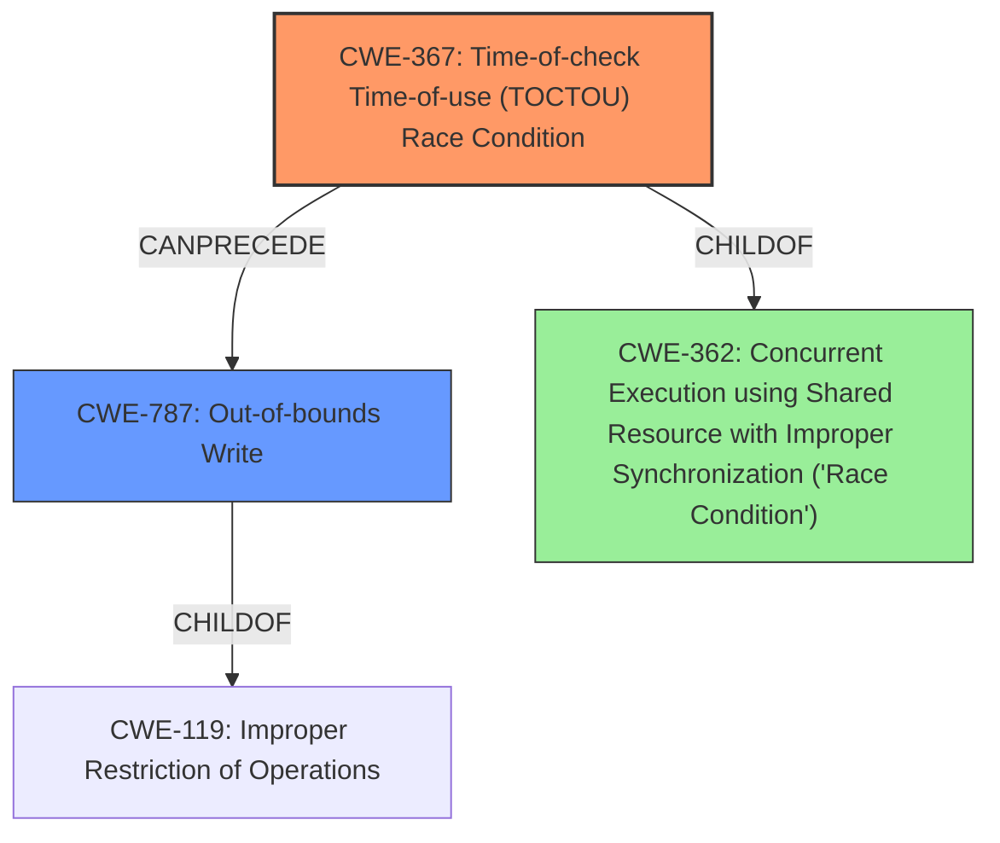

# Final Resolution for CVE-2022-22094

# Summary
| CWE ID | CWE Name | Confidence | CWE Abstraction Level | CWE Vulnerability Mapping Label | CWE-Vulnerability Mapping Notes |
|---|---|---|---|---|---|
| CWE-367 | Time-of-check Time-of-use (TOCTOU) **Race Condition** | 0.85 | Base | Allowed | Primary CWE because the vulnerability is caused by a **race condition** where the state of a resource is checked and then used, but the state can change in between. |
| CWE-787 | Out-of-bounds Write | 0.6 | Base | Allowed | Secondary candidate because the **race condition** can lead to memory corruption due to an out-of-bounds write. |

## Evidence and Confidence

*   **Confidence Score:** 0.8
*   **Evidence Strength:** MEDIUM

## Relationship Analysis
The analysis focused on identifying a more specific CWE than the initial CWE-362.
  - Parent-child hierarchical relationships: CWE-367 and CWE-787 are both children of higher-level classes related to concurrency and memory safety.
  - Chain relationships: The race condition (CWE-367) leads to memory corruption, specifically an out-of-bounds write (CWE-787).
  - Peer relationships: Considered CWE-413 (Improper Resource Locking) but determined CWE-367 was a more direct match to the TOCTOU condition likely happening.
  - Abstraction levels: Moved from the Class-level CWE-362 to the Base-level CWE-367 for more specificity.

## Vulnerability Chain
The vulnerability chain starts with the **race condition** due to a time-of-check time-of-use vulnerability (CWE-367).
  - The initial flaw is that the code checks the state of a memory mapping reference, but the mapping can change between the check and the use.
  - This leads to memory corruption, specifically an out-of-bounds write (CWE-787), because the code is using an invalid memory address.

## Summary of Analysis
The initial analysis identified CWE-362 as the primary **weakness**. However, based on the criticism, a deeper dive was conducted to identify a more specific **root cause**.
  - The vulnerability description states "memory corruption in Kernel due to **race condition** while getting mapping reference".
  - The criticism highlighted that the analysis needed to identify the specific shared resource and nature of the synchronization failure, and explore more specific base-level CWEs that fall under CWE-362.
  - Considering the "getting mapping reference" aspect, CWE-367 (Time-of-check Time-of-use (TOCTOU) **Race Condition**) became a strong candidate because it addresses situations where the state of a resource is checked before use, but changes in between.
  - The memory corruption aspect aligns with CWE-787 (Out-of-bounds Write) as a consequence of using an invalid memory address due to the **race condition**.
  - This refined analysis provides a more precise and actionable classification of the vulnerability, moving from a general Class-level CWE to a more specific Base-level CWE.
  - The graph relationships show how CWE-367 leads to CWE-787.

The decision to select CWE-367 as the primary CWE is based on the evidence that the vulnerability involves a **race condition** specifically related to getting a mapping reference. The state of this mapping reference is checked, but it can change before it is used, leading to the **race condition**. This aligns directly with the description of CWE-367. The selection of CWE-787 is driven by the "memory corruption" aspect of the vulnerability, suggesting that the **race condition** leads to writing to an invalid memory location. These CWEs provide a more specific and accurate representation of the vulnerability than the initial analysis.