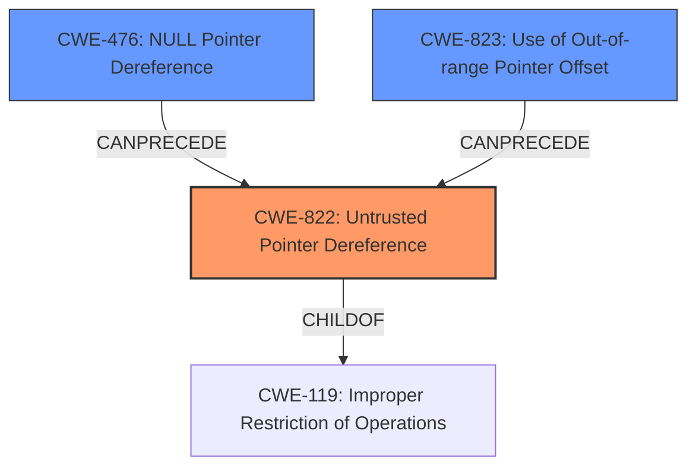

# Final Resolution for CVE-2022-22098

# Summary
| CWE ID  | CWE Name                       | Confidence | CWE Abstraction Level | CWE Vulnerability Mapping Label | CWE-Vulnerability Mapping Notes |
| :------- | :----------------------------- | :--------- | :-------------------- | :------------------------------ | :------------------------------ |
| CWE-822  | **Untrusted Pointer Dereference**  | 0.95       | Base                  | Allowed                         | Primary CWE                     |
| CWE-476 | **NULL Pointer Dereference** | 0.75 | Base | Allowed | Secondary Candidate, potential consequence of untrusted pointer. |
| CWE-823  | **Use of Out-of-range Pointer Offset** | 0.65 | Base | Allowed | Secondary Candidate, If pointer arithmetic used with untrusted pointer, can cause out-of-range memory access. |

## Evidence and Confidence

*   **Confidence Score:** 0.85
*   **Evidence Strength:** HIGH

## Relationship Analysis
The primary CWE is CWE-822 (**Untrusted Pointer Dereference**). CWE-476 (**NULL Pointer Dereference**) is included as a secondary candidate since an untrusted pointer could be NULL. CWE-823 (**Use of Out-of-range Pointer Offset**) is included as a secondary candidate, since the untrusted pointer might be used in pointer arithmetic that leads to an out-of-range access. All three are Base level CWEs which is the preferred level of abstraction. CWE-822 is related to CWE-119 (**Improper Restriction of Operations within the Bounds of a Memory Buffer**) via a CHILDOF relationship, but CWE-822 is more specific.

## Vulnerability Chain
The vulnerability chain starts with an **untrusted pointer** obtained from a socket. The software then dereferences this **untrusted pointer** (CWE-822). This could lead to a **NULL pointer dereference** (CWE-476) if the pointer is NULL. It could also lead to an **out-of-range pointer offset** (CWE-823) if the pointer is used in pointer arithmetic. Both of these could lead to memory corruption.

## Summary of Analysis
The initial analysis correctly identified CWE-822 (**Untrusted Pointer Dereference**) as the primary **weakness**. The vulnerability description explicitly states "untrusted pointer dereference," making this a direct match. The extended description of CWE-822 perfectly aligns with the scenario: "The product obtains a value from an untrusted source, converts this value to a pointer, and dereferences the resulting pointer."

The criticism suggested an example CVE-2008-0062. This example shows a chain of an untrusted value leading to a null pointer dereference, strengthening the justification for including CWE-476.

The criticism suggested that CWE-787 (**Out-of-bounds Write**) should be refined and possibly replaced with CWE-823 (**Use of Out-of-range Pointer Offset**). I agree with this assessment, and I'm replacing CWE-787 with CWE-823.

I'm basing my assessment on the provided evidence. The vulnerability description explicitly mentions "**untrusted pointer dereference**" as the root cause. This directly aligns with CWE-822 (**Untrusted Pointer Dereference**).

The graph relationships influenced my selection by reinforcing that CWE-822 is a base CWE and that the secondary CWEs are potential consequences of the primary CWE.

The selected CWEs are at the optimal level of specificity because they are all base-level CWEs.