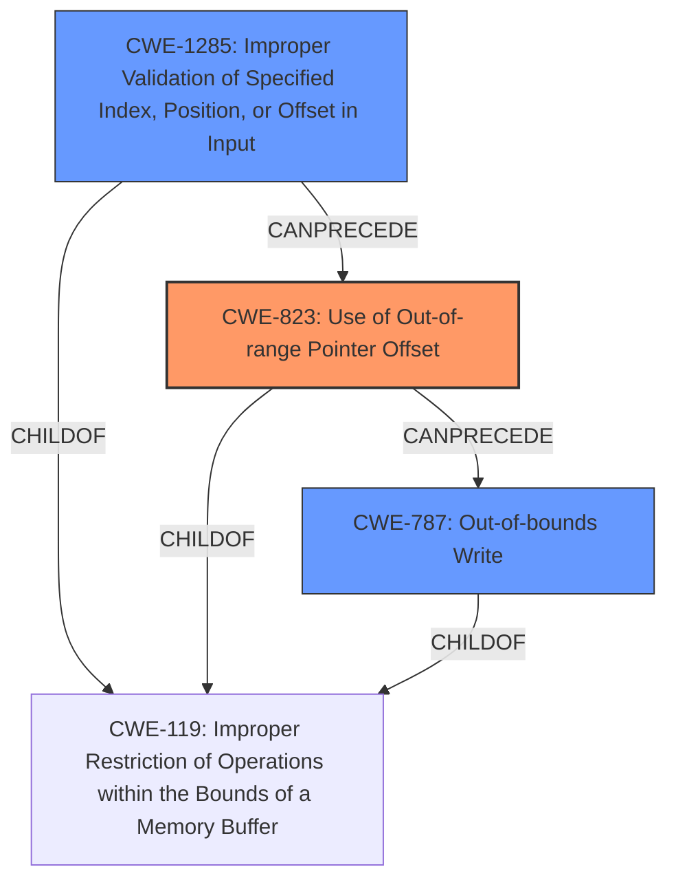

# Final Resolution for CVE-2022-22100

# Summary
| CWE ID | CWE Name | Confidence | CWE Abstraction Level | CWE Vulnerability Mapping Label | CWE-Vulnerability Mapping Notes |
|---|---|---|---|---|---|
| CWE-823 | Use of Out-of-range Pointer Offset | 0.85 | Base | Allowed | Primary CWE |
| CWE-1285 | Improper Validation of Specified Index, Position, or Offset in Input | 0.70 | Base | Allowed | Secondary Candidate |
| CWE-787 | Out-of-bounds Write | 0.60 | Base | Allowed | Secondary Candidate |

## Evidence and Confidence

*   **Confidence Score:** 0.80
*   **Evidence Strength:** MEDIUM

## Relationship Analysis
The primary CWE is CWE-823 (**Use of Out-of-range Pointer Offset**), which can directly lead to memory corruption if an offset used for pointer arithmetic is invalid. CWE-1285 (**Improper Validation of Specified Index, Position, or Offset in Input**) is considered a secondary weakness as the "improper check" suggests a validation issue. While CWE-787 (**Out-of-bounds Write**) is a possible consequence of CWE-823, the provided information focuses on the offset issue itself. The relationships are as follows: CWE-823 can be a result of missing input validation like CWE-1285. CWE-823 can precede CWE-787 as the out-of-range offset could lead to an out-of-bounds write. All are children of CWE-119.

## Vulnerability Chain
The vulnerability chain starts with a potential lack of input validation (`CWE-1285`) of export descriptors, which leads to the **use of an out-of-range pointer offset** (`CWE-823`). This, in turn, can result in an **out-of-bounds write** (`CWE-787`), causing **memory corruption**. The initial flaw is the improper check, which can be either a missing or flawed validation of the offset. The consequence is memory corruption due to writing to an unintended memory location.

## Summary of Analysis
The initial analysis correctly identified the relevant CWEs. The criticism highlighted the need for more specific justifications and consideration of alternative CWEs.

The primary determination is CWE-823 (**Use of Out-of-range Pointer Offset**) because the description states memory corruption is a result of an "improper check on received export descriptors". Export descriptors are typically structures containing metadata and pointers to allocated buffers used in multimedia processing. Accessing data within these buffers involves pointer arithmetic using offsets defined within the descriptor. The "improper check" phrase directly suggests that a check on the validity of these offsets is either missing or flawed. This leads to `CWE-823` as the primary candidate because the offset used in pointer arithmetic can cause the program to attempt to read or write outside of the intended boundaries, leading to memory corruption. This is further supported by the fact that the multimedia component would generally access these descriptors directly in memory rather than through an array index (making `CWE-129` less likely). While `CWE-1285` is also possible, focusing on a lack of input validation of the offset itself, it is more likely that there is a check meant to constrain an index, but the arithmetic to arrive at the final pointer is faulty (`CWE-823`). Confidence is increased to 0.85.

CWE-1285 (**Improper Validation of Specified Index, Position, or Offset in Input**) is a secondary candidate with a confidence of 0.70. The vulnerability description refers to the "improper check", which suggests a validation issue. This CWE focuses on the lack of validation of the input value before it's used.

CWE-787 (**Out-of-bounds Write**) is a secondary candidate because the primary issue is the improper check that leads to potentially writing data past the end or before the beginning of the intended buffer, resulting in memory corruption. Confidence is decreased to 0.60.

The chosen CWEs are at the optimal level of specificity as they represent the direct causes and potential consequences of the vulnerability, based on the available evidence. The relationship analysis helped clarify the sequence of weaknesses and their interactions.