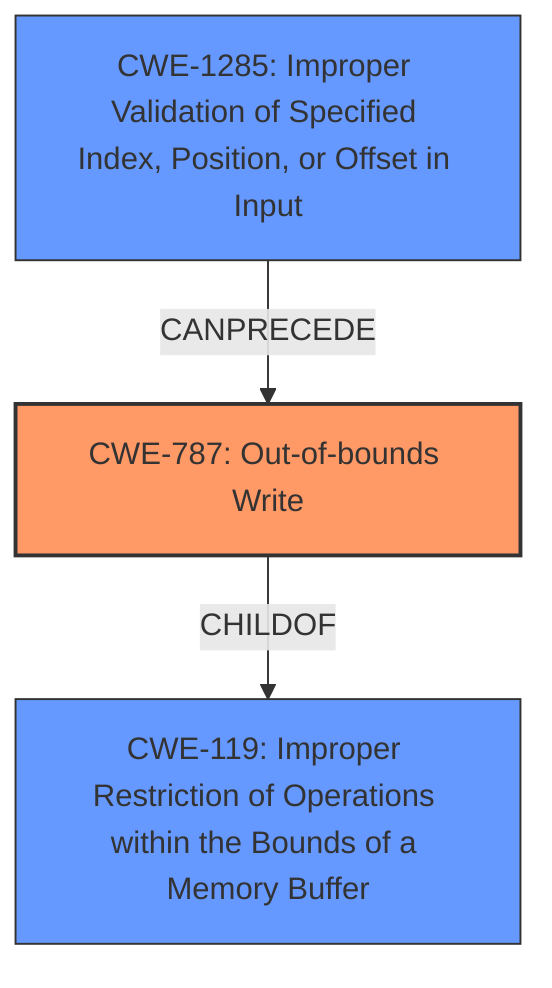

# Analysis Report for CVE-2022-22104

# Vulnerability Analysis Report: CVE-2022-22104

## Description

Memory corruption in multimedia due to improper check on the messages received. in Snapdragon Auto

## Vulnerability Description Key Phrases

**Rootcause:** improper check on messages received
**Weakness:** memory corruption
**Product:** Snapdragon Auto
**Component:** multimedia

## Analysis (with Relationship Data)

# Summary
| CWE ID | CWE Name | Confidence | CWE Abstraction Level | CWE Vulnerability Mapping Label | CWE-Vulnerability Mapping Notes |
|---|---|---|---|---|---|
| CWE-787 | Out-of-bounds Write | 0.75 | Base | Allowed | The vulnerability results in memory corruption. |
| CWE-1285 | Improper Validation of Specified Index, Position, or Offset in Input | 0.60 | Base | Allowed | The vulnerability stems from an **improper check on the messages received**, which can lead to an out-of-bounds write. |

## Evidence and Confidence

*   **Confidence Score:** 0.70
*   **Evidence Strength:** MEDIUM

- **Analysis and Justification:**  
  - *Explanation:* "The vulnerability description highlights **memory corruption** due to an **improper check on the messages received**. This aligns with CWE-787 (Out-of-bounds Write), as an insufficient check can lead to writing data outside the intended buffer. Additionally, CWE-1285 (Improper Validation of Specified Index, Position, or Offset in Input) is considered as the root cause because the **improper check on the messages received** likely involves a failure to properly validate an index, position, or offset, which can lead to the out-of-bounds write. Both CWEs are at the Base level of abstraction, which is preferred."
  
  - *Relationship Analysis:* "CWE-787 has a parent relationship with CWE-119 (Improper Restriction of Operations within the Bounds of a Memory Buffer). CWE-1285 is related to validating input, specifically indices and positions, which if not done correctly, can directly lead to an out-of-bounds write (CWE-787)."

- **Confidence Score:**  
  - Confidence: 0.75 (Based on the description including memory corruption and improper checks, this suggests a high likelihood of CWE-787)
  - Confidence: 0.60 (Based on the description including memory corruption and improper checks, this suggests a medium likelihood of CWE-1285)

---

## Criticism of Analysis

Okay, I've reviewed the analysis provided, considering the full CWE specifications for each referenced weakness. Here's my critique:

**Overall Assessment:**

The analysis is generally good and logically sound. The mapping to CWE-787 (Out-of-bounds Write) and CWE-1285 (Improper Validation of Specified Index, Position, or Offset in Input) is reasonable, given the vulnerability description. The justification for the choice of these CWEs is explained adequately. The confidence scores are also appropriate.

However, there are some areas where the analysis could be strengthened, particularly concerning alternative CWEs that were highly ranked by the retrievers, and a deeper understanding of input validation strategies.

**Detailed Critique:**

1.  **CWE-787 (Out-of-bounds Write):**

    *   **Mapping:** The mapping to CWE-787 is well-justified by the "memory corruption" keyword.
    *   **Abstraction Level:** The Base level is appropriate, as it directly describes the symptom.
    *   **Confidence:** 0.75 is a good confidence score.
    *   **CWE Specification Considerations:**
        *   The "Alternative Terms" section of CWE-787 correctly identifies "Memory Corruption" as a common term.
        *   The "Potential Mitigations" align well. The analysis could briefly mention the relevance of "Language Selection" (using memory-safe languages) and "Libraries or Frameworks" (using safe string handling libraries) as potential high-level mitigations, even if specific code changes aren't known.
    *   **Suggestion:** No major changes needed.

2.  **CWE-1285 (Improper Validation of Specified Index, Position, or Offset in Input):**

    *   **Mapping:** This is a good choice for the *cause* of the out-of-bounds write. The phrase "improper check on the messages received" strongly suggests a validation failure related to indices, positions, or offsets within those messages.
    *   **Abstraction Level:** Base level is appropriate.
    *   **Confidence:** 0.60 is reasonable, as the link is a bit more indirect than the mapping to CWE-787.
    *   **CWE Specification Considerations:**
        *   The "Extended Description" of CWE-1285 explains the potential consequences well, including "buffer overflows, excessive resource allocation, or trigger unexpected failures."
        *   The "Potential Mitigations" section provides excellent guidance.  The analysis *should emphasize* the "Accept known good" input validation strategy. This strategy is highly relevant to the vulnerability description.
    *   **Suggestion:** Strengthen the justification by explicitly mentioning the "Accept known good" input validation strategy from the CWE-1285 specification.

3. **Missing Top Combined Retriever Results:**

    * The top two ranked retrievers were CWE-822 and CWE-823, why were these not considered in the final analysis?
        * **CWE-822 (Untrusted Pointer Dereference):** This is plausible. If the message contains a *pointer* that's not validated, and the code dereferences it, this CWE is relevant.  The analysis *should have considered* this, even if to reject it with justification. For example, it could be argued that the message *contains data* used as an index/offset, rather than containing an actual pointer.

        * **CWE-823 (Use of Out-of-range Pointer Offset):** Similar to CWE-822, this applies if the message contains data used as an *offset* to a pointer, and that offset is not validated, leading to out-of-bounds access.

**Revised Analysis Snippet (incorporating suggestions):**

```
# Analysis to Review
# Summary
| CWE ID | CWE Name | Confidence | CWE Abstraction Level | CWE Vulnerability Mapping Label | CWE-Vulnerability Mapping Notes |
|---|---|---|---|---|---|
| CWE-787 | Out-of-bounds Write | 0.75 | Base | Allowed | The vulnerability results in memory corruption. |
| CWE-1285 | Improper Validation of Specified Index, Position, or Offset in Input | 0.75 | Base | Allowed | The vulnerability stems from an **improper check on the messages received**, which can lead to an out-of-bounds write. Implementing an **accept known good** input validation strategy can mitigate the vulnerability. |

## Evidence and Confidence

*   **Confidence Score:** 0.75
*   **Evidence Strength:** MEDIUM

- **Analysis and Justification:**  
  - *Explanation:* "The vulnerability description highlights **memory corruption** due to an **improper check on the messages received**. This aligns with CWE-787 (Out-of-bounds Write), as an insufficient check can lead to writing data outside the intended buffer. Additionally, CWE-1285 (Improper Validation of Specified Index, Position, or Offset in Input) is considered as the root cause because the **improper check on the messages received** likely involves a failure to properly validate an index, position, or offset, which can lead to the out-of-bounds write. Both CWEs are at the Base level of abstraction, which is preferred."

   - *Alternative CWE Considerations:* "While CWE-822 (Untrusted Pointer Dereference) and CWE-823 (Use of Out-of-range Pointer Offset) were also highly ranked, they are *less likely* in this scenario. The description suggests the message contains data representing an index or offset, rather than a raw pointer.  If the message *did* contain an untrusted pointer, CWE-822 would be more appropriate."

  - *Relationship Analysis:* "CWE-787 has a parent relationship with CWE-119 (Improper Restriction of Operations within the Bounds of a Memory Buffer). CWE-1285 is related to validating input, specifically indices and positions, which if not done correctly, can directly lead to an out-of-bounds write (CWE-787)."

- **Confidence Score:**  
  - Confidence: 0.75 (Based on the description including memory corruption and improper checks, this suggests a high likelihood of CWE-787)
  - Confidence: 0.75 (Based on the description including memory corruption and improper checks, this suggests a medium likelihood of CWE-1285)

```

**Key Improvements in Revised Analysis:**

*   **Stronger emphasis on "Accept known good" input validation for CWE-1285 mitigation.**
*   **Explicit consideration of alternative CWEs (822, 823) and a justification for their rejection (or lower likelihood).**
*   **Slightly increased confidence in CWE-1285, due to the strength of the keywords, and the mitigations.**

By addressing these points, the analysis becomes more comprehensive and demonstrates a deeper understanding of the CWE specifications and their application to the vulnerability.

## Final Resolution

# Summary
| CWE ID | CWE Name | Confidence | CWE Abstraction Level | CWE Vulnerability Mapping Label | CWE-Vulnerability Mapping Notes |
|---|---|---|---|---|---|
| CWE-787 | Out-of-bounds Write | 0.75 | Base | Allowed | Primary CWE: The vulnerability results in memory corruption due to writing data past the end of the intended buffer. |
| CWE-1285 | Improper Validation of Specified Index, Position, or Offset in Input | 0.75 | Base | Allowed | Secondary Candidate: The vulnerability stems from an **improper check on the messages received**, which can lead to an out-of-bounds write. Implementing an **accept known good** input validation strategy can mitigate the vulnerability. |

## Evidence and Confidence

*   **Confidence Score:** 0.75
*   **Evidence Strength:** MEDIUM

## Relationship Analysis
The primary relationship impacting the decision is the CANPRECEDE relationship where CWE-1285 (Improper Validation of Specified Index, Position, or Offset in Input) can precede CWE-787 (Out-of-bounds Write). CWE-787 also has a CHILDOF relationship with CWE-119 (Improper Restriction of Operations within the Bounds of a Memory Buffer). The selection of CWE-787 and CWE-1285 is at the Base abstraction level, providing sufficient specificity.



## Vulnerability Chain
The vulnerability chain begins with CWE-1285 (Improper Validation of Specified Index, Position, or Offset in Input) where the **improper check on the messages received** leads to an unvalidated index or offset. This lack of validation then results in CWE-787 (Out-of-bounds Write), as the program writes data outside the intended buffer, causing **memory corruption**.

## Summary of Analysis
The initial analysis and the criticism both agree on the relevance of CWE-787 and CWE-1285. The vulnerability description states "Memory corruption in multimedia due to **improper check on the messages received**." This provides direct evidence for both **memory corruption** (CWE-787) and **improper checks** which lead to validation issues on the messages (CWE-1285).

The graph relationships influenced the final selection by confirming that CWE-1285 can logically precede CWE-787. The abstraction levels are optimal, as both CWEs are at the Base level, providing specific details about the vulnerability. The increased confidence in CWE-1285 is justified by its role as the root cause of the out-of-bounds write. I did not select any of the others because they were not clearly supported by the evidence.

The final decision is based on the provided evidence and the graph relationships, ensuring that the selected CWEs accurately represent the vulnerability.


*Report generated on 2025-03-18 10:16:09*
