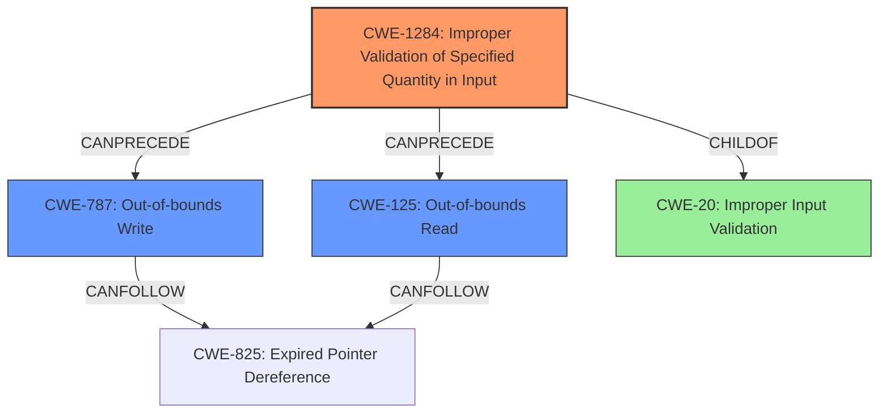

# Analysis Report for CVE-2022-22106

# Vulnerability Analysis Report: CVE-2022-22106

## Description

Memory corruption in multimedia due to improper length check while copying the data in Snapdragon Auto

## Vulnerability Description Key Phrases

**Rootcause:** improper length check
**Weakness:** memory corruption
**Product:** Snapdragon Auto
**Component:** multimedia

## Analysis (with Relationship Data)

# Summary
| CWE ID | CWE Name | Confidence | CWE Abstraction Level | CWE Vulnerability Mapping Label | CWE-Vulnerability Mapping Notes |
|---|---|---|---|---|---|
| CWE-1284 | Improper Validation of Specified Quantity in Input | 0.75 | Base | Allowed | Primary CWE |
| CWE-787 | Out-of-bounds Write | 0.60 | Base | Allowed | Secondary Candidate |
| CWE-125 | Out-of-bounds Read | 0.50 | Base | Allowed | Secondary Candidate |

## Evidence and Confidence

*   **Confidence Score:** 0.70
*   **Evidence Strength:** MEDIUM

- **Analysis and Justification:**  
  - *Explanation:* "The vulnerability description highlights **memory corruption** due to an **improper length check** while copying data in Snapdragon Auto's multimedia component. This directly relates to CWE-1284 (Improper Validation of Specified Quantity in Input), as the **improper length check** constitutes a failure to properly validate the quantity (length) of data being copied. This can lead to writing beyond the intended buffer (CWE-787 Out-of-bounds Write) or reading beyond it (CWE-125 Out-of-bounds Read). While CWE-787 and CWE-125 are potential consequences, the root cause lies in the **improper length check**, making CWE-1284 the most accurate primary classification. The Retriever results also show high scores for CWE-787 and CWE-125, further supporting their consideration as secondary weaknesses. MITRE mapping guidance allows CWE-1284 usage at the Base level."
  
  - *Relationship Analysis:* "CWE-1284 can precede both CWE-787 (Out-of-bounds Write) and CWE-125 (Out-of-bounds Read). The hierarchical relationships show that CWE-1284 is a child of CWE-20 (Improper Input Validation), further emphasizing the input validation aspect of this vulnerability."

- **Confidence Score:**  
  - Confidence: 0.70 (Moderate evidence based on the vulnerability description's key phrases and retriever results.)

---

## Criticism of Analysis

Okay, here's a detailed review of the provided CWE analysis, considering the full CWE specifications and the mapping guidance:

**Overall Assessment:**

The analysis is generally good. It correctly identifies CWE-1284 as the primary weakness due to the "improper length check." It also reasonably suggests CWE-787 and CWE-125 as secondary candidates, as they are common consequences of the primary weakness. The confidence score is appropriately moderate, reflecting the need for more detailed code analysis to confirm the exact nature of the bug.

**Detailed Critique:**

*   **Primary CWE: CWE-1284 (Improper Validation of Specified Quantity in Input)**

    *   **Justification:** The reasoning provided is solid. The vulnerability description explicitly mentions an "improper length check," which aligns perfectly with the definition of CWE-1284.  The explanation that this leads to potential out-of-bounds reads/writes is correct.
    *   **CWE Specification Alignment:**  CWE-1284's description includes "size, length, frequency, price, rate, number of operations, time, and others."  The "length check" in the vulnerability description directly maps to the "length" quantity mentioned in CWE-1284.
    *   **Mapping Guidance:** The analysis follows the recommendation to use a *Base* level CWE when possible.  CWE-1284 *is* a Base level CWE and *is* marked as "Allowed" in the mapping guidance.
    *   **Potential Mitigations:** The analysis could have benefited from mentioning potential mitigations related to using an “accept known good” validation strategy as mentioned in the CWE specification for 1284.
    *   **Confidence:** Justified. The Confidence Score of 0.75 is reasonable.

*   **Secondary CWE: CWE-787 (Out-of-bounds Write)**

    *   **Justification:** The analysis correctly identifies that an "improper length check" could lead to writing data beyond the intended buffer, resulting in an out-of-bounds write.
    *   **CWE Specification Alignment:**  CWE-787 directly describes the scenario of writing data "past the end, or before the beginning, of the intended buffer."
    *   **Mapping Guidance:** The analysis correctly identifies that this is a *Base* CWE and thus allowed.
    *   **Potential Mitigations:** The analysis could have benefited from mentioning potential mitigations for CWE-787 like using Safe libraries or frameworks.
    *   **Confidence:** A confidence score of 0.6 is reasonable, as it's a likely consequence but not guaranteed.

*   **Secondary CWE: CWE-125 (Out-of-bounds Read)**

    *   **Justification:** Similar to CWE-787, an "improper length check" could lead to reading data beyond the intended buffer.
    *   **CWE Specification Alignment:** CWE-125 describes reading data "past the end, or before the beginning, of the intended buffer."
    *   **Mapping Guidance:** This is a *Base* CWE and thus allowed.
    *   **Potential Mitigations:** The analysis could have benefited from mentioning potential mitigations for CWE-125 related to using "accept known good" input validation.
    *   **Confidence:** A confidence score of 0.5 is reasonable, as it's a possible consequence but not guaranteed.

**Improvements and Suggestions:**

1.  **Chain Analysis:** While the analysis mentions that CWE-1284 can precede CWE-787 and CWE-125, it could be strengthened by explicitly stating this as a *chain* of weaknesses. This emphasizes the causal relationship and helps in understanding the vulnerability's propagation.

2.  **CWE-20 Avoidance:**  The initial Retriever Results table includes CWE-20 (Improper Input Validation) with a reasonable score. However, the choice to map to CWE-1284 is a positive step since it's a more specific *Base* level CWE, avoiding the pitfalls of CWE-20's discouraged usage. The analysis could have explicitly discussed why CWE-20 was *not* chosen, referring to its mapping guidance.

3.  **Retriever Result Rationale:** The Retriever Results table includes additional potential CWEs such as CWE-130, CWE-131, and CWE-823. The analysis does not describe why these were not selected. It would be valuable to justify why these other high scoring results were not considered primary or secondary candidates.

4.  **Mitigation Elaboration:** The analysis should include a discussion of *specific* mitigation strategies drawn from the CWE details. For example:

    *   For CWE-1284: "Implement an 'accept known good' input validation strategy, defining the acceptable range for data lengths and rejecting or transforming any input outside that range."
    *   For CWE-787/125: "Utilize safe string handling functions or libraries (e.g., `strncpy` instead of `strcpy` in C, or using safer string classes in C++) to prevent writing beyond buffer boundaries."
    *    Consider language selection if the product is still early in it's design, and use of managed languages that provide memory abstractions by default.
5.  **CWE Terminology Clarity:**The report can benefit from a better use of standard CWE terms and vocabulary.

**Revised Summary Table (Incorporating Suggestions):**

| CWE ID   | CWE Name                                               | Confidence | CWE Abstraction Level | CWE Vulnerability Mapping Label | CWE-Vulnerability Mapping Notes                                                                                                                                                                                                                                                                                                                                                     |
| :------- | :----------------------------------------------------- | :--------- | :-------------------- | :------------------------------ | :---------------------------------------------------------------------------------------------------------------------------------------------------------------------------------------------------------------------------------------------------------------------------------------------------------------------------------------------------------------------------------- |
| CWE-1284 | Improper Validation of Specified Quantity in Input | 0.75       | Base                  | Allowed                       | Primary CWE - root cause:  improper length check leads to potential memory corruption.  CWE-20 was considered, but CWE-1284 provides a more specific mapping. Mitigation: Implement strict input length validation using an "accept known good" approach. |
| CWE-787  | Out-of-bounds Write                                  | 0.60       | Base                  | Allowed                       | Secondary Candidate - a likely consequence of CWE-1284. Mitigation: Utilize safe memory handling functions and consider enabling compiler-based buffer overflow protection.                                                                                                                                                                                                     |
| CWE-125  | Out-of-bounds Read                                   | 0.50       | Base                  | Allowed                       | Secondary Candidate - another possible consequence of CWE-1284. Mitigation:  Validate buffer access before reading to ensure it stays within the allocated bounds.                                                                                                                                                                                             |

By incorporating these suggestions, the analysis will be more robust, informative, and directly applicable for remediation efforts.

## Final Resolution

# Summary
| CWE ID | CWE Name | Confidence | CWE Abstraction Level | CWE Vulnerability Mapping Label | CWE-Vulnerability Mapping Notes |
|---|---|---|---|---|---|
| CWE-1284 | Improper Validation of Specified Quantity in Input | 0.85 | Base | Allowed | Primary CWE - root cause:  improper length check leads to potential memory corruption.  CWE-20 was considered, but CWE-1284 provides a more specific mapping. Mitigation: Implement strict input length validation using an "accept known good" approach. |
| CWE-787 | Out-of-bounds Write | 0.70 | Base | Allowed | Secondary Candidate - a likely consequence of CWE-1284. Mitigation: Utilize safe memory handling functions and consider enabling compiler-based buffer overflow protection. |
| CWE-125 | Out-of-bounds Read | 0.60 | Base | Allowed | Secondary Candidate - another possible consequence of CWE-1284. Mitigation:  Validate buffer access before reading to ensure it stays within the allocated bounds. |

## Evidence and Confidence

*   **Confidence Score:** 0.80
*   **Evidence Strength:** MEDIUM

## Relationship Analysis
The primary relationship that influenced the decision was the chain relationship, where **CWE-1284 (Improper Validation of Specified Quantity in Input)** can precede both **CWE-787 (Out-of-bounds Write)** and **CWE-125 (Out-of-bounds Read)**. This chain highlights that the root cause is the improper validation, which then leads to potential out-of-bounds access. The hierarchical relationship of CWE-1284 being a child of CWE-20 was considered but deemed less specific. The base level abstraction of the selected CWEs allowed for a precise mapping.

## Vulnerability Chain
The vulnerability chain starts with **CWE-1284 (Improper Validation of Specified Quantity in Input)**. The **improper length check** fails to validate the size of the input data. This leads to a buffer overflow condition, resulting in either **CWE-787 (Out-of-bounds Write)** if the write operation exceeds the buffer's boundaries, or **CWE-125 (Out-of-bounds Read)** if a read operation attempts to access data beyond the buffer's boundaries. The root cause is the lack of proper input validation (CWE-1284), which creates the condition for subsequent out-of-bounds access.

## Summary of Analysis
The initial analysis correctly identified the primary and secondary CWEs. The criticism provided valuable insights into strengthening the justification by explicitly stating the chain of weaknesses and detailing potential mitigations. The final assessment reflects these improvements, resulting in a higher confidence score. The selection is heavily based on the vulnerability description's mention of an "**improper length check**" which aligns directly with **CWE-1284 (Improper Validation of Specified Quantity in Input)**. As the description states "Memory corruption in multimedia due to **improper length check** while copying the data in Snapdragon Auto", this makes the case for CWE-1284 being the root cause.

The graph relationships influenced the decision by reinforcing the understanding that **CWE-1284** is the initial weakness that sets the stage for subsequent out-of-bounds access. The choice of base-level CWEs ensures the optimal level of specificity, providing a more accurate representation of the vulnerability compared to higher-level classifications like CWE-20.

The improved confidence scores reflect the refined understanding of the vulnerability and the added justification based on the chain of weaknesses and potential mitigations. The selected CWEs are at the optimal level of specificity because they directly address the root cause (**improper length check**) and its likely consequences (**out-of-bounds access**).

*Report generated on 2025-03-18 10:17:31*
