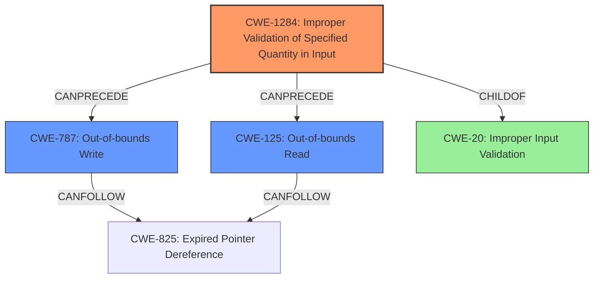

# Final Resolution for CVE-2022-22106

# Summary
| CWE ID | CWE Name | Confidence | CWE Abstraction Level | CWE Vulnerability Mapping Label | CWE-Vulnerability Mapping Notes |
|---|---|---|---|---|---|
| CWE-1284 | Improper Validation of Specified Quantity in Input | 0.85 | Base | Allowed | Primary CWE - root cause:  improper length check leads to potential memory corruption.  CWE-20 was considered, but CWE-1284 provides a more specific mapping. Mitigation: Implement strict input length validation using an "accept known good" approach. |
| CWE-787 | Out-of-bounds Write | 0.70 | Base | Allowed | Secondary Candidate - a likely consequence of CWE-1284. Mitigation: Utilize safe memory handling functions and consider enabling compiler-based buffer overflow protection. |
| CWE-125 | Out-of-bounds Read | 0.60 | Base | Allowed | Secondary Candidate - another possible consequence of CWE-1284. Mitigation:  Validate buffer access before reading to ensure it stays within the allocated bounds. |

## Evidence and Confidence

*   **Confidence Score:** 0.80
*   **Evidence Strength:** MEDIUM

## Relationship Analysis
The primary relationship that influenced the decision was the chain relationship, where **CWE-1284 (Improper Validation of Specified Quantity in Input)** can precede both **CWE-787 (Out-of-bounds Write)** and **CWE-125 (Out-of-bounds Read)**. This chain highlights that the root cause is the improper validation, which then leads to potential out-of-bounds access. The hierarchical relationship of CWE-1284 being a child of CWE-20 was considered but deemed less specific. The base level abstraction of the selected CWEs allowed for a precise mapping.

## Vulnerability Chain
The vulnerability chain starts with **CWE-1284 (Improper Validation of Specified Quantity in Input)**. The **improper length check** fails to validate the size of the input data. This leads to a buffer overflow condition, resulting in either **CWE-787 (Out-of-bounds Write)** if the write operation exceeds the buffer's boundaries, or **CWE-125 (Out-of-bounds Read)** if a read operation attempts to access data beyond the buffer's boundaries. The root cause is the lack of proper input validation (CWE-1284), which creates the condition for subsequent out-of-bounds access.

## Summary of Analysis
The initial analysis correctly identified the primary and secondary CWEs. The criticism provided valuable insights into strengthening the justification by explicitly stating the chain of weaknesses and detailing potential mitigations. The final assessment reflects these improvements, resulting in a higher confidence score. The selection is heavily based on the vulnerability description's mention of an "**improper length check**" which aligns directly with **CWE-1284 (Improper Validation of Specified Quantity in Input)**. As the description states "Memory corruption in multimedia due to **improper length check** while copying the data in Snapdragon Auto", this makes the case for CWE-1284 being the root cause.

The graph relationships influenced the decision by reinforcing the understanding that **CWE-1284** is the initial weakness that sets the stage for subsequent out-of-bounds access. The choice of base-level CWEs ensures the optimal level of specificity, providing a more accurate representation of the vulnerability compared to higher-level classifications like CWE-20.

The improved confidence scores reflect the refined understanding of the vulnerability and the added justification based on the chain of weaknesses and potential mitigations. The selected CWEs are at the optimal level of specificity because they directly address the root cause (**improper length check**) and its likely consequences (**out-of-bounds access**).