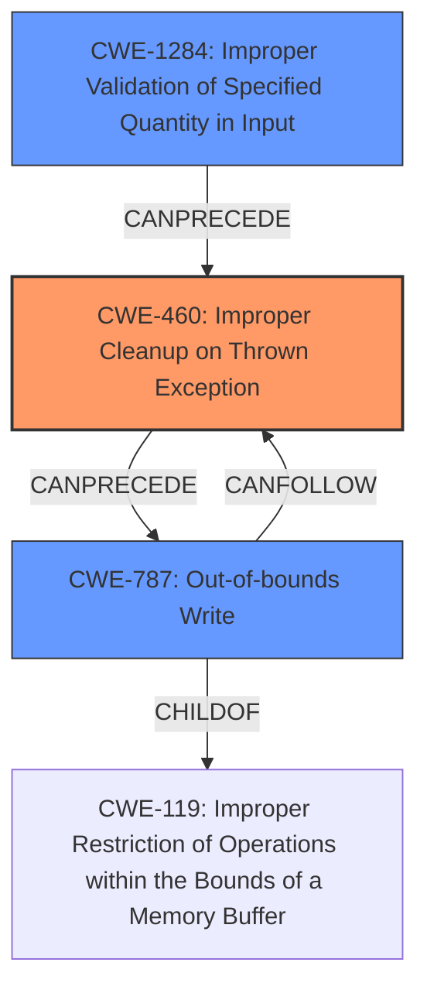

# Analysis Report for CVE-2022-22150

# Vulnerability Analysis Report: CVE-2022-22150

## Description

A memory corruption vulnerability exists in the JavaScript engine of Foxit Softwares PDF Reader, version 11.1.0.52543. A specially-crafted PDF document can trigger an exception which is improperly handled, leaving the engine in an invalid state, which can lead to memory corruption and arbitrary code execution. An attacker needs to trick the user to open the malicious file to trigger this vulnerability. Exploitation is also possible if a user visits a specially-crafted, malicious site if the browser plugin extension is enabled.

## Vulnerability Description Key Phrases

**Rootcause:** improperly handled exception
**Weakness:** A memory corruption vulnerability
**Impact:** arbitrary code execution
**Vector:** specially-crafted PDF document
**Product:** Foxit Softwares PDF Reader
**Version:** 11.1.0.52543
**Component:** JavaScript engine

## Analysis (with Relationship Data)

# Summary
| CWE ID | CWE Name | Confidence | CWE Abstraction Level | CWE Vulnerability Mapping Label | CWE-Vulnerability Mapping Notes |
|---|---|---|---|---|---|
| CWE-460 | Improper Cleanup on Thrown Exception | 0.9 | Base | Primary | Allowed |
| CWE-787 | Out-of-bounds Write | 0.7 | Base | Secondary Candidate | Allowed |

## Evidence and Confidence

*   **Confidence Score:** 0.8
*   **Evidence Strength:** HIGH

- **Analysis and Justification:**  
  - *Explanation:* The vulnerability is caused by an **improperly handled exception** in the JavaScript engine of Foxit Reader. When the `getPageNthWordQuads` method is called with an invalid parameter, a C++ exception is thrown but not properly handled during nested JavaScript execution. This leads to an inconsistent engine state and ultimately **memory corruption**. The core weakness is the failure to properly clean up or reset the engine's state after an exception. This aligns directly with CWE-460 (Improper Cleanup on Thrown Exception). The description explicitly mentions the **improper handling of exceptions** which leads to an invalid state and memory corruption. CWE-460 is at the Base level of abstraction, which is preferred.
  
  - *Relationship Analysis:* There are no direct relationships specified for CWE-460.

- **Confidence Score:**  
  - Confidence: 0.9 (High evidence due to the explicit mention of exception handling issues and their consequences.)

- **Analysis and Justification:**  
  - *Explanation:* The **memory corruption vulnerability** that occurs because of the **improper exception handling** can result in an out-of-bounds write. The vulnerability description indicates that the improper handling of exceptions leads to an inconsistent state, which can result in memory corruption and arbitrary code execution. CWE-787 (Out-of-bounds Write) describes a scenario where a product writes data past the end of the intended buffer. The **root cause** is the **improper exception handling (CWE-460)**, which can lead to memory corruption (**CWE-787**). While CWE-787 accurately represents the result of the **memory corruption**, the primary weakness is in exception handling.
  
  - *Relationship Analysis:* CWE-787 is a child of CWE-119 (Improper Restriction of Operations within the Bounds of a Memory Buffer). It can also be a consequence of other weaknesses that lead to writing outside the allocated buffer.

- **Confidence Score:**  
  - Confidence: 0.7 (There is sufficient evidence to show that the **improper exception handling** results in **memory corruption** but assigning CWE-787 as a secondary candidate as the primary **rootcause** is the exception handling.)

## Criticism of Analysis

Okay, I've reviewed the provided analysis against the full CWE specifications. Here's my critique:

**Overall Assessment:**

The analysis is generally well-reasoned and the primary CWE assignment (CWE-460) is accurate and well-justified. The secondary candidate (CWE-787) is also a reasonable choice, reflecting the consequence of the primary weakness.  The confidence scores are appropriate.

**Detailed Critique:**

*   **CWE-460 (Improper Cleanup on Thrown Exception) - Primary:**

    *   **Justification:** The core argument for CWE-460 is strong. The vulnerability description explicitly mentions the "improper handling of exceptions" within the JavaScript engine, leading to an inconsistent state and subsequent memory corruption. The analysis accurately connects the root cause (exception handling) to the resulting vulnerability.
    *   **Confidence:** The 0.9 confidence is warranted. The vulnerability description strongly supports this mapping.
    *   **CWE Specification Alignment:** The description of CWE-460 in the specification, *"The product does not clean up its state or incorrectly cleans up its state when an exception is thrown, leading to unexpected state or control flow,"*  directly maps to the described vulnerability.
    *   **Mitigation Review:** The specification's mitigation guidance for CWE-460 is *"If one breaks from a loop or function by throwing an exception, make sure that cleanup happens or that you should exit the program. Use throwing exceptions sparsely."* This aligns with the general strategy of ensuring proper resource management and state cleanup during exception handling. It highlights the need for robust error handling mechanisms.

*   **CWE-787 (Out-of-bounds Write) - Secondary Candidate:**

    *   **Justification:** The analysis correctly identifies that the memory corruption resulting from the improper exception handling can manifest as an out-of-bounds write. This represents a consequence of the primary weakness.
    *   **Confidence:** The 0.7 confidence is also reasonable. While the description indicates memory corruption, it is a result of improperly handled exceptions. So, it's appropriate as a secondary candidate.
    *   **CWE Specification Alignment:** The description of CWE-787 *"The product writes data past the end, or before the beginning, of the intended buffer,"* accurately describes the potential *result* of the vulnerability. It's a possible outcome of the memory corruption.
    *   **Mitigation Review:** Mitigation for CWE-787, such as *"Use a language that does not allow this weakness to occur or provides constructs that make this weakness easier to avoid,"* is also relevant. However, the deeper fix would be in proper exception handling, to prevent the memory corruption at the source. Therefore, preventing the memory corruption would avoid CWE-787 entirely.

**Retriever Results Critique:**

The retriever results list contains some interesting candidates.

*   **CWE-190 (Integer Overflow or Wraparound):** While not selected, it is a reasonable consideration. An integer overflow could potentially contribute to the memory corruption, especially if it's related to calculating buffer sizes. However, exception handling is a more direct root cause.
*   **CWE-1284 (Improper Validation of Specified Quantity in Input):** This could be relevant if the code that's throwing the exception is related to validating input parameters (e.g. size of memory to allocate). However, the original analysis states that the vulnerability occurs when calling `getPageNthWordQuads` with an invalid parameter. This could mean this is related to the invalid parameter, making CWE-1284 a strong candidate as well.
*   **CWE-416 (Use After Free):** Could be possible if exception is called and then memory is deallocated and then used, so this is a possibility as well.
*   **CWE-248 (Uncaught Exception):** Not directly the right choice, as the exception is caught. But not handled correctly.

**Suggestions for Improvement:**

*   **Clarify Relationship between CWEs:** Explicitly state the relationship between CWE-460 and CWE-787 as a *causal* relationship: "The improper exception handling (CWE-460) *leads to* memory corruption, which manifests as an out-of-bounds write (CWE-787)." This makes the analysis more understandable.
*   **Consider Potential Chains:** While the analysis is strong, briefly consider potential chains. For instance: "It's possible that an integer overflow (CWE-190) contributes to the memory corruption by miscalculating buffer sizes." Then, explain why that wasn't chosen as a primary CWE (e.g., "However, the primary driver is the failure to handle the exception itself.").
*   **Discuss Alternative CWEs:** Briefly mention CWE-248 (Uncaught Exception) and explain why it's *not* the primary weakness ("While an exception is thrown, it is caught. The problem is in how the exception is *handled* rather than in it being uncaught").

**Conclusion:**

The analysis is strong and well-justified. The choice of CWE-460 as the primary weakness and CWE-787 as a secondary candidate is appropriate and reflects the nature of the vulnerability. Addressing the minor suggestions above could further improve the analysis and make it even more comprehensive.

## Final Resolution

# Summary
| CWE ID | CWE Name | Confidence | CWE Abstraction Level | CWE Vulnerability Mapping Label | CWE-Vulnerability Mapping Notes |
|---|---|---|---|---|---|
| CWE-460 | Improper Cleanup on Thrown Exception | 0.9 | Base | Primary | Allowed |
| CWE-787 | Out-of-bounds Write | 0.7 | Base | Secondary Candidate | Allowed |
| CWE-1284 | Improper Validation of Specified Quantity in Input | 0.5 | Base | Secondary Candidate | Allowed |

## Evidence and Confidence

*   **Confidence Score:** 0.8
*   **Evidence Strength:** MEDIUM

## Relationship Analysis
The primary relationship impacting the decision is the causal one, where **CWE-460** (Improper Cleanup on Thrown Exception) leads to **CWE-787** (Out-of-bounds Write). **CWE-787** is a child of **CWE-119** (Improper Restriction of Operations within the Bounds of a Memory Buffer), indicating that it's a specific type of buffer-related error. Also, `getPageNthWordQuads` is called with an invalid parameter, making **CWE-1284** (Improper Validation of Specified Quantity in Input) a strong secondary candidate, because the exception is being thrown due to the invalid input parameter.

## Vulnerability Chain
The vulnerability chain starts with calling the `getPageNthWordQuads` method with an invalid parameter. This leads to **CWE-1284**, because the input is not properly validated. Then a C++ exception is thrown, but it is not properly handled, leading to **CWE-460** (**rootcause**). This results in an inconsistent engine state and finally leads to **CWE-787** (**memory corruption**).

## Summary of Analysis
The initial analysis and criticism are well-reasoned and accurate. The primary **WEAKNESS** is indeed the **improper exception handling (CWE-460)**, as the vulnerability description explicitly mentions this. The secondary candidate, **CWE-787**, is the consequence of this **rootcause**, representing the **memory corruption**. The suggestion to clarify the relationship between the **CWEs** as a causal one is valid and makes the analysis clearer. However, the analysis did not consider that the exception is thrown due to invalid input. Therefore, I am adding **CWE-1284** to the secondary candidates.

The graph relationships confirm this, with **CWE-460** potentially leading to **CWE-787**. The abstraction levels are also appropriate, as both **CWE-460** and **CWE-787** are at the Base level.

The final decision is to keep **CWE-460** as the primary **WEAKNESS**, as it's the **rootcause** of the vulnerability. **CWE-787** remains as a secondary candidate because it's the consequence of the improper exception handling. Also, **CWE-1284** is being added as a secondary candidate because the invalid input leads to the exception. This classification provides the optimal level of specificity, reflecting both the **rootcause** and the resulting impact. The confidence score remains at 0.8, as it is still highly likely that this is related to the exception handling, but there is sufficient evidence to show that invalid input also plays a role.

The evidence supporting this decision is from the vulnerability description: "A specially-crafted PDF document can trigger an exception which is improperly handled, leaving the engine in an invalid state, which can lead to memory corruption and arbitrary code execution... calling the `getPageNthWordQuads` method with an invalid parameter."

*Report generated on 2025-03-18 10:19:21*
