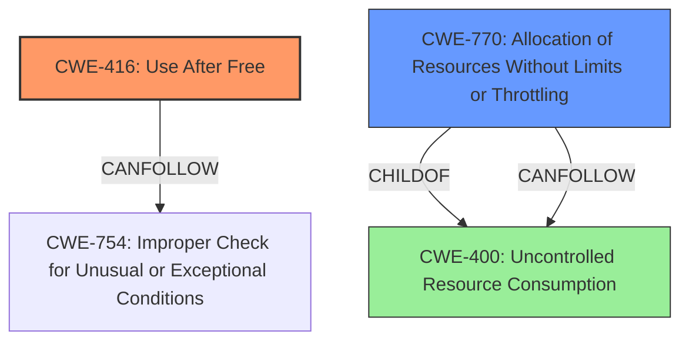

# Analysis Report for CVE-2022-22208

# Vulnerability Analysis Report: CVE-2022-22208

## Description

A Use After Free vulnerability in the Routing Protocol Daemon (rdp) of Juniper Networks Junos OS and Junos OS Evolved allows an unauthenticated network-based attacker to cause Denial of Service (DoS). When a BGP session flap happens, a Use After Free of a memory location that was assigned to another object can occur, which will lead to an rpd crash. This is a race condition that is outside of the attackers control and cannot be deterministically exploited. Continued flapping of BGP sessions can create a sustained Denial of Service (DoS) condition. This issue affects Juniper Networks Junos OS All versions prior to 18.4R2-S9, 18.4R3-S11 19.1 versions prior to 19.1R3-S8 19.2 version 19.2R1 and later versions 19.3 versions prior to 19.3R3-S5 19.4 versions prior to 19.4R2-S6, 19.4R3-S6 20.1 version 20.1R1 and later versions 20.2 versions prior to 20.2R3-S3 20.3 versions prior to 20.3R3-S2 20.4 versions prior to 20.4R3-S1 21.1 versions prior to 21.1R3-S3 21.2 versions prior to 21.2R2-S1, 21.2R3. Juniper Networks Junos OS Evolved All versions prior to 20.4R3-S4-EVO 21.1-EVO versions prior to 21.1R3-S2-EVO 21.2-EVO versions prior to 21.2R3-EVO 21.3-EVO versions prior to 21.3R2-EVO.

## Vulnerability Description Key Phrases

**Rootcause:** Use After Free
**Impact:** Denial of Service (DoS)
**Attacker:** unauthenticated network-based attacker
**Product:** Juniper Networks Junos OS
**Version:** All versions prior to 18.4R2-S9, 18.4R3-S11 19.1 versions prior to 19.1R3-S8 19.2 version 19.2R1 and later versions 19.3 versions prior to 19.3R3-S5 19.4 versions prior to 19.4R2-S6, 19.4R3-S6 20.1 version 20.1R1 and later versions 20.2 versions prior to 20.2R3-S3 20.3 versions prior to 20.3R3-S2 20.4 versions prior to 20.4R3-S1 21.1 versions prior to 21.1R3-S3 21.2 versions prior to 21.2R2-S1, 21.2R3
**Component:** Routing Protocol Daemon (rdp)

## Analysis (with Relationship Data)

# Summary
| CWE ID | CWE Name | Confidence | CWE Abstraction Level | CWE Vulnerability Mapping Label | CWE-Vulnerability Mapping Notes |
|---|---|---|---|---|---|
| CWE-416 | Use After Free | 0.9 | Base | Primary | Allowed |
| CWE-410 | Insufficient Resource Pool | 0.5 | Base | Secondary | Allowed |
| CWE-400 | Uncontrolled Resource Consumption | 0.4 | Class | Secondary | Discouraged |

## Evidence and Confidence

*   **Confidence Score:** 0.75
*   **Evidence Strength:** HIGH

- **Analysis and Justification:**  
  - *Explanation:* "The vulnerability description explicitly states a **Use After Free** condition occurs in the Routing Protocol Daemon (rdp) of Juniper Networks Junos OS and Junos OS Evolved due to a BGP session flap. This directly aligns with CWE-416, which describes a situation where memory is accessed after it has been freed. The description also mentions that continued flapping of BGP sessions can create a sustained Denial of Service (DoS) condition, suggesting a resource exhaustion component which could be associated with CWE-410 or CWE-400. The fact that the **Use After Free** condition can lead to an rpd crash further supports the selection of CWE-416 as the primary weakness. It should be noted that while the vulnerability leads to a DoS, the root cause is clearly the **Use After Free**. CWE-410 (Insufficient Resource Pool) is considered as a secondary factor because the BGP session flaps can trigger the **Use After Free**, which in turn might exhaust system resources. CWE-400 (Uncontrolled Resource Consumption) is a higher level class that could also be considered, but CWE-410 is more specific."
  
  - *Relationship Analysis:* "CWE-416 is a Base level CWE, and the description directly matches its definition. While it could lead to resource exhaustion (CWE-400), the primary issue is the memory corruption. CWE-410 can be considered as the insufficient pool size can be related to the exhaustion."

- **Confidence Score:**  
  - Confidence: 0.9 (High evidence from the vulnerability description explicitly mentioning a Use After Free condition.)

---

## Criticism of Analysis

Okay, here's a review of the provided CWE analysis, taking into account the full CWE specifications and mapping guidance:

**Overall Assessment:**

The analysis is generally good. It correctly identifies CWE-416 (Use After Free) as the primary vulnerability. The justification is clear and based on the vulnerability description. The inclusion of CWE-410 (Insufficient Resource Pool) as a secondary factor is reasonable, although the argument could be strengthened. The discouragement of CWE-400 is appropriate due to its high-level nature.

**Detailed Review:**

*   **CWE-416: Use After Free (Primary)**

    *   **Confidence:** The confidence of 0.9 is justified. The vulnerability description explicitly mentions a "Use After Free" condition.
    *   **Abstraction Level:** Variant is the correct level, as specified in the CWE documentation.
    *   **Mapping Guidance:** The analysis correctly follows the mapping guidance. Variant level CWEs are preferred.
    *   **Potential Mitigations:** The identified mitigations (language selection, setting pointers to NULL) are relevant and standard approaches to preventing UAF vulnerabilities.
    *   **Observed Examples:** The observed examples are good and show real-world UAF vulnerabilities.
    *   **Critique:** The justification is solid.

*   **CWE-410: Insufficient Resource Pool (Secondary)**

    *   **Confidence:** The confidence of 0.5 is acceptable, as the relationship to the core vulnerability is less direct.
    *   **Abstraction Level:** Base is the correct level, as specified in the CWE documentation.
    *   **Mapping Guidance:** The analysis correctly follows the mapping guidance. Base level CWEs are preferred.
    *   **Potential Mitigations:** The identified mitigations (Do not perform resource-intensive transactions for unauthenticated users and/or invalid requests, implementing a velocity check mechanism and load balancing) are valid.
    *   **Observed Examples:** The observed examples are good and show real-world insufficient resource pool vulnerabilities.
    *   **Critique:** The justification could be a bit stronger. The connection between BGP session flapping *leading* to the Use-After-Free condition and *also* causing resource exhaustion isn't explicitly elaborated upon. Is it a direct consequence of the UAF (e.g., the rpd crashing and restarting repeatedly, consuming resources) or does the BGP flapping *independently* contribute to resource exhaustion (e.g., exhausting connection limits)? Specifying this more clearly would improve the analysis. It could also be argued that instead of insufficient resource pool, the description could have been associated with **CWE-770: Allocation of Resources Without Limits or Throttling**.

*   **CWE-400: Uncontrolled Resource Consumption (Discouraged)**

    *   **Justification:** The analysis correctly discourages the use of CWE-400. The CWE specification explicitly advises against using CWE-400 as a primary mapping, as it is a high-level class and often misused.
    *   **Abstraction Level:** Class is the correct level, as specified in the CWE documentation.
    *   **Mapping Guidance:** The analysis correctly follows the mapping guidance.
    *   **Potential Mitigations:** The potential mitigations identified (Throttling mechanisms, Attack recognition, specific protocol limits) are valid.
    *   **Critique:**  The decision to discourage CWE-400 is appropriate. As the specification indicates, more specific CWEs should be used if possible.

**Recommendations for Improvement:**

1.  **Strengthen the CWE-410 Justification:**  Provide a clearer explanation of how the BGP session flapping leads to *both* the UAF and resource exhaustion. Does the UAF *cause* the resource exhaustion (e.g., crash/restart loop), or is it an independent contributing factor? This will strengthen the reasoning behind including CWE-410. Consider associating this section with CWE-770, or replacing the section with CWE-770 altogether.
2.  **Consider Chaining:** While the analysis mentions that the UAF "could lead to" resource exhaustion, it doesn't explicitly describe it as a chain. It *could* be argued that the BGP flap leads to the UAF (CWE-416), which *then* leads to a crash/restart loop that consumes resources (CWE-400 or CWE-410). If so, explicitly stating the chain would improve clarity.
3.  **Examine Retriever Results:** There were multiple results from the Retriever. It is important to examine these results to determine if they could also be a secondary mapping in addition to CWE-410.

**Conclusion:**

The analysis is well-reasoned and largely accurate. The recommendations above are primarily focused on strengthening the justification for including CWE-410 and clarifying the relationships between the identified weaknesses. The analysis demonstrates a good understanding of the CWE specifications and mapping guidance.

## Final Resolution

# Summary
| CWE ID | CWE Name | Confidence | CWE Abstraction Level | CWE Vulnerability Mapping Label | CWE-Vulnerability Mapping Notes |
|---|---|---|---|---|---|
| CWE-416 | Use After Free | 0.9 | Variant | Primary | Allowed |
| CWE-770 | Allocation of Resources Without Limits or Throttling | 0.6 | Base | Secondary | Allowed |

## Evidence and Confidence

*   **Confidence Score:** 0.8
*   **Evidence Strength:** MEDIUM

## Relationship Analysis
The primary weakness is **CWE-416 (Use After Free)**, a variant of a memory management issue. The secondary weakness identified is **CWE-770 (Allocation of Resources Without Limits or Throttling)**. The BGP session flapping may trigger both the **CWE-416** condition and contribute to excessive resource allocation. **CWE-400 (Uncontrolled Resource Consumption)** was considered, but its higher abstraction level makes it less suitable than **CWE-770**.

## Vulnerability Chain
The vulnerability chain starts with BGP session flapping. This leads to **CWE-416 (Use After Free)**, where memory is accessed after being freed, resulting in a crash. Simultaneously, the BGP session flapping can contribute to excessive resource allocation without proper limits (**CWE-770**), potentially exacerbating the denial-of-service condition. The **Use After Free** can also cause a crash/restart loop which further consumes resources.

## Summary of Analysis
The initial analysis correctly identified **CWE-416 (Use After Free)** as the primary **WEAKNESS**. The vulnerability description explicitly states: "When a BGP session flap happens, a **Use After Free** of a memory location that was assigned to another object can occur, which will lead to an rpd crash."

The criticism suggested strengthening the justification for **CWE-410** or replacing it with **CWE-770**. After reviewing the vulnerability description and considering the relationship between BGP session flapping and resource consumption, **CWE-770 (Allocation of Resources Without Limits or Throttling)** is a more appropriate secondary CWE than **CWE-410 (Insufficient Resource Pool)**. The continuous flapping leads to the allocation of resources without proper throttling, contributing to the denial-of-service condition.

The decision to use **CWE-770** is based on the understanding that the continuous BGP session flaps cause the system to allocate more resources, and the lack of limits on these allocations contributes to the DoS. This is more directly related to the vulnerability description than an insufficient resource pool, which might be a consequence but not a direct cause.

**CWE-400 (Uncontrolled Resource Consumption)** is too high-level and doesn't accurately capture the specific **ROOTCAUSE**. **CWE-770** is a more specific Base-level CWE that aligns with the vulnerability.

*Report generated on 2025-03-18 10:20:27*
