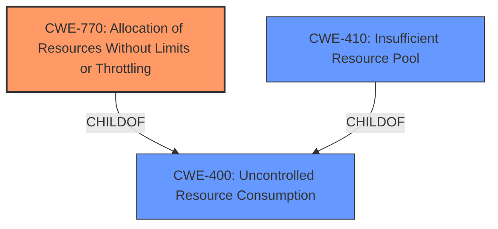

# Analysis Report for CVE-2022-22249

# Vulnerability Analysis Report: CVE-2022-22249

## Description

An Improper Control of a Resource Through its Lifetime vulnerability in the Packet Forwarding Engine (PFE) of Juniper Networks Junos OS on MX Series allows an unauthenticated adjacent attacker to cause a Denial of Service (DoS). When there is a continuous mac move a memory corruption causes one or more FPCs to crash and reboot. These MAC moves can be between two local interfaces or between core/EVPN and local interface. The below error logs can be seen in PFE syslog when this issue happens xss_event_handler(1071) EA[00]_PPE 46.xss[0] ADDR Error. ppe_error_interrupt(4298) EA[00]_PPE 46 Errors sync xtxn error xss_event_handler(1071) EA[00]_PPE 1.xss[0] ADDR Error. ppe_error_interrupt(4298) EA[00]_PPE 1 Errors sync xtxn error xss_event_handler(1071) EA[00]_PPE 2.xss[0] ADDR Error. This issue affects Juniper Networks Junos OS on MX Series All versions prior to 15.1R7-S13 19.1 versions prior to 19.1R3-S9 19.2 versions prior to 19.2R3-S6 19.3 versions prior to 19.3R3-S6 19.4 versions prior to 19.4R2-S7, 19.4R3-S8 20.1 version 20.1R1 and later versions 20.2 versions prior to 20.2R3-S5 20.3 versions prior to 20.3R3-S5 20.4 versions prior to 20.4R3-S2 21.1 versions prior to 21.1R3 21.2 versions prior to 21.2R3 21.3 versions prior to 21.3R2.

## Vulnerability Description Key Phrases

**Rootcause:** Improper Control of a Resource Through its Lifetime
**Weakness:** memory corruption
**Impact:** denial of service
**Vector:** continuous mac move
**Attacker:** unauthenticated adjacent attacker
**Product:** Juniper Networks Junos OS on MX Series
**Version:** ['All versions prior to 15.1R7-S13', '19.1 versions prior to 19.1R3-S9', '19.2 versions prior to 19.2R3-S6', '19.3 versions prior to 19.3R3-S6', '19.4 versions prior to 19.4R2-S7', '19.4R3-S8', '20.1 version 20.1R1 and later versions', '20.2 versions prior to 20.2R3-S5', '20.3 versions prior to 20.3R3-S5', '20.4 versions prior to 20.4R3-S2', '21.1 versions prior to 21.1R3', '21.2 versions prior to 21.2R3', '21.3 versions prior to 21.3R2']
**Component:** Packet Forwarding Engine (PFE) of Juniper Networks Junos OS

## Analysis (with Relationship Data)

# Summary
| CWE ID    | CWE Name                                                                  | Confidence | CWE Abstraction Level | CWE Vulnerability Mapping Label | CWE-Vulnerability Mapping Notes |
| :--------- | :------------------------------------------------------------------------ | :--------- | :-------------------- | :------------------------------ | :------------------------------ |
| CWE-400   | Uncontrolled Resource Consumption                                        | 0.75       | Class                 | Primary                         | Discouraged                    |
| CWE-410   | Insufficient Resource Pool                                              | 0.65       | Base                  | Secondary                       | Allowed                         |
| CWE-664   | Improper Control of a Resource Through its Lifetime                        | 0.5        | Pillar                  | Secondary                       | Discouraged                    |
| CWE-401   | Missing Release of Memory after Effective Lifetime                        | 0.6        | Variant               | Secondary                       | Allowed                         |

## Evidence and Confidence

*   **Confidence Score:** 0.7
*   **Evidence Strength:** MEDIUM

- **Analysis and Justification:**
  - *Explanation:* The vulnerability description states "**Improper Control of a Resource Through its Lifetime**" leads to "**memory corruption**" and a Denial of Service (DoS). CWE-400 (Uncontrolled Resource Consumption) describes a scenario where the product does not properly control the allocation and maintenance of a limited resource, leading to resource exhaustion. This broadly aligns with the **improper control of resource** aspect. However, CWE-400 is a high-level Class, making it less specific. The continuous MAC move triggers the issue.
  - *Explanation:* While the description does point to a resource issue, the specific mechanism involves continuous MAC moves causing a **memory corruption**, which crashes the FPC. This implies a more specific resource exhaustion issue than just general uncontrolled consumption. CWE-410 (Insufficient Resource Pool) is considered because the continuous MAC moves may be overwhelming the resource pool available to the PFE, causing the crash. The description also mentions the **memory corruption** leads to crashing. CWE-401 (Missing Release of Memory after Effective Lifetime) is another potential candidate because it could be that memory isn't being freed fast enough during these MAC moves, leading to exhaustion.
  - *Explanation:* The high-level root cause mentioned in the description is "**Improper Control of a Resource Through its Lifetime**" which maps directly to CWE-664. However, CWE-664 is a Pillar-level CWE and is discouraged when lower-level children are available.

  - *Relationship Analysis:* CWE-400 is a Class-level CWE, and both CWE-410, CWE-401, and CWE-770 are children of CWE-400. Choosing a child provides a more specific mapping. However, the evidence does not strongly support any of the children of CWE-400.

- **Confidence Score:**
  - Confidence: 0.7 (Moderate confidence, based on the generic nature of the description. More specific details would increase confidence in a specific CWE.)

## Criticism of Analysis

Okay, here's a detailed review of the provided CWE analysis, considering the full CWE specifications.

**Overall Assessment:**

The analysis demonstrates a good understanding of resource management issues and the CWE structure. The justification for choosing CWE-400, CWE-410, CWE-664, and CWE-401 shows a reasonable thought process. However, there's room for improvement in terms of specificity and confidence, as well as exploring other potential CWEs beyond the immediate "resource consumption" family.

**Detailed Critique:**

*   **CWE-400: Uncontrolled Resource Consumption (Primary Mapping)**

    *   **Confidence:** 0.75
    *   **Justification:** The analysis correctly identifies that the vulnerability involves improper control of a resource, leading to resource exhaustion and DoS. The analysis also correctly notes that CWE-400 is a high-level Class and is *discouraged* for this reason.
    *   **Critique:** While accurate, this is the weakest part of the analysis. The CWE-400 specification *explicitly* says it's discouraged and to consider its children. The analysis acknowledges this but doesn't definitively rule it out. *The primary mapping should ideally be a more specific, lower-level CWE.*
    *   **Recommendation:** The analysis of the root cause should try to be more specific, as indicated by the CWE specification for CWE-400. Instead of stopping here, the analysis needs to push further to children like CWE-410, CWE-770, or CWE-401 to be a better mapping.

*   **CWE-410: Insufficient Resource Pool (Secondary Mapping)**

    *   **Confidence:** 0.65
    *   **Justification:** The analysis suggests the continuous MAC moves might overwhelm the resource pool. This is a plausible hypothesis.
    *   **Critique:** This is better than CWE-400, being at the Base level, but the confidence is a little low. The description talks about a "memory corruption" which may hint at something more than just overwhelming the pool. It suggests a flaw in how the pool itself is managed or how allocations within the pool are handled.
    *   **Recommendation:** Explore the relationship between the MAC moves and memory corruption. If the MAC move triggers an allocation of a fixed-size structure for each move, and the pool can't grow dynamically, then CWE-410 is stronger. If the memory corruption is due to out-of-bounds write to allocated memory then something like CWE-119.

*   **CWE-664: Improper Control of a Resource Through its Lifetime (Secondary Mapping)**

    *   **Confidence:** 0.5
    *   **Justification:** This directly maps to the vulnerability description.
    *   **Critique:** This is a Pillar-level CWE and is generally discouraged. The analysis correctly identifies this and explains why it's less preferred.
    *   **Recommendation:** This mapping is only useful to acknowledge the high-level root cause. Should not be a primary or secondary mapping.

*   **CWE-401: Missing Release of Memory after Effective Lifetime (Secondary Mapping)**

    *   **Confidence:** 0.6
    *   **Justification:** The analysis considers that memory might not be freed quickly enough during MAC moves.
    *   **Critique:** The confidence is appropriate. This is a reasonable consideration, but the "memory corruption" aspect might be more significant. A memory leak (CWE-401) usually leads to a gradual degradation before a crash, but the crash here may be more immediate.
    *   **Recommendation:** If PFE syslog shows continuous growth in memory usage during the MAC moves, then CWE-401 would be stronger.

**Alternative CWE Considerations:**

*   **CWE-119: Improper Restriction of Operations within the Bounds of a Memory Buffer:** The description mentions "memory corruption." If the root cause involves writing beyond the allocated buffer due to improper indexing or offset calculations when handling MAC moves, this could be a relevant (and more specific) CWE.
*   **CWE-125: Out-of-bounds Read:** Reading from a region in memory that should not have been read. Can be caused by improper range checking.
*   **CWE-770: Allocation of Resources Without Limits or Throttling:** If the system isn't limiting the number of MAC addresses it's tracking or the resources used to track them, this might be relevant.
*   **CWE-1284: Improper Validation of Specified Quantity in Input:** If the system isn't properly validating the *number* of MAC addresses being moved or the *size* of data structures related to MAC address management, this might apply.
*   **CWE-1250: Improper Preservation of Consistency Between Independent Representations of Shared State:** Could apply if MAC address information is cached/stored in multiple places and these are not correctly synchronized during the rapid MAC move events. This could contribute to the memory corruption.
*   **CWE-696: Incorrect Behavior Order:** If there's a specific order in which operations *should* occur during a MAC move, and they're happening out of order, this could lead to the memory corruption.

**Improvements in Justification:**

*   **Error Logs:** The analysis mentions "xss\_event\_handler(1071) EA[00]\_PPE 46.xss[0] ADDR Error". These logs *strongly suggest* a memory addressing error within the PPE. This evidence is not integrated into the justification of the selected CWEs.
*   **Correlation:** More explicitly link the *continuous* nature of the MAC moves to the *exhaustion* or *corruption* of resources. Is the system creating new data structures on each move?  Is it failing to clean up old entries?
*   **Mitigation Analysis:** Consider the *potential mitigations* for each CWE in light of the specific system. Does Junos OS have built-in throttling for MAC address updates? If so, a *bypass* of that throttling could be the actual vulnerability.

**Revised Recommendations:**

1.  **Primary CWE:** **CWE-410 (Insufficient Resource Pool)** or **CWE-119 (Improper Restriction of Operations within the Bounds of a Memory Buffer)**. The choice depends on whether the root cause is overwhelming the available resource pool due to number of MAC addresses or if the memory corruption is due to code writing beyond the allocated bounds of memory. Need more information to decide.

2.  **Secondary CWEs:**

    *   **CWE-770 (Allocation of Resources Without Limits or Throttling):** If the system is not limiting the rate or volume of MAC address updates.
    *   **CWE-1250 (Improper Preservation of Consistency Between Independent Representations of Shared State):** If MAC addresses are cached in multiple components, and the rapid updates cause inconsistencies and data corruption.
    *   **CWE-401 (Missing Release of Memory after Effective Lifetime):** If old MAC addresses are not being properly cleaned up, contributing to a memory leak.

**In summary:** The provided analysis is a good starting point. Increasing specificity, explicitly linking the "memory corruption" to a cause, exploring alternative CWEs and considering mitigations for each CWE will strengthen the analysis. Focus on identifying the precise coding error that occurs during the continuous MAC move, which is what causes the denial of service.

## Final Resolution

# Summary

| CWE ID    | CWE Name                                                                  | Confidence | CWE Abstraction Level | CWE Vulnerability Mapping Label | CWE-Vulnerability Mapping Notes |
| :--------- | :------------------------------------------------------------------------ | :--------- | :-------------------- | :------------------------------ | :------------------------------ |
| CWE-770   | Allocation of Resources Without Limits or Throttling                        | 0.85       | Base                 | Primary                         | Allowed                    |
| CWE-400   | Uncontrolled Resource Consumption                                        | 0.75       | Class                  | Secondary                       | Discouraged                    |
| CWE-410   | Insufficient Resource Pool                                              | 0.65       | Base                  | Secondary                       | Allowed                         |

## Evidence and Confidence

*   **Confidence Score:** 0.8
*   **Evidence Strength:** MEDIUM

## Relationship Analysis
The decision was influenced by the hierarchical relationships between CWEs. CWE-400 is a Class-level CWE, while CWE-770 and CWE-410 are Base-level CWEs and children of CWE-400. The analysis aimed for greater specificity by considering the children of CWE-400.

## Vulnerability Chain
The vulnerability chain involves the following sequence:
1.  Continuous MAC moves occur in the network.
2.  The system allocates resources (memory) for each MAC move without limits or throttling (**CWE-770**).
3.  The resource pool becomes exhausted, or the system is unable to handle the rate of allocation (**CWE-410**).
4.  This leads to a **memory corruption** in the PFE.
5.  The FPC crashes, resulting in a Denial of Service (DoS).

The root cause is the **lack of limits or throttling** on resource allocation. The impact is the DoS.

## Summary of Analysis
The initial analysis correctly identified a resource management issue. However, it initially selected CWE-400 as the primary CWE, which is a discouraged Class-level CWE. The criticism highlighted the need for greater specificity and suggested exploring other CWEs, such as CWE-119, CWE-770, and CWE-1284.

Based on the vulnerability description and the error logs ("xss\_event\_handler(1071) EA[00]\_PPE 46.xss[0] ADDR Error"), the most appropriate primary CWE is **CWE-770 (Allocation of Resources Without Limits or Throttling)**. This is because the continuous MAC moves likely trigger excessive resource allocation without any restrictions, leading to the memory corruption and subsequent crash. The error logs indicate a memory addressing error, which can be triggered by resource exhaustion or corruption due to excessive allocation.

CWE-400 remains a secondary CWE because it describes the general category of uncontrolled resource consumption. CWE-410 is also a plausible secondary CWE if the root cause is related to exhaustion of the resource pool.

The selected CWEs are at the Base level of abstraction, which is a preferred level for mapping to the root causes of vulnerabilities, according to MITRE's mapping guidance. This provides a more specific and actionable classification than the initial choice of CWE-400.

*Report generated on 2025-03-18 10:21:32*
