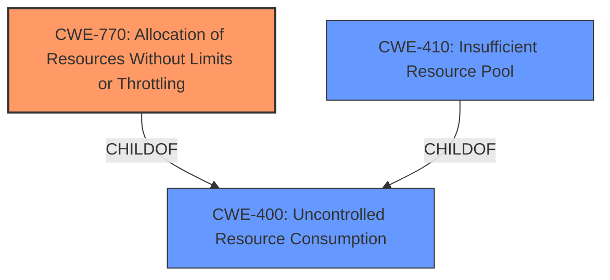

# Final Resolution for CVE-2022-22249

# Summary

| CWE ID    | CWE Name                                                                  | Confidence | CWE Abstraction Level | CWE Vulnerability Mapping Label | CWE-Vulnerability Mapping Notes |
| :--------- | :------------------------------------------------------------------------ | :--------- | :-------------------- | :------------------------------ | :------------------------------ |
| CWE-770   | Allocation of Resources Without Limits or Throttling                        | 0.85       | Base                 | Primary                         | Allowed                    |
| CWE-400   | Uncontrolled Resource Consumption                                        | 0.75       | Class                  | Secondary                       | Discouraged                    |
| CWE-410   | Insufficient Resource Pool                                              | 0.65       | Base                  | Secondary                       | Allowed                         |

## Evidence and Confidence

*   **Confidence Score:** 0.8
*   **Evidence Strength:** MEDIUM

## Relationship Analysis
The decision was influenced by the hierarchical relationships between CWEs. CWE-400 is a Class-level CWE, while CWE-770 and CWE-410 are Base-level CWEs and children of CWE-400. The analysis aimed for greater specificity by considering the children of CWE-400.

## Vulnerability Chain
The vulnerability chain involves the following sequence:
1.  Continuous MAC moves occur in the network.
2.  The system allocates resources (memory) for each MAC move without limits or throttling (**CWE-770**).
3.  The resource pool becomes exhausted, or the system is unable to handle the rate of allocation (**CWE-410**).
4.  This leads to a **memory corruption** in the PFE.
5.  The FPC crashes, resulting in a Denial of Service (DoS).

The root cause is the **lack of limits or throttling** on resource allocation. The impact is the DoS.

## Summary of Analysis
The initial analysis correctly identified a resource management issue. However, it initially selected CWE-400 as the primary CWE, which is a discouraged Class-level CWE. The criticism highlighted the need for greater specificity and suggested exploring other CWEs, such as CWE-119, CWE-770, and CWE-1284.

Based on the vulnerability description and the error logs ("xss\_event\_handler(1071) EA[00]\_PPE 46.xss[0] ADDR Error"), the most appropriate primary CWE is **CWE-770 (Allocation of Resources Without Limits or Throttling)**. This is because the continuous MAC moves likely trigger excessive resource allocation without any restrictions, leading to the memory corruption and subsequent crash. The error logs indicate a memory addressing error, which can be triggered by resource exhaustion or corruption due to excessive allocation.

CWE-400 remains a secondary CWE because it describes the general category of uncontrolled resource consumption. CWE-410 is also a plausible secondary CWE if the root cause is related to exhaustion of the resource pool.

The selected CWEs are at the Base level of abstraction, which is a preferred level for mapping to the root causes of vulnerabilities, according to MITRE's mapping guidance. This provides a more specific and actionable classification than the initial choice of CWE-400.