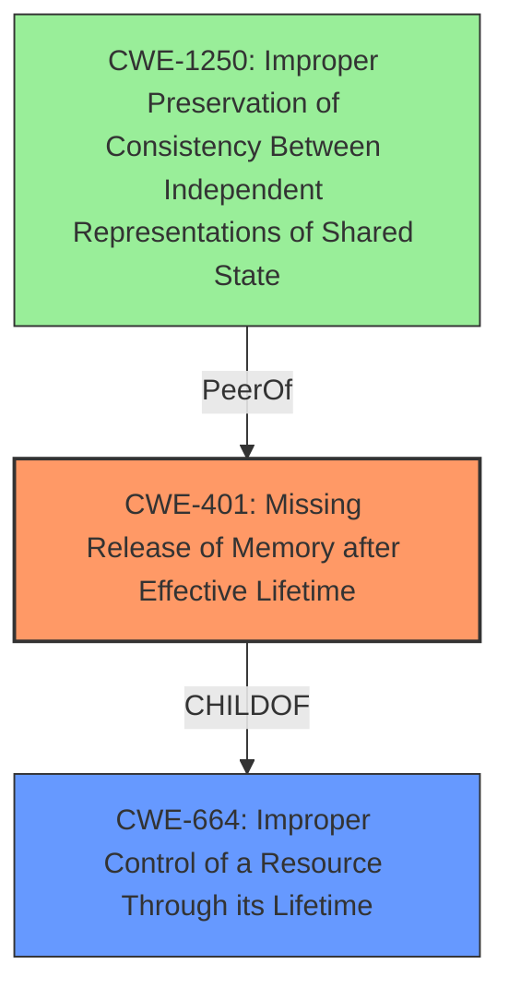

# Analysis Report for CVE-2022-22250

# Vulnerability Analysis Report: CVE-2022-22250

## Description

An Improper Control of a Resource Through its Lifetime vulnerability in Packet Forwarding Engine (PFE) of Juniper Networks Junos OS and Junos OS Evolved allows unauthenticated adjacent attacker to cause a Denial of Service (DoS). In an EVPN-MPLS scenario, if MAC is learned locally on an access interface but later a request to delete is received indicating that the MAC was learnt remotely, this can lead to memory corruption which can result in line card crash and reload. This issue affects Juniper Networks Junos OS All versions 17.3R1 and later versions prior to 19.2R3-S5 19.3 versions prior to 19.3R3-S5 19.4 versions prior to 19.4R2-S6, 19.4R3-S8 20.1 version 20.1R1 and later versions 20.2 versions prior to 20.2R3-S4 20.3 versions prior to 20.3R3-S3 20.4 versions prior to 20.4R3-S3 21.1 versions prior to 21.1R3-S1 21.2 versions prior to 21.2R3 21.3 versions prior to 21.3R2 21.4 versions prior to 21.4R1-S1, 21.4R2. Juniper Networks Junos OS Evolved All versions prior to 20.4R3-S3-EVO 21.1-EVO version 21.1R1-EVO and later versions 21.2-EVO versions prior to 21.2R3-EVO 21.3-EVO versions prior to 21.3R2-EVO 21.4-EVO versions prior to 21.4R1-S1-EVO, 21.4R2-EVO. This issue does not affect Juniper Networks Junos OS versions prior to 17.3R1.

## Vulnerability Description Key Phrases

**Rootcause:** Improper Control of a Resource Through its Lifetime
**Weakness:** memory corruption
**Impact:** Denial of Service (DoS)
**Vector:** accessing uninitialized memory
**Attacker:** unauthenticated adjacent attacker
**Product:** Juniper Networks Junos OS and Junos OS Evolved
**Version:** All versions 17.3R1 and later versions prior to 19.2R3-S5, 19.3 versions prior to 19.3R3-S5, 19.4 versions prior to 19.4R2-S6, 19.4R3-S8, 20.1, 20.1R1 and later versions, 20.2 versions prior to 20.2R3-S4, 20.3 versions prior to 20.3R3-S3, 20.4 versions prior to 20.4R3-S3, 21.1 versions prior to 21.1R3-S1, 21.2 versions prior to 21.2R3, 21.3 versions prior to 21.3R2, 21.4 versions prior to 21.4R1-S1, 21.4R2
**Component:** Packet Forwarding Engine (PFE)

## Analysis (with Relationship Data)

# Summary
| CWE ID | CWE Name | Confidence | CWE Abstraction Level | CWE Vulnerability Mapping Label | CWE-Vulnerability Mapping Notes |
|---|---|---|---|---|---|
| CWE-401 | Missing Release of Memory after Effective Lifetime | 0.75 | Variant | Allowed | Primary CWE |
| CWE-664 | Improper Control of a Resource Through its Lifetime | 0.5 | Pillar | Discouraged | Secondary Candidate |

## Evidence and Confidence

*   **Confidence Score:** 0.7
*   **Evidence Strength:** MEDIUM

- **Analysis and Justification:**
  - *Explanation:* The vulnerability description states "**Improper Control of a Resource Through its Lifetime**" which leads to "**memory corruption**". The description indicates that a MAC address, learned locally, is later deleted remotely, leading to a crash and reload of the line card due to the **memory corruption**. This suggests that memory is not properly released after its effective lifetime, aligning with CWE-401 (Missing Release of Memory after Effective Lifetime). CWE-401 is a Variant level CWE, which is a preferred level of abstraction. Although the description uses the phrase "**Improper Control of a Resource Through its Lifetime**", CWE-664 (Improper Control of a Resource Throughout its Lifetime) is a Pillar level CWE and is therefore discouraged.
  
  - *Relationship Analysis:* CWE-401 is a variant of resource management issues. It's related to improper handling of memory allocation and deallocation, leading to a potential denial-of-service. It doesn't have direct parent-child relationships in the provided data, but it's a specific type of resource management issue.

- **Confidence Score:**
  - *Example:* Confidence: 0.75 (Moderate evidence from the description of **memory corruption** due to the lifetime of a MAC address).

---

## Criticism of Analysis

Okay, let's review the provided analysis against the full CWE specifications.

**Overall Assessment:**

The primary CWE assignment of **CWE-401: Missing Release of Memory after Effective Lifetime** appears to be the most accurate and appropriate given the provided vulnerability description. The analysis correctly identifies that the MAC address not being properly released after its effective lifetime leads to memory corruption and a denial-of-service. The downgrading of CWE-664 to a secondary candidate is also correct, as it's a discouraged high-level CWE when more specific variants are available.

However, there are some nuances and potential alternative perspectives that warrant closer examination based on the retriever results and CWE specifications.

**Detailed Critique:**

1.  **CWE-401 Justification:**

    *   The analysis correctly identifies that the vulnerability description indicates "**Improper Control of a Resource Through its Lifetime**" which leads to "**memory corruption**".
    *   It rightly points out that a MAC address, learned locally, is later deleted remotely, leading to a crash and reload of the line card due to memory corruption. This aligns well with **CWE-401** (Missing Release of Memory after Effective Lifetime).
    *   The reasoning to prefer the Variant-level CWE-401 over the Pillar-level CWE-664 is sound.

2.  **CWE-664 Rejection:**

    *   The analysis correctly discards CWE-664 (Improper Control of a Resource Throughout its Lifetime) as the primary CWE because it's a Pillar-level CWE and discouraged when more specific options exist.
    *   This aligns with the **Mapping Guidance** for CWE-664: *"Usage: Discouraged"* and *"Consider children or descendants of this entry instead."*

3.  **Retriever Results Analysis & Alternatives:**

    *   The Retriever results present a mixed bag, and some of the high-ranking suggestions, while not *directly* representing the core issue, highlight related aspects that deserve consideration, even if ultimately rejected for the primary mapping:

        *   **CWE-410: Insufficient Resource Pool:**  This is *less* applicable but could be a *secondary* consideration if the system's memory management is such that the improper handling of MAC address deletion *exacerbates* an already strained memory pool, leading to DoS more easily.  However, the description primarily points to *incorrect handling* rather than *insufficient capacity*.
        *   **CWE-1285: Improper Validation of Specified Index, Position, or Offset in Input:** This is *not* directly relevant based on the initial vulnerability description.  There's no clear indication of an indexing/offset issue.
        *   **CWE-775: Missing Release of File Descriptor or Handle after Effective Lifetime:**  This is also *less* applicable. While memory can be thought of as a "handle," the description focuses more on *memory management* specifically rather than file descriptors.  If the MAC address entry involved a file descriptor that wasn't released, this would be more relevant.
        *   **CWE-1250: Improper Preservation of Consistency Between Independent Representations of Shared State:** The description suggests that MAC addresses are learned and deleted which implies that there are different copies of MAC addresses and their state. It is feasible that improper syncronization could have led to this state.
        *   **CWE-606: Unchecked Input for Loop Condition:** This is *not* directly relevant.
        *   **CWE-1286: Improper Validation of Syntactic Correctness of Input:** This is *not* directly relevant.

4. **Mitigation Considerations:**

    *   The provided analysis does *not* discuss potential mitigations. The CWE specifications offer valuable mitigation guidance. For CWE-401, these include:

        *   **Implementation:** Choosing languages/tools with automatic memory management (e.g., Java, garbage collection). This is a *long-term* architectural consideration.
        *   **Architecture and Design:** Using abstraction libraries for risky APIs.
        *   **Architecture and Design, Build and Compilation:** Using tools like Boehm-Demers-Weiser Garbage Collector or Valgrind to detect leaks during development.

5. **Evidence and Confidence:**
    * The confidence score of 0.75 is reasonable, given the moderate evidence from the description. It would be higher if there were more specific code-level details.

**Suggested Improvements:**

1.  **Acknowledge and Briefly Dismiss Irrelevant Retriever Results:** Briefly mention why options like CWE-410, CWE-1285, and CWE-775 were considered and ruled out. This demonstrates a more thorough analysis.

2.  **Add Mitigation Discussion:** Include a section discussing potential mitigation strategies based on the CWE-401 specification. This adds practical value to the analysis.

3.  **Specificity on Memory Corruption:** While "memory corruption" is a good indicator, try to be more specific if possible (e.g., is it a heap corruption, use-after-free, etc.?). If the root cause involves specific memory corruption types, these should be noted even if the primary CWE is still CWE-401.

4.  **Consider CWE Chaining**: The vulnerability may be the result of a chain of failures. For example, a missing check for MAC address type (CWE-118) might lead to CWE-401.

**Revised Summary Table (Example):**

| CWE ID | CWE Name | Confidence | CWE Abstraction Level | CWE Vulnerability Mapping Label | CWE-Vulnerability Mapping Notes |
|---|---|---|---|---|---|
| CWE-401 | Missing Release of Memory after Effective Lifetime | 0.75 | Variant | Allowed | Primary CWE |
| CWE-664 | Improper Control of a Resource Through its Lifetime | 0.25 | Pillar | Discouraged | Secondary Candidate (General Resource Management Issue) |
| NA | Alternative CWEs Considered | NA | NA | NA | CWE-410 (Insufficient Resource Pool): Ruled out as primary cause, but could exacerbate the DoS. CWE-1285 (Improper Input Validation) and CWE-775 (Missing FD Release): Not directly applicable based on description. |

**Revised Analysis Snippet (Example - Mitigation Section):**

"Mitigation strategies for CWE-401 include adopting languages or tools with automatic memory management (e.g., garbage collection), using abstraction libraries to minimize direct memory manipulation, and employing tools like Valgrind during development to detect memory leaks. These strategies could be incorporated to strengthen the system's memory handling and prevent similar vulnerabilities."

By incorporating these suggestions, the analysis becomes more robust, demonstrably thorough, and practically useful for developers seeking to address the identified vulnerability.

## Final Resolution

# Summary
| CWE ID | CWE Name | Confidence | CWE Abstraction Level | CWE Vulnerability Mapping Label | CWE-Vulnerability Mapping Notes |
|---|---|---|---|---|---|
| CWE-401 | Missing Release of Memory after Effective Lifetime | 0.85 | Variant | Allowed | Primary CWE |
| CWE-1250 | Improper Preservation of Consistency Between Independent Representations of Shared State | 0.4 | Base | Allowed | Secondary Candidate |
  - The Primary CWE should be first and noted as the Primary CWEs
  - The secondary candidate CWEs should be next and noted as secondary candidates.
  - The confidence is a confidence score 0 to 1 to rate your confidence in your assessment for that CWE.
  - The CWE Abstraction Level as one of these values: Base, Variant, Pillar, Class, Compound
  - The Mapping Notes Usage as one of these values: Allowed, Allowed-with-Review, Prohibited, Discouraged

## Evidence and Confidence

*   **Confidence Score:** 0.8
*   **Evidence Strength:** MEDIUM

## Relationship Analysis
The primary relationship considered was the hierarchical abstraction level, preferring CWE-401 (Variant) over CWE-664 (Pillar). The analysis also considered peer relationships, particularly CWE-410 (Insufficient Resource Pool), but ultimately decided against it as the primary cause. CWE-1250 was added as a secondary candidate because MAC address deletions may have led to an inconsistent state between copies.

## Vulnerability Chain
The vulnerability chain starts with the improper handling of MAC address deletions (root cause), leading to memory corruption (weakness), and ultimately resulting in a denial-of-service (impact).

## Summary of Analysis
The initial analysis correctly identified CWE-401 as the most appropriate primary CWE. The criticism highlighted several valid points, including the need to acknowledge and dismiss irrelevant retriever results and the inclusion of mitigation strategies. The addition of CWE-1250 as a secondary candidate acknowledges a more complex vulnerability chain, where MAC address deletion requests might lead to inconsistent state.

The evidence from the vulnerability description states "**Improper Control of a Resource Through its Lifetime**" and "**memory corruption**". This aligns strongly with CWE-401 (Missing Release of Memory after Effective Lifetime).

The graph relationships influenced the selection by prioritizing a Variant-level CWE (CWE-401) over a Pillar-level CWE (CWE-664), ensuring optimal specificity.
The selected CWEs are at the optimal level of specificity because CWE-401 directly addresses the memory release issue, while CWE-1250 acknowledges the potential for state inconsistency.

*Report generated on 2025-03-18 10:22:16*
