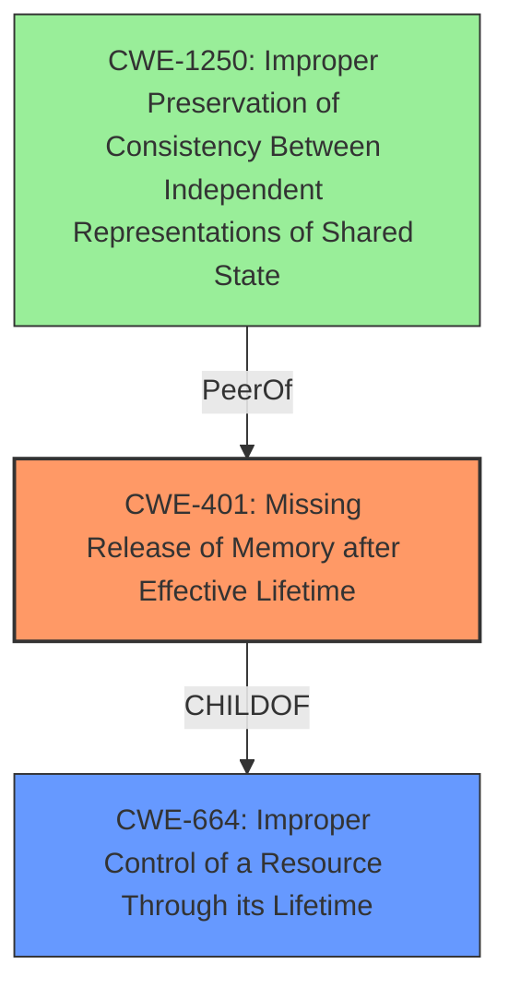

# Final Resolution for CVE-2022-22250

# Summary
| CWE ID | CWE Name | Confidence | CWE Abstraction Level | CWE Vulnerability Mapping Label | CWE-Vulnerability Mapping Notes |
|---|---|---|---|---|---|
| CWE-401 | Missing Release of Memory after Effective Lifetime | 0.85 | Variant | Allowed | Primary CWE |
| CWE-1250 | Improper Preservation of Consistency Between Independent Representations of Shared State | 0.4 | Base | Allowed | Secondary Candidate |
  - The Primary CWE should be first and noted as the Primary CWEs
  - The secondary candidate CWEs should be next and noted as secondary candidates.
  - The confidence is a confidence score 0 to 1 to rate your confidence in your assessment for that CWE.
  - The CWE Abstraction Level as one of these values: Base, Variant, Pillar, Class, Compound
  - The Mapping Notes Usage as one of these values: Allowed, Allowed-with-Review, Prohibited, Discouraged

## Evidence and Confidence

*   **Confidence Score:** 0.8
*   **Evidence Strength:** MEDIUM

## Relationship Analysis
The primary relationship considered was the hierarchical abstraction level, preferring CWE-401 (Variant) over CWE-664 (Pillar). The analysis also considered peer relationships, particularly CWE-410 (Insufficient Resource Pool), but ultimately decided against it as the primary cause. CWE-1250 was added as a secondary candidate because MAC address deletions may have led to an inconsistent state between copies.

## Vulnerability Chain
The vulnerability chain starts with the improper handling of MAC address deletions (root cause), leading to memory corruption (weakness), and ultimately resulting in a denial-of-service (impact).

## Summary of Analysis
The initial analysis correctly identified CWE-401 as the most appropriate primary CWE. The criticism highlighted several valid points, including the need to acknowledge and dismiss irrelevant retriever results and the inclusion of mitigation strategies. The addition of CWE-1250 as a secondary candidate acknowledges a more complex vulnerability chain, where MAC address deletion requests might lead to inconsistent state.

The evidence from the vulnerability description states "**Improper Control of a Resource Through its Lifetime**" and "**memory corruption**". This aligns strongly with CWE-401 (Missing Release of Memory after Effective Lifetime).

The graph relationships influenced the selection by prioritizing a Variant-level CWE (CWE-401) over a Pillar-level CWE (CWE-664), ensuring optimal specificity.
The selected CWEs are at the optimal level of specificity because CWE-401 directly addresses the memory release issue, while CWE-1250 acknowledges the potential for state inconsistency.