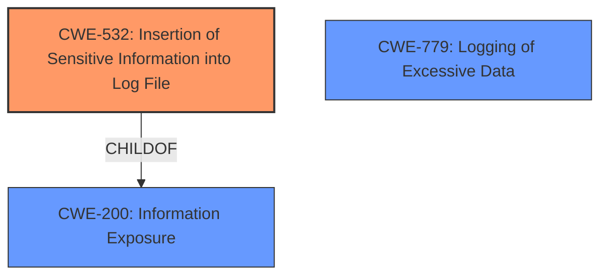

# Final Resolution for CVE-2022-22291

# Summary
| CWE ID  | CWE Name                               | Confidence | CWE Abstraction Level | CWE Vulnerability Mapping Label | CWE-Vulnerability Mapping Notes |
| ------- | -------------------------------------- | ---------- | --------------------- | ------------------------------- | ----------------------------- |
| CWE-532 | Insertion of Sensitive Information into Log File | 0.95       | Base                  | Allowed                         | Primary CWE. The vulnerability description explicitly states "**Logging of excessive data**" leading to a privileged attacker being able to get "Cell Location Information". This directly aligns with CWE-532. The core issue is the *sensitivity* of the logged data. |
| CWE-779 | Logging of Excessive Data | 0.4       | Base                  | Allowed                         | Secondary Candidate. The vulnerability description mentions "**Logging of excessive data**" which could point to CWE-779. However, the primary concern is the sensitivity of the data rather than the volume of logs. |

## Evidence and Confidence

*   **Confidence Score:** 0.95
*   **Evidence Strength:** HIGH

## Relationship Analysis
The primary relationship influencing the decision is the parent-child relationship between CWE-532 and CWE-200 (Information Exposure). While the impact results in information exposure, the **rootcause** is specifically the logging of sensitive data, making CWE-532 the more appropriate and specific choice.

Although the description mentions "**Logging of excessive data**" which is related to CWE-779 (Logging of Excessive Data), the sensitivity of data being logged is the bigger concern, so CWE-532 is selected over CWE-779.

## Vulnerability Chain
The vulnerability chain starts with the **rootcause**:

1.  **CWE-532: Insertion of Sensitive Information into Log File**: The system logs sensitive cell location information.

This leads to the **impact**:

2.  Privileged attackers can access the log file and obtain the sensitive cell location information, violating user privacy.

## Summary of Analysis
The initial analysis correctly identified CWE-532 as the primary **weakness**. The vulnerability description explicitly states "**Logging of excessive data**" which directly leads to the exposure of "Cell Location Information." The evidence strength is high due to the explicit mention of logging sensitive information.

The criticism suggested addressing CWE-779 (Logging of Excessive Data). While the vulnerability description mentions "**Logging of excessive data**," the core issue is the *sensitivity* of the data being logged, not necessarily the volume. If the volume of logging were the main issue, CWE-779 would be more appropriate. Since the primary concern is the logging of cell location data, CWE-532 is the more accurate classification.

The selection of CWE-532 is at the optimal level of specificity because it directly addresses the **rootcause** of the vulnerability, which is the insertion of sensitive information into log files.