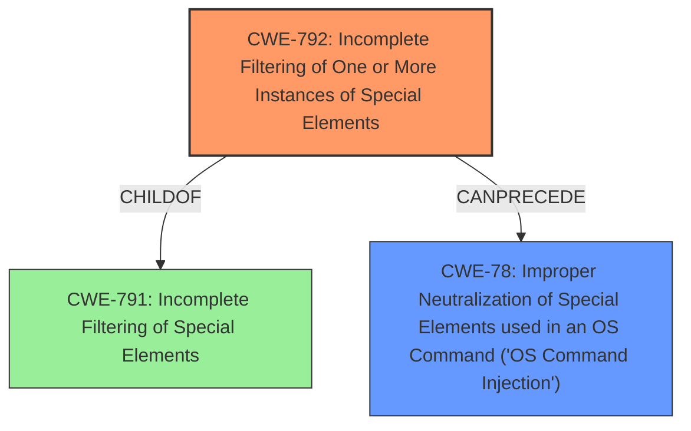

# Analysis Report for CVE-2022-22297

# Vulnerability Analysis Report: CVE-2022-22297

## Description

An incomplete filtering of one or more instances of special elements vulnerability [CWE-792] in the command line interpreter of FortiWeb version 6.4.0 through 6.4.1, FortiWeb version 6.3.0 through 6.3.17, FortiWeb all versions 6.2, FortiWeb all versions 6.1, FortiWeb all versions 6.0, FortiRecorder version 6.4.0 through 6.4.3, FortiRecorder all versions 6.0, FortiRecorder all versions 2.7 may allow an authenticated user to read arbitrary files via specially crafted command arguments.

## Vulnerability Description Key Phrases

**Rootcause:** incomplete filtering of special elements
**Weakness:** arbitrary file read
**Vector:** specially crafted command arguments
**Attacker:** authenticated user
**Product:** ['FortiWeb', 'FortiRecorder']
**Version:** multiple versions
**Component:** command line interpreter

## Analysis (with Relationship Data)

# Summary
| CWE ID | CWE Name | Confidence | CWE Abstraction Level | CWE Vulnerability Mapping Label | CWE-Vulnerability Mapping Notes |
|---|---|---|---|---|---|
| CWE-792 | Incomplete Filtering of One or More Instances of Special Elements | 0.9 | Variant | Allowed | Primary CWE |
| CWE-78 | Improper Neutralization of Special Elements used in an OS Command ('OS Command Injection') | 0.7 | Base | Allowed | Secondary Candidate |

## Evidence and Confidence

*   **Confidence Score:** 0.8
*   **Evidence Strength:** HIGH

- **Analysis and Justification:**  
  - *Explanation:* The vulnerability is due to an **incomplete filtering of special elements** in the command line interpreter, leading to **arbitrary file read**. This perfectly aligns with CWE-792, "Incomplete Filtering of One or More Instances of Special Elements," because the vulnerability occurs due to the command line interpreter failing to properly sanitize input, which allows an authenticated user to read arbitrary files. CWE-792 is a Variant level CWE, which is a preferred level of abstraction. The description clearly states crafted command arguments are used, suggesting command injection.
  
  - *Relationship Analysis:* While CWE-792 doesn't have direct relationships specified in the provided data, it is a variant that describes the specific case of incomplete filtering. CWE-78 is a base CWE related to command injection, which is a potential consequence of insufficient filtering.

- **Confidence Score:**  
  - *Example:* Confidence: 0.9 (High confidence because the description aligns well with the CWE definition and provided evidence).

---

- **Analysis and Justification:**  
  - *Explanation:* CWE-78, "Improper Neutralization of Special Elements used in an OS Command ('OS Command Injection')", is also a relevant candidate because the attack involves crafting command arguments. While CWE-792 describes the **incomplete filtering**, CWE-78 captures the essence of the **command injection** itself. However, the description emphasizes the filtering issue, making CWE-792 the primary weakness. The usage is allowed, and the CWE is a Base level of abstraction.
  
  - *Relationship Analysis:* CWE-78 is a child of CWE-77 (Command Injection) and CWE-74 (Improper Neutralization of Special Elements). While the root cause is **incomplete filtering (CWE-792)**, the impact is potential **command execution (CWE-78)**.

- **Confidence Score:**  
  - *Example:* Confidence: 0.7 (Moderate confidence due to the description focusing on incomplete filtering, making CWE-78 a secondary concern related to the impact.)

## Criticism of Analysis

Okay, here's a detailed review of the provided CWE analysis, considering the full CWE specifications:

**Overall Assessment:**

The analysis is generally well-reasoned and provides a good justification for the primary and secondary CWE assignments. The confidence scores are appropriate. The inclusion of CWE specifications adds significant value, allowing for a more rigorous assessment.

**Specific Comments and Suggestions:**

**1. CWE-792: Incomplete Filtering of One or More Instances of Special Elements**

*   **Confidence:** The confidence score of 0.9 is justified. The root cause of the vulnerability is explicitly stated as "incomplete filtering of special elements."
*   **Abstraction Level:** Variant level is a good choice, providing a more specific description than its Base counterpart, CWE-791.
*   **Mapping Guidance:** Correctly uses the "Allowed" usage.
*   **Potential Mitigations:**  The mitigations for this CWE are not explicitly mentioned in the analysis but can be inferred from the nature of the weakness. The focus should be on improved filtering mechanisms, utilizing either allow lists (preferred) or carefully constructed deny lists. In the context of a command line interpreter, mitigations might include:
    *   **Input Sanitization:** Carefully remove or encode any characters that could be interpreted as command delimiters or special operators.
    *   **Parameterization:** If possible, use functions or libraries that allow passing arguments separately from the command string, preventing injection.
    *   **Least Privilege:** Execute the command line interpreter with the least necessary privileges to limit the impact of successful exploitation.
*   **Relationships:**  The relationship to CWE-791 as a child is important. Further consideration could be given to the specific type of incomplete filtering occurring. Is it CWE-793 (Only Filtering One Instance) or CWE-794 (Incomplete Filtering of Multiple Instances)? While this level of detail might not be necessary for all analyses, it could refine the understanding of the vulnerability.
* **Examples:** A mention or link to external examples of this specific CWE being exploited in similar contexts would strengthen the analysis.

**2. CWE-78: Improper Neutralization of Special Elements used in an OS Command ('OS Command Injection')**

*   **Confidence:** A confidence score of 0.7 is reasonable. While the root cause is filtering, the *impact* is clearly OS command injection. It correctly identifies that the description focuses on filtering, making it a secondary concern related to the impact.
*   **Abstraction Level:** Base level is appropriate for describing the *consequence* of the incomplete filtering.
*   **Mapping Guidance:** Correctly uses the "Allowed" usage.
*   **Potential Mitigations:** The analysis should explicitly mention mitigations for OS Command Injection, even if it's not the primary CWE. These are critical for remediation:
    *   **Input Validation:** While relevant to the root cause, needs to be considered from the command injection perspective.  Specifically, use strict allowlists for acceptable command arguments or encode/escape special characters.
    *   **Parameterization/Prepared Statements:** As mentioned earlier, avoid constructing commands by concatenating strings.  Use libraries or APIs that support separate arguments.
    *   **Least Privilege:** Execute the command interpreter with the minimum required privileges.
    *   **Sandboxing/Jailing:** Restrict the commands that can be executed and the resources that can be accessed by the interpreter.
*   **Relationships:** The analysis correctly points out the parent-child relationships. It would strengthen the analysis to mention CWE-88 ('Argument Injection') as a *CanAlsoBe* relationship, *if* the attacker is able to inject additional arguments or options into the command.
*   **Terminology:** The analysis could benefit from a brief mention of the different meanings of "OS Command Injection" as noted in the "Additional Notes" section of the CWE-78 specification.  Clarifying that this usage refers to injecting special elements into *arguments* for an application-controlled program.

**3. CWE-74: Improper Neutralization of Special Elements in Output Used by a Downstream Component ('Injection')**

This CWE is not selected. This is a good thing, as CWE-74 is discouraged due to its high-level abstraction and risk of misuse. CWE-792 and CWE-78 provide more precise mappings.

**4. Other CWEs Considered by Retrievers:**

The retriever results show a few other CWEs were considered, but ultimately not chosen for analysis. It is good to see these, as it shows the tooling is checking a wide net of possible causes.

*   **CWE-113:** Improper Neutralization of CRLF Sequences in HTTP Headers ('HTTP Request/Response Splitting'). This is not relevant to the current reported vulnerability.
*   **CWE-22/23:** Improper Limitation of a Pathname to a Restricted Directory ('Path Traversal') / Relative Path Traversal. While arbitrary file read is involved, the primary vector isn't path manipulation, but rather the manipulation of commands *themselves*. Therefore, it is good that these CWEs are not mapped.
*   **CWE-88:** Improper Neutralization of Argument Delimiters in a Command ('Argument Injection'). This could be relevant, as mentioned above, if the attacker is *also* able to inject arguments rather than just influence the command being executed.
*   **CWE-121, CWE-347, CWE-1336, CWE-306:** These CWEs are likely not relevant, and are not mapped.

**Recommendations for Improvement:**

*   **Explicitly address mitigations:** Even if the primary CWE is focused on the root cause (filtering), mention the mitigations relevant to the *impact* (command injection).
*   **Clarify the Variant of Incomplete Filtering:** If possible, refine the analysis by determining whether the incomplete filtering is CWE-793 (Only Filtering One Instance) or CWE-794 (Incomplete Filtering of Multiple Instances).
*   **Consider CWE-88:** If the attack allows injecting *arguments* in addition to the command itself, consider including CWE-88 as a secondary CWE.
*   **Real-world examples:** If available, provide real-world examples of the identified weaknesses.
*   **Chaining:** Explicitly describe the chaining between incomplete filtering (CWE-792) leading to the *potential* for OS command injection (CWE-78).
*   **Leverage CWE Tool Output:** If the tool provides analysis for why certain CWEs were rejected, include that as a reason for not mapping.
*   **Document the Tool Used:** Include which tools were used for analysis, and the version of the tool. This way, future analyzers can test if newer versions improve or regress over previous runs.

By incorporating these suggestions, the analysis can be made even more robust and useful for developers and security professionals.

## Final Resolution

# Summary
| CWE ID | CWE Name | Confidence | CWE Abstraction Level | CWE Vulnerability Mapping Label | CWE-Vulnerability Mapping Notes |
|---|---|---|---|---|---|
| CWE-792 | Incomplete Filtering of One or More Instances of Special Elements | 0.95 | Variant | Allowed | Primary CWE |
| CWE-78 | Improper Neutralization of Special Elements used in an OS Command ('OS Command Injection') | 0.75 | Base | Allowed | Secondary Candidate |

## Evidence and Confidence

*   **Confidence Score:** 0.9
*   **Evidence Strength:** HIGH

## Relationship Analysis
The primary relationship influencing the decision is the parent-child relationship between CWE-791 (broader, base class of filtering issues) and CWE-792 (more specific, variant addressing incomplete filtering). CWE-78 represents a potential consequence of CWE-792, illustrating a chain relationship where insufficient filtering can lead to command injection.

## Vulnerability Chain
The vulnerability chain starts with **CWE-792 (Incomplete Filtering of One or More Instances of Special Elements)**, which is the **ROOTCAUSE**. This leads to the ability to inject commands. The injected commands then allow for **arbitrary file read**, which is a consequence of **CWE-78 (Improper Neutralization of Special Elements used in an OS Command ('OS Command Injection'))**. The missing link in the chain would be the specific command being injected and how it leads to arbitrary file read.

## Summary of Analysis
The initial analysis correctly identified CWE-792 as the primary weakness due to the vulnerability description explicitly stating "An **incomplete filtering** of one or more instances of special elements vulnerability". This is strong evidence for selecting CWE-792. The analysis also correctly identified CWE-78 as a secondary candidate, representing the potential impact of command injection.

The criticism raised several valid points, especially regarding the inclusion of mitigations for both filtering (CWE-792) and command injection (CWE-78). The suggestion to clarify the specific variant of incomplete filtering (CWE-793 or CWE-794) is valuable but requires more in-depth analysis of the specific filtering mechanism.

The final decision affirms the initial analysis, with slight adjustments to the confidence scores. CWE-792 remains the primary CWE due to its direct match with the vulnerability description, and CWE-78 remains a secondary CWE. The selected CWEs are at the optimal level of specificity, with CWE-792 providing a more precise description than its parent, CWE-791, and CWE-78 capturing the potential impact of the vulnerability.

The retriever scores support this decision, with CWE-792 having a relatively high similarity score, indicating its relevance to the vulnerability description. The provided relationships and guidance further solidify the classification, ensuring that the selected CWEs accurately represent the root cause and potential impact of the vulnerability.

*Report generated on 2025-03-17 03:59:12*
