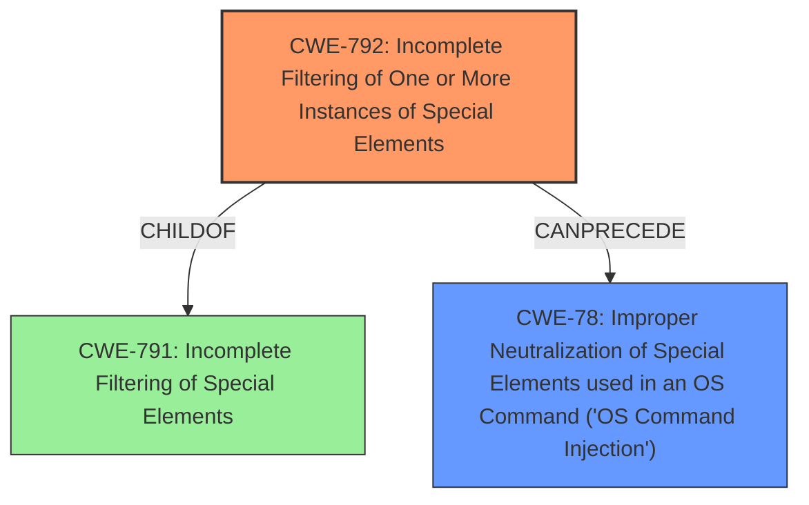

# Final Resolution for CVE-2022-22297

# Summary
| CWE ID | CWE Name | Confidence | CWE Abstraction Level | CWE Vulnerability Mapping Label | CWE-Vulnerability Mapping Notes |
|---|---|---|---|---|---|
| CWE-792 | Incomplete Filtering of One or More Instances of Special Elements | 0.95 | Variant | Allowed | Primary CWE |
| CWE-78 | Improper Neutralization of Special Elements used in an OS Command ('OS Command Injection') | 0.75 | Base | Allowed | Secondary Candidate |

## Evidence and Confidence

*   **Confidence Score:** 0.9
*   **Evidence Strength:** HIGH

## Relationship Analysis
The primary relationship influencing the decision is the parent-child relationship between CWE-791 (broader, base class of filtering issues) and CWE-792 (more specific, variant addressing incomplete filtering). CWE-78 represents a potential consequence of CWE-792, illustrating a chain relationship where insufficient filtering can lead to command injection.

## Vulnerability Chain
The vulnerability chain starts with **CWE-792 (Incomplete Filtering of One or More Instances of Special Elements)**, which is the **ROOTCAUSE**. This leads to the ability to inject commands. The injected commands then allow for **arbitrary file read**, which is a consequence of **CWE-78 (Improper Neutralization of Special Elements used in an OS Command ('OS Command Injection'))**. The missing link in the chain would be the specific command being injected and how it leads to arbitrary file read.

## Summary of Analysis
The initial analysis correctly identified CWE-792 as the primary weakness due to the vulnerability description explicitly stating "An **incomplete filtering** of one or more instances of special elements vulnerability". This is strong evidence for selecting CWE-792. The analysis also correctly identified CWE-78 as a secondary candidate, representing the potential impact of command injection.

The criticism raised several valid points, especially regarding the inclusion of mitigations for both filtering (CWE-792) and command injection (CWE-78). The suggestion to clarify the specific variant of incomplete filtering (CWE-793 or CWE-794) is valuable but requires more in-depth analysis of the specific filtering mechanism.

The final decision affirms the initial analysis, with slight adjustments to the confidence scores. CWE-792 remains the primary CWE due to its direct match with the vulnerability description, and CWE-78 remains a secondary CWE. The selected CWEs are at the optimal level of specificity, with CWE-792 providing a more precise description than its parent, CWE-791, and CWE-78 capturing the potential impact of the vulnerability.

The retriever scores support this decision, with CWE-792 having a relatively high similarity score, indicating its relevance to the vulnerability description. The provided relationships and guidance further solidify the classification, ensuring that the selected CWEs accurately represent the root cause and potential impact of the vulnerability.