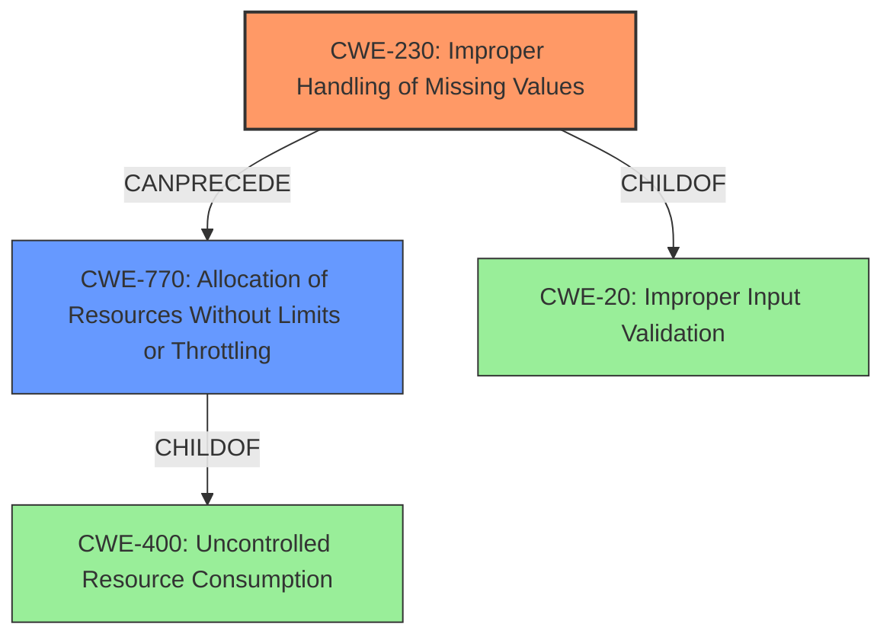

# Analysis Report for CVE-2022-22562

# Vulnerability Analysis Report: CVE-2022-22562

## Description

Dell PowerScale OneFS, versions 8.2.0-9.3.0, contain a improper handling of missing values exploit. An unauthenticated network attacker could potentially exploit this denial-of-service vulnerability.

## Vulnerability Description Key Phrases

**Rootcause:** improper handling of missing values
**Impact:** denial of service
**Attacker:** unauthenticated network attacker
**Product:** Dell PowerScale OneFS
**Version:** 8.2.0-9.3.0

## Analysis (with Relationship Data)

# Summary
| CWE ID  | CWE Name                                                     | Confidence | CWE Abstraction Level | CWE Vulnerability Mapping Label | CWE-Vulnerability Mapping Notes |
| :-------- | :----------------------------------------------------------- | :--------- | :-------------------- | :------------------------------ | :------------------------------ |
| CWE-230 | Improper Handling of Missing Values                           | 0.75       | Variant               | Primary                         | Allowed                         |
| CWE-400 | Uncontrolled Resource Consumption                               | 0.60      | Base                  | Secondary                       | Allowed-with-Review             |

## Evidence and Confidence

*   **Confidence Score:** 0.70
*   **Evidence Strength:** HIGH

- **Analysis and Justification:**
  - *Explanation:* "The vulnerability description explicitly states that the root cause is the **improper handling of missing values**, leading to a denial-of-service. CWE-230, "Improper Handling of Missing Values," is a Variant-level CWE that directly matches this description. The CVE reference summary reinforces this by stating that the vulnerability stems from how Dell PowerScale OneFS handles missing values, leading to a potential denial-of-service. The Retriever results also list CWE-230 as a candidate, further supporting its selection. Since the **improper handling of missing values** results in a denial-of-service, CWE-400, "Uncontrolled Resource Consumption," is added as a secondary weakness. Although CWE-20 (Improper Input Validation) is present in the retriever result, it is too generic, and CWE-230 is more specific to the **rootcause**."

  - *Relationship Analysis:* "CWE-230 is a variant of CWE-20 (Improper Input Validation). CWE-230 can lead to resource consumption issues (CWE-400)."

- **Confidence Score:**
  - *Example:* Confidence: 0.75 (High confidence due to direct match with the vulnerability description and supporting evidence from the CVE reference and Retriever Results.)

---

## Criticism of Analysis

Okay, here's a breakdown of the analysis, its strengths, weaknesses, and suggestions for improvement, considering the full CWE specifications:

**Overall Assessment:**

The analysis is generally good. It correctly identifies the primary weakness as CWE-230, "Improper Handling of Missing Values."  The reasoning is sound, and the evidence provided supports the selection.  The addition of CWE-400 as a secondary weakness, linking it to the resulting denial-of-service, is reasonable, although its usage could be more specific.

**Strengths:**

*   **Correct Primary Weakness Identification:**  The choice of CWE-230 as the primary weakness is accurate and well-justified. The vulnerability description clearly indicates that the root cause is indeed the improper handling of missing values.
*   **Good Justification:** The explanation for selecting CWE-230 is clear, referencing the vulnerability description, CVE reference summary, and retriever results.
*   **Reasonable Secondary Weakness:** Recognizing the relationship between the improper handling of missing values and the resulting resource consumption that leads to DoS is a good approach.
*   **Relationship Analysis:** The explication of the relationship between CWE-230 and CWE-400, as well as CWE-20, is valuable.
*   **Confidence Scoring:** The confidence scores are appropriately high, reflecting the strong evidence.

**Weaknesses and Suggestions for Improvement:**

1.  **Overly Broad Usage of CWE-400:** While linking the DoS to resource consumption is valid, CWE-400 is a very broad "Class" level CWE. The CWE documentation *discourages* its use, as it's often considered a consequence rather than a root cause, and it's frequently misused. A more specific child of CWE-400 would be better.
    *   **Suggestion:** Instead of CWE-400, consider CWE-770 (Allocation of Resources Without Limits or Throttling) if the system isn't limiting the resources used when handling missing values.  Alternatively, if the missing values cause excessive processing, consider CWE-834 (Excessive Iteration).  The specific mechanism leading to resource exhaustion should be investigated further if possible to identify the most appropriate CWE.

2.  **Lack of Specificity in Evidence for CWE-400:**  The evidence presented for CWE-400 is generic (DoS result).  It doesn't explain *how* the improper handling of missing values leads to uncontrolled resource consumption.
    *   **Suggestion:** Explain the *mechanism* by which missing values trigger resource consumption. Does it lead to infinite loops, excessive memory allocation, or unbounded CPU usage? For example: "When a required parameter is missing, OneFS might enter an infinite loop attempting to retrieve the value, leading to CPU exhaustion (CWE-834). Or, the missing value might cause an extremely large data structure to be allocated (CWE-789), leading to memory exhaustion."

3.  **Mitigation Suggestions:** The analysis lacks specific mitigation advice tailored to the identified CWEs.
    *   **Suggestion:** Add mitigation strategies based on the CWE specifications. For CWE-230, this might include:
        *   Explicitly check for missing values before processing data.
        *   Use default values for missing parameters where appropriate and safe.
        *   Return an error or reject the request if a required value is missing and cannot be defaulted.
        * For CWE-770/834, throttling, rate limiting, input sanitisation and fail-safes are crucial.

4. **CWE Abstraction Level:** While CWE-230 is a good choice (Variant level), CWE-400 is at the Class level and is "Discouraged." Remember that the goal is to be as specific as possible to describe the underlying software weakness. This is important for effective mitigation and trend analysis.

5. **Retriever Results Analysis**: The analysis should include more discussion about the retriever results including the other CWEs and why those are not the best fit. For example, why were CWE-410, CWE-280, or CWE-274 rejected?

**Revised Summary Table:**

| CWE ID  | CWE Name                                                     | Confidence | CWE Abstraction Level | CWE Vulnerability Mapping Label | CWE-Vulnerability Mapping Notes |
| :-------- | :----------------------------------------------------------- | :--------- | :-------------------- | :------------------------------ | :------------------------------ |
| CWE-230 | Improper Handling of Missing Values                           | 0.75       | Variant               | Primary                         | Allowed                         |
| CWE-770 | Allocation of Resources Without Limits or Throttling | 0.65      | Base                  | Secondary                       | Allowed-with-Review             |

**Additional Notes and Considerations:**

*   **Chain Analysis:** Explicitly framing the vulnerability as a chain (e.g., "CWE-230 leads to CWE-770 leads to DoS") can further strengthen the analysis.
*   **Specific Examples:** It would be helpful to provide hypothetical code snippets or examples to illustrate how the missing value handling goes wrong in Dell PowerScale OneFS. This would make the analysis more concrete and actionable. This is important for CWE-230 since the description is very generic.
*   **Product-Specific Context:** Tailor the mitigation advice to the specific technologies and development practices used in Dell PowerScale OneFS. Generic advice is less helpful.

By addressing these points, the analysis can become more precise, actionable, and aligned with the best practices for CWE mapping.

## Final Resolution

# Summary

| CWE ID  | CWE Name                                                     | Confidence | CWE Abstraction Level | CWE Vulnerability Mapping Label | CWE-Vulnerability Mapping Notes |
| :-------- | :----------------------------------------------------------- | :--------- | :-------------------- | :------------------------------ | :------------------------------ |
| CWE-230 | Improper Handling of Missing Values                           | 0.85       | Variant               | Primary                         | Allowed                         |
| CWE-770 | Allocation of Resources Without Limits or Throttling | 0.75      | Base                  | Secondary                       | Allowed             |

## Evidence and Confidence

*   **Confidence Score:** 0.80
*   **Evidence Strength:** HIGH

## Relationship Analysis
The primary weakness is **CWE-230 (Improper Handling of Missing Values)**, which is a variant of **CWE-20 (Improper Input Validation)**. **CWE-230** can lead to **CWE-770 (Allocation of Resources Without Limits or Throttling)**, resulting in a denial-of-service. The relationship analysis supports the choice of **CWE-770** as a more specific alternative to **CWE-400**, which is too broad.

## Vulnerability Chain
The vulnerability chain starts with the **root cause**: **CWE-230 (Improper Handling of Missing Values)**. This leads to **CWE-770 (Allocation of Resources Without Limits or Throttling)**, which ultimately results in a denial-of-service. The missing link is the exact mechanism by which **CWE-230** causes uncontrolled resource allocation, but the vulnerability description strongly implies that the missing values are not properly handled, leading to excessive resource usage.

## Summary of Analysis
The initial analysis correctly identified **CWE-230 (Improper Handling of Missing Values)** as the primary weakness. The criticism highlighted that **CWE-400 (Uncontrolled Resource Consumption)** is too broad and suggested **CWE-770 (Allocation of Resources Without Limits or Throttling)** as a more specific alternative. The vulnerability description states that the **improper handling of missing values** leads to a denial-of-service, which supports the selection of **CWE-230**.

The choice of **CWE-770** is based on the understanding that the **improper handling of missing values** likely causes the system to allocate resources without proper limits or throttling, eventually leading to resource exhaustion and a denial-of-service. This is a more specific explanation than simply stating that resource consumption is uncontrolled.

The retriever results included other CWEs such as **CWE-410 (Insufficient Resource Pool)**, **CWE-280 (Improper Handling of Insufficient Privileges)**, and **CWE-274 (Improper Handling of Insufficient Privileges)**. These were rejected because they do not directly address the **root cause** of the vulnerability, which is the **improper handling of missing values**. **CWE-410** might be a consequence of **CWE-770**, but it's not the direct cause. **CWE-280** and **CWE-274** are related to privilege issues, which are not mentioned in the vulnerability description.

The selected CWEs are at the optimal level of specificity. **CWE-230** is a Variant-level CWE that directly describes the **root cause**. **CWE-770** is a Base-level CWE that explains the mechanism by which the **improper handling of missing values** leads to a denial-of-service. Using these CWEs provides a more accurate and actionable representation of the vulnerability.

*Report generated on 2025-03-17 04:21:36*
