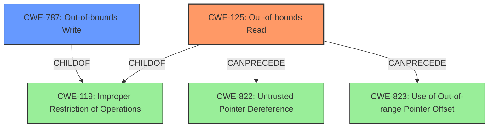

# Final Resolution for CVE-2022-22627

# Summary 
| CWE ID | CWE Name | Confidence | CWE Abstraction Level | CWE Vulnerability Mapping Label | CWE-Vulnerability Mapping Notes |
|---|---|---|---|---|---|
| CWE-125 | Out-of-bounds Read | 1.0 | Base | Allowed | Primary CWE: The vulnerability description explicitly states an **out-of-bounds read**, aligning directly with CWE-125. |
| CWE-787 | Out-of-bounds Write | 0.3 | Base | Allowed | Secondary Candidate: While the primary issue is an **out-of-bounds read**, the potential for writing to unintended memory locations as a result of processing the malicious AppleScript binary exists, but is not explicitly stated. |

## Evidence and Confidence

*   **Confidence Score:** 0.95
*   **Evidence Strength:** HIGH

## Relationship Analysis
The primary CWE is CWE-125 (**Out-of-bounds Read**), which is a child of CWE-119 (**Improper Restriction of Operations within the Bounds of a Memory Buffer**). CWE-787 (**Out-of-bounds Write**) is also a child of CWE-119. The choice of CWE-125 is more specific than CWE-119 because the vulnerability description explicitly mentions "**out-of-bounds read**." CWE-125 can precede other weaknesses like CWE-822 (**Untrusted Pointer Dereference**) or CWE-823 (**Use of Out-of-range Pointer Offset**), depending on how the read is achieved. CWE-787 is kept as a secondary candidate because a maliciously crafted binary could potentially lead to writes outside the intended buffer, but the description focuses on reading.

## Vulnerability Chain
The vulnerability chain starts with a maliciously crafted AppleScript binary. The processing of this binary leads to an **out-of-bounds read** (CWE-125). This **out-of-bounds read** can then potentially lead to disclosure of process memory or unexpected application termination. While not explicitly stated, there's a possibility that the crafted binary could also cause an **out-of-bounds write** (CWE-787), further exacerbating the issue.

## Summary of Analysis
The initial analysis correctly identified CWE-125 (**Out-of-bounds Read**) as the primary **weakness**. The vulnerability description explicitly states an **out-of-bounds read**, providing strong evidence for this classification. The inclusion of CWE-787 (**Out-of-bounds Write**) as a secondary candidate was reasonable, but its confidence has been lowered to 0.3 because the vulnerability description primarily focuses on the read, not write.

The relationship analysis confirms that CWE-125 and CWE-787 are both children of CWE-119 (**Improper Restriction of Operations within the Bounds of a Memory Buffer**), but CWE-125 is the more specific and appropriate choice due to the explicit mention in the vulnerability description.

The analysis is based on the provided evidence, specifically the vulnerability description: "An **out-of-bounds read** was addressed with improved bounds checking...Processing a maliciously crafted AppleScript binary may result in unexpected application termination or disclosure of process memory." This directly supports the classification of CWE-125.

The retriever results suggested other CWEs such as CWE-843, CWE-190, CWE-122, and CWE-277. These were not selected because there is no explicit information about type confusion (CWE-843), integer overflow (CWE-190), heap overflow (CWE-122) or improper check for unusual or exceptional conditions (CWE-277).
CWE-125 and CWE-787 are at the optimal level of specificity as they are base-level CWEs that directly address the described **weaknesses**.