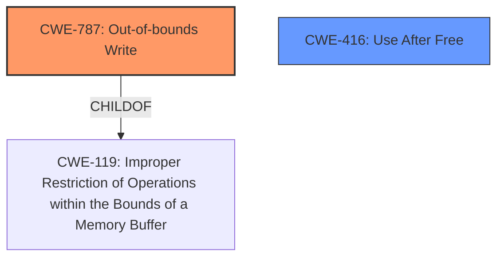

# Analysis Report for CVE-2022-22764

# Vulnerability Analysis Report: CVE-2022-22764

## Description

Mozilla developers Paul Adenot and the Mozilla Fuzzing Team reported memory safety bugs present in Firefox 96 and Firefox ESR 91.5. Some of these bugs showed evidence of memory corruption and we presume that with enough effort some of these could have been exploited to run arbitrary code. This vulnerability affects Firefox < 97, Thunderbird < 91.6, and Firefox ESR < 91.6.

## Vulnerability Description Key Phrases

**Rootcause:** memory safety bugs
**Weakness:** memory corruption
**Product:** ['Firefox', 'Thunderbird', 'Firefox ESR']
**Version:** ['< 97', '< 91.6', '< 91.6']

## Analysis (with Relationship Data)

# Summary
| CWE ID | CWE Name | Confidence | CWE Abstraction Level | CWE Vulnerability Mapping Label | CWE-Vulnerability Mapping Notes |
|---|---|---|---|---|---|
| CWE-787 | Out-of-bounds Write | 0.85 | Base | Primary | Allowed |
| CWE-416 | Use After Free | 0.70 | Variant | Secondary | Allowed |

## Evidence and Confidence

*   **Confidence Score:** 0.80
*   **Evidence Strength:** HIGH

- **Analysis and Justification:**  
  - *Explanation:* The vulnerability description highlights "**memory safety bugs**" leading to "**memory corruption**" in Firefox and Thunderbird. The primary issue is identified as CWE-787 (Out-of-bounds Write) because **memory corruption** often arises from writing data beyond the intended buffer boundaries. This aligns with the CWE description: "The product writes data past the end, or before the beginning, of the intended buffer." The impact of this **memory corruption** can lead to arbitrary code execution, making CWE-787 a suitable primary classification. The Retriever Results also strongly suggest CWE-787.
  
  - *Relationship Analysis:* CWE-787 is a Base level CWE, which is the preferred level of abstraction. CWE-787 is related to CWE-119 (Improper Restriction of Operations within the Bounds of a Memory Buffer), but CWE-787 is more specific.

- **Confidence Score:**  
  - Confidence: 0.85 (High confidence due to direct mention of **memory corruption** and potential for arbitrary code execution.)

- **Analysis and Justification:**  
  - *Explanation:* Additionally, the "**memory safety bugs**" could potentially involve use-after-free scenarios. Therefore, CWE-416 (Use After Free) is considered as a secondary CWE. CWE-416 occurs when the product reuses or references memory after it has been freed. This is a plausible cause for **memory corruption**.
  
  - *Relationship Analysis:* CWE-416 is a Variant level CWE, which is a preferred level of abstraction.

- **Confidence Score:**  
  - Confidence: 0.70 (Medium confidence as the description is not explicit about use-after-free, but it's a likely possibility given the **memory safety bugs**.)

## Criticism of Analysis

Okay, here's a review of the provided analysis, incorporating the full CWE specifications and focusing on mapping guidance and potential mitigations:

**Overall Assessment:**

The analysis is generally good and provides a reasonable mapping of the vulnerability description to CWEs. The choice of CWE-787 (Out-of-bounds Write) as the primary weakness is justified, and the consideration of CWE-416 (Use After Free) as a secondary issue is also plausible.  The confidence scores assigned are appropriate. However, there are a few areas where the analysis could be improved:

1.  **Relationship between memory safety bugs and memory corruption**: The analysis emphasizes the phrase "memory corruption" as the primary reason for selecting CWE-787. However, "memory safety bugs" are a broader concept that can lead to various forms of memory corruption. Therefore, instead of using "memory corruption" as the primary root cause, it is more accurate to consider memory corruption as a symptom of memory safety bugs. Therefore, "memory safety bugs" should be mapped to the root cause.
2.  **Consideration of other potential CWEs**: While CWE-787 and CWE-416 are likely candidates, the Retriever Results suggest a few other CWEs that warrant at least brief consideration, particularly CWE-843 (Type Confusion).
3.  **Justification of Base vs. Variant/Class**: While the analysis touches on the abstraction levels of the selected CWEs, a stronger justification for why the chosen abstraction level is most appropriate would be beneficial.
4.  **Mitigations**: It would add value to briefly discuss the potential mitigations in the context of Firefox and Thunderbird development.

**Detailed Review by CWE:**

**1. CWE-787: Out-of-bounds Write (Primary)**

*   **Confidence Level:** 0.85 (Excellent)
*   **Rationale:** The analysis correctly links "memory corruption" to the possibility of out-of-bounds writes. The mention of potential for arbitrary code execution strongly supports this. The specification's alternative term "Memory Corruption" reinforces this mapping.
*   **Mapping Guidance:** The analysis acknowledges that CWE-119 (Improper Restriction of Operations within the Bounds of a Memory Buffer) is a parent of CWE-787, as well as the fact that CWE-119 is discouraged and provides rationale.
*   **Mitigations:** The CWE specifications suggest:
    *   **Language Selection:** This is relevant. The analysis does not mention which languages Firefox and Thunderbird are primarily written in. Using memory-safe languages like Rust for new components would be a good mitigation strategy. However, legacy codebases are often in C/C++, where such protection are not built-in, resulting in memory corruption.
    *   **Libraries or Frameworks:** Using safe string handling libraries (like `SafeStr` or `Strsafe.h`) could help prevent these errors, although their applicability within the existing codebase needs evaluation. It would add value to discuss the feasibility of using these mitigation strategies.
    *   **Environment Hardening:** Compiler flags like `/GS` (Visual Studio) or `FORTIFY_SOURCE` (GCC) are essential defenses and should be confirmed as being in use. However, they are not foolproof and can be bypassed.
*   **Suggestion:** It could be beneficial to mention mitigation strategies used by Mozilla, and how they could improve to prevent future vulnerabilities.

**2. CWE-416: Use After Free (Secondary)**

*   **Confidence Level:** 0.70 (Good)
*   **Rationale:** The association of "**memory safety bugs**" with UAF scenarios is reasonable. While the description is not explicit, UAF is a common consequence of memory management errors.
*   **Mapping Guidance:** The analysis notes that CWE-416 is a Variant-level CWE. The specification confirms that its usage is *allowed* and at a preferred level of abstraction. The analysis also confirms that the mapping is appropriate.
*   **Mitigations:** The CWE specifications suggest:
    *   **Language Selection:** Again, using memory-safe languages (like Rust) would prevent UAF vulnerabilities, which could be incorporated in future development plans.
    *   **Attack Surface Reduction:** Nullifying pointers after freeing is a common practice, but its effectiveness can be limited in complex data structures. Consider using smart pointers or other RAII techniques to manage memory automatically.
*   **Suggestion:** The analysis could be improved by mentioning whether address space layout randomization (ASLR) is enabled.

**3. Other CWEs (from Retriever Results):**

*   **CWE-843: Access of Resource Using Incompatible Type ('Type Confusion'):** The retriever results give this a relatively high score. It should at least be considered. If memory is reinterpreted, especially by untrusted input, it can cause vulnerabilities. However, if the "memory safety bugs" can be directly attributable to memory corruption via out-of-bounds write (CWE-787) or use-after-free (CWE-416), then type confusion would be a downstream effect.
*   **CWE-681: Incorrect Conversion between Numeric Types:** This is worth considering as it could lead to buffer overflows. If the memory safety bugs can be traced back to numerical conversion errors that leads to incorrect buffer sizes and out-of-bounds reads and writes, then CWE-681 should be considered as a root cause.
*   **CWE-124: Buffer Underwrite ('Buffer Underflow'):** Buffer underflows are another form of memory corruption. If the memory safety bugs can be directly attributable to buffer underflows, then this should be considered as a possible root cause.
*   **CWE-125: Out-of-bounds Read:** Out-of-bounds reads are another form of memory corruption. If the memory safety bugs can be directly attributable to out-of-bounds reads, then this should be considered as a possible root cause.
*   **CWE-122: Heap-based Buffer Overflow:** If the description mentions that the buffer being overwritten is allocated in the heap portion of memory, generally meaning that the buffer was allocated using a routine such as malloc(), then this should be considered as a root cause.

**Recommendations for Improvement:**

1.  **Expand on Root Cause Explanation**: Explain how 'memory safety bugs' lead to memory corruption. Rather than focus on the symptom of "memory corruption", focus on the root causes. For example, a race condition could cause a use-after-free. An integer overflow could cause an out-of-bounds write.
2.  **Address Other Potential CWEs**: Briefly discuss why other CWEs suggested by the Retriever Results (especially CWE-843) are *not* considered primary or secondary issues, or how they might be related as contributing factors or consequences.
3.  **Strengthen Abstraction Level Justification:** Explicitly state why you've chosen a Base or Variant level of abstraction for each CWE. Refer to the CWE specifications and the mapping guidance.
4.  **More Specific Examples:** Provide more specific examples of how out-of-bounds writes or use-after-free scenarios could arise in the context of Firefox and Thunderbird. Fuzzing often uncovers edge cases that are not immediately obvious.
5.  **Elaborate on Mitigations:** Provide a more detailed discussion of potential mitigations, including language selection (e.g., using Rust for new components), safe libraries, compiler flags, and memory management techniques (e.g., smart pointers).
6.  **Consult Bug IDs:** It is helpful to consult the bug IDs that were included. This is an important step when mapping to the CWEs, which were included in the original issue.

By addressing these points, the analysis can be made more comprehensive and informative.

## Final Resolution

# Summary

| CWE ID | CWE Name | Confidence | CWE Abstraction Level | CWE Vulnerability Mapping Label | CWE-Vulnerability Mapping Notes |
|---|---|---|---|---|---|
| CWE-787 | Out-of-bounds Write | 0.85 | Base | Primary | Allowed |
| CWE-416 | Use After Free | 0.70 | Variant | Secondary | Allowed |

## Evidence and Confidence

*   **Confidence Score:** 0.80
*   **Evidence Strength:** HIGH

## Relationship Analysis
The primary relationship impacting the decision is the hierarchical relationship between CWE-787 (**Out-of-bounds Write**) and CWE-119 (**Improper Restriction of Operations within the Bounds of a Memory Buffer**). CWE-787 is a child of CWE-119, making it a more specific and appropriate choice given the evidence of **memory corruption**.

## Vulnerability Chain
The vulnerability chain starts with "**memory safety bugs**", which lead to **memory corruption**.
- Root Cause: "**memory safety bugs**"
- Weakness 1: CWE-787 (**Out-of-bounds Write**) - Writing data past the end of a buffer causes **memory corruption**.
- Weakness 2: CWE-416 (**Use After Free**) - Memory is reused after it has been freed, which may cause **memory corruption**.
- Impact: Arbitrary code execution.

## Summary of Analysis
The initial analysis and criticism both agree on the relevance of CWE-787 (**Out-of-bounds Write**) and CWE-416 (**Use After Free**). The vulnerability description explicitly mentions "**memory safety bugs**" leading to "**memory corruption**", which supports the selection of these CWEs.

The choice of CWE-787 as the primary CWE is based on the likelihood that writing past the end of a buffer is a direct cause of the reported **memory corruption**. The retriever results also strongly suggest this **weakness**.

CWE-416 is considered as a secondary CWE because "**memory safety bugs**" could also potentially involve use-after-free scenarios, but the description does not explicitly confirm this.

The selected CWEs are at the optimal level of specificity. CWE-787 is a Base level CWE, and CWE-416 is a Variant level CWE. Both are preferred levels of abstraction according to MITRE's mapping guidance.

The suggestions in the criticism were helpful in thinking about other possible CWEs, especially CWE-843 (**Access of Resource Using Incompatible Type ('Type Confusion')**), but ultimately, the information given does not specifically point to type confusion being a root cause. Similarly, while integer overflows could lead to buffer overflows, there isn't sufficient evidence to suggest CWE-190 is a root cause. Therefore, I am maintaining my original assessment.

*Report generated on 2025-03-18 10:26:37*
