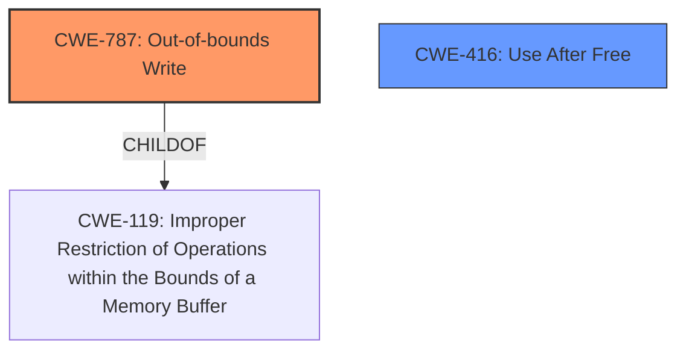

# Final Resolution for CVE-2022-22764

# Summary

| CWE ID | CWE Name | Confidence | CWE Abstraction Level | CWE Vulnerability Mapping Label | CWE-Vulnerability Mapping Notes |
|---|---|---|---|---|---|
| CWE-787 | Out-of-bounds Write | 0.85 | Base | Primary | Allowed |
| CWE-416 | Use After Free | 0.70 | Variant | Secondary | Allowed |

## Evidence and Confidence

*   **Confidence Score:** 0.80
*   **Evidence Strength:** HIGH

## Relationship Analysis
The primary relationship impacting the decision is the hierarchical relationship between CWE-787 (**Out-of-bounds Write**) and CWE-119 (**Improper Restriction of Operations within the Bounds of a Memory Buffer**). CWE-787 is a child of CWE-119, making it a more specific and appropriate choice given the evidence of **memory corruption**.

## Vulnerability Chain
The vulnerability chain starts with "**memory safety bugs**", which lead to **memory corruption**.
- Root Cause: "**memory safety bugs**"
- Weakness 1: CWE-787 (**Out-of-bounds Write**) - Writing data past the end of a buffer causes **memory corruption**.
- Weakness 2: CWE-416 (**Use After Free**) - Memory is reused after it has been freed, which may cause **memory corruption**.
- Impact: Arbitrary code execution.

## Summary of Analysis
The initial analysis and criticism both agree on the relevance of CWE-787 (**Out-of-bounds Write**) and CWE-416 (**Use After Free**). The vulnerability description explicitly mentions "**memory safety bugs**" leading to "**memory corruption**", which supports the selection of these CWEs.

The choice of CWE-787 as the primary CWE is based on the likelihood that writing past the end of a buffer is a direct cause of the reported **memory corruption**. The retriever results also strongly suggest this **weakness**.

CWE-416 is considered as a secondary CWE because "**memory safety bugs**" could also potentially involve use-after-free scenarios, but the description does not explicitly confirm this.

The selected CWEs are at the optimal level of specificity. CWE-787 is a Base level CWE, and CWE-416 is a Variant level CWE. Both are preferred levels of abstraction according to MITRE's mapping guidance.

The suggestions in the criticism were helpful in thinking about other possible CWEs, especially CWE-843 (**Access of Resource Using Incompatible Type ('Type Confusion')**), but ultimately, the information given does not specifically point to type confusion being a root cause. Similarly, while integer overflows could lead to buffer overflows, there isn't sufficient evidence to suggest CWE-190 is a root cause. Therefore, I am maintaining my original assessment.