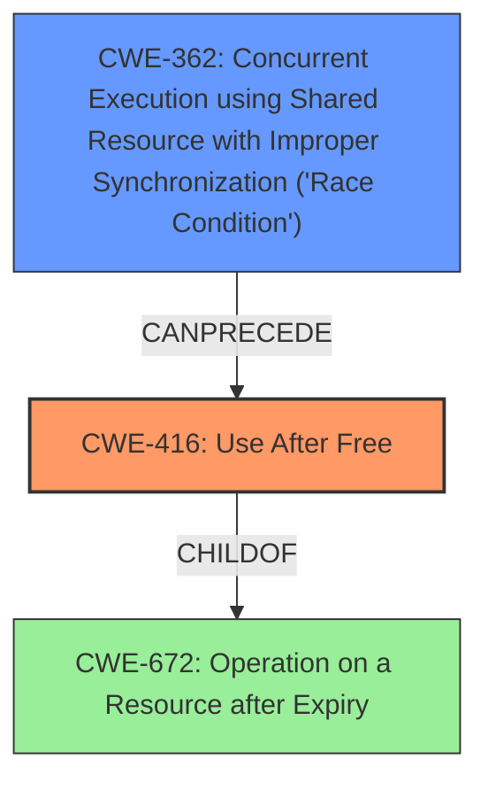

# Final Resolution for CVE-2022-2296

# Summary
| CWE ID | CWE Name | Confidence | CWE Abstraction Level | CWE Vulnerability Mapping Label | CWE-Vulnerability Mapping Notes |
|---|---|---|---|---|---|
| CWE-416 | Use After Free | 1.0 | Variant | Allowed | The product reuses or references memory after it has been freed. |
| CWE-362 | Concurrent Execution using Shared Resource with Improper Synchronization ('Race Condition') | 0.6 | Class | Allowed-with-Review | A race condition may exist that enables the use-after-free. Further analysis of the code is needed to confirm. |

## Evidence and Confidence

*   **Confidence Score:** 0.9
*   **Evidence Strength:** MEDIUM

## Relationship Analysis
The primary CWE is CWE-416, which has a parent relationship to CWE-672. The criticism suggests that if a race condition leads to the use-after-free, then CWE-362 should be included. This introduces a chain relationship where CWE-362 can precede CWE-416. The abstraction levels influenced the selection by favoring the more specific Variant (CWE-416) and considering the Class (CWE-362) for a broader concurrency issue.

## Vulnerability Chain
The vulnerability chain starts with a potential **CWE-362** (Race Condition), leading to **CWE-416** (Use After Free), which results in heap corruption and potential exploitation by a remote attacker. The initial flaw is the improper synchronization of shared resources. The consequence is the reuse of memory after it has been freed. A missing link is definitive confirmation of the race condition through code analysis, thus a lower confidence score for that.

## Summary of Analysis
The initial analysis correctly identified **CWE-416** (Use After Free) as the primary weakness. The criticism suggested the possibility of a race condition contributing to the vulnerability. Based on the vulnerability description "Use after free in Chrome OS Shell in Google Chrome on Chrome OS prior to 103.0.5060.114 allowed a remote attacker who convinced a user to engage in specific user interactions to potentially exploit heap corruption via direct UI interactions.", there is a possibility that a concurrency issue exists. However, without further code analysis, it is difficult to confirm. Therefore, **CWE-362** (Race Condition) is added as a secondary CWE with a lower confidence score. The selected CWEs are at the optimal level of specificity, with **CWE-416** being a Variant and **CWE-362** being a Class that encompasses various race conditions. The graph relationships influenced the decision by highlighting the potential chain of events leading to the vulnerability.