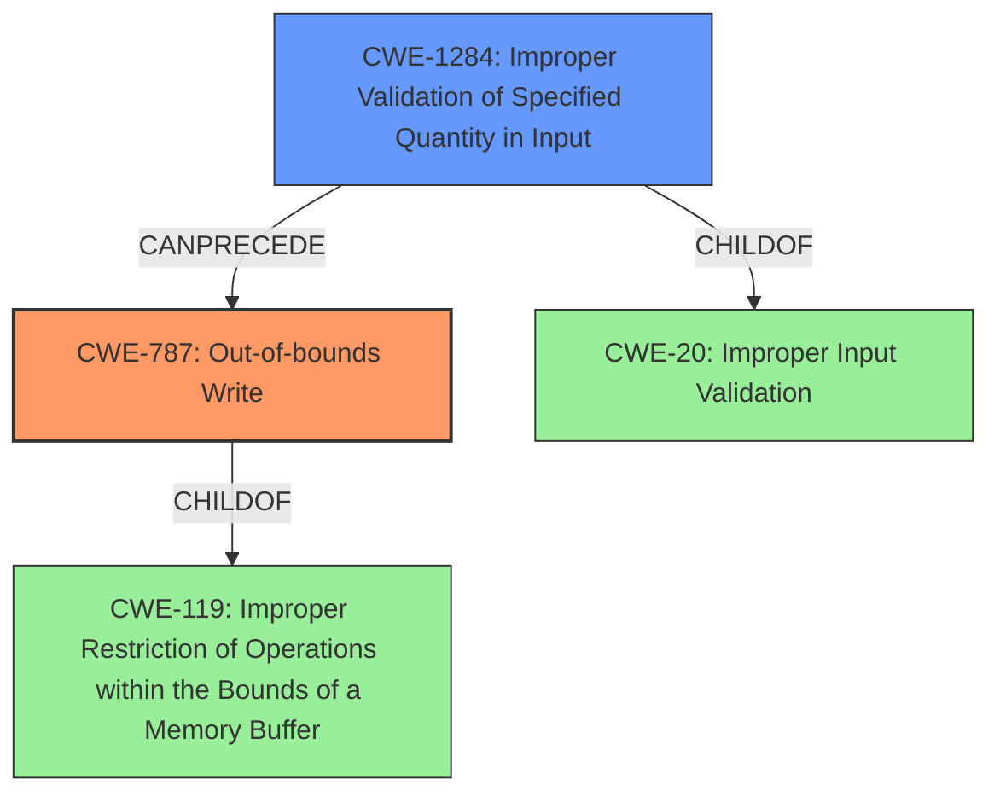

# Analysis Report for CVE-2022-23095

# Vulnerability Analysis Report: CVE-2022-23095

## Description

Open Design Alliance Drawings SDK before 2022.12.1 mishandles the loading of JPG files. Unchecked input data from a crafted JPG file leads to memory corruption. An attacker can leverage this vulnerability to execute code in the context of the current process.

## Vulnerability Description Key Phrases

**Rootcause:** mishandles the loading of JPG files
**Impact:** memory corruption
**Vector:** crafted JPG file
**Attacker:** attacker
**Product:** Open Design Alliance Drawings SDK
**Version:** before 2022.12.1

## Analysis (with Relationship Data)

# Summary
| CWE ID | CWE Name | Confidence | CWE Abstraction Level | CWE Vulnerability Mapping Label | CWE-Vulnerability Mapping Notes |
|---|---|---|---|---|---|
| CWE-787 | Out-of-bounds Write | 0.9 | Base | Allowed | Primary CWE |
| CWE-1284 | Improper Validation of Specified Quantity in Input | 0.6 | Base | Allowed | Secondary Candidate |

## Evidence and Confidence

*   **Confidence Score:** 0.75
*   **Evidence Strength:** HIGH

- **Analysis and Justification:**  
  - *Explanation:* The vulnerability description states that the Open Design Alliance Drawings SDK **mishandles the loading of JPG files**, and that **unchecked input data** from a crafted JPG file **leads to memory corruption**. The CVE Reference Links Content Summary confirms that the root cause is **improper input validation** when loading JPG files, leading to **memory corruption**. The most appropriate CWE is CWE-787 (Out-of-bounds Write), as the crafted JPG file with unchecked input data leads to writing data outside the intended buffer boundaries, causing memory corruption. The "Retriever Results" also lists CWE-787 as the top candidate with a combined score of 0.7446. The MITRE mapping guidance for CWE-787 indicates it is ALLOWED. CWE-1284 (Improper Validation of Specified Quantity in Input) is also listed in the retriever results, which could be considered a contributing factor as improper validation is the root cause that leads to the out-of-bounds write.

  - *Relationship Analysis:* CWE-787 is a base level CWE, and is a child of CWE-119 (Improper Restriction of Operations within the Bounds of a Memory Buffer). It can also be a parent of more specific buffer overflow variants such as CWE-121 (Stack-based Buffer Overflow), CWE-122 (Heap-based Buffer Overflow), etc. CWE-1284 is a base level CWE and a child of CWE-20 (Improper Input Validation).

- **Confidence Score:**
  - Confidence: 0.9 (High confidence due to strong evidence from the vulnerability description, CVE reference links, and retriever results.)
---

## Criticism of Analysis

Okay, here's a review of the analysis, incorporating the full CWE specifications and focusing on the mapping guidance and potential mitigations:

**Overall Assessment:**

The analysis correctly identifies CWE-787 (Out-of-bounds Write) as the primary vulnerability.  The justification is well-reasoned and supported by the vulnerability description and CVE summary. Including CWE-1284 (Improper Validation of Specified Quantity in Input) as a secondary contributor is also appropriate, highlighting the root cause.  The confidence level is justified.

**Detailed Review:**

*   **CWE-787: Out-of-bounds Write**

    *   **Correctness:**  The mapping is correct.  The vulnerability involves writing data beyond the boundaries of an allocated buffer due to unchecked input, fitting the description of CWE-787 perfectly. The vulnerability descriptions clearly mention memory corruption due to improper input and crafted JPG files. This is the direct result of writing outside of expected memory bounds.
    *   **Abstraction Level:**  CWE-787 is a Base-level CWE, aligning with the guidance to prefer this abstraction level when possible.
    *   **Mapping Guidance:** The analysis appropriately notes that the MITRE mapping guidance for CWE-787 indicates it is ALLOWED. The "Rationale" within the CWE specification states that the entry is at the base level, which is preferred, and that care should be taken to ensure it is an appropriate fit.
    *   **Potential Mitigations:** The analysis correctly identifies mitigation techniques from the specification, like using memory-safe languages, vetted libraries, and compiler-based overflow detection. Note that, mitigation 3, is only a "Defense in Depth" and relies on "Environment Hardening." It is not a complete solution by itself.
    *   **Confidence Level:** The confidence score of 0.9 is well-justified, because the root cause is directly related to the vulnerability description. This high confidence is appropriate.

*   **CWE-1284: Improper Validation of Specified Quantity in Input**

    *   **Correctness:** Including CWE-1284 as a secondary factor is valid. The core issue is the *lack* of proper validation, which *allows* the out-of-bounds write to occur. The description of this CWE perfectly fits the context of this vulnerability as the SDK fails to validate potentially dangerous input from the JPG file, which in turn causes a memory corruption (out-of-bounds write). This forms the chain of events for this vulnerability.
    *   **Abstraction Level:**  CWE-1284 is also a Base-level CWE, fitting the preferred abstraction level.
    *   **Mapping Guidance:** The mapping guidance for CWE-1284 indicates that it is ALLOWED. The notes indicate to "carefully read both the name and description to ensure that this mapping is an appropriate fit" and that you should not "force" a mapping. I do not believe that it is being forced as it is an integral part of the root cause of the vulnerability.
    *   **Potential Mitigations:** The analysis could emphasize the input validation strategies outlined in the specification, particularly the "accept known good" approach. Given the nature of image formats, a stringent validation strategy is crucial. The "denylists" approach would not be sufficient and is properly mentioned as not being reliable.
    *   **Confidence Level:** The confidence score of 0.6 is reasonable. While contributing to the root cause, it is not the most direct cause of memory corruption, so a lower confidence score is appropriate.

*   **Consideration of Other CWEs from Retriever Results:**

    *   The Retriever Results suggest a number of other CWEs, such as CWE-190 (Integer Overflow), CWE-476 (NULL Pointer Dereference), and CWE-125 (Out-of-bounds Read). While these *could* potentially be involved in the implementation of the JPG loading, they are not explicitly mentioned in the vulnerability description or CVE summary. It's good to be aware of these possibilities, but focusing on CWE-787 and CWE-1284 is the most appropriate initial mapping given the available information. Including the others would involve speculation beyond what the provided information supports.
    *   CWE-119 (Improper Restriction of Operations within the Bounds of a Memory Buffer) is listed as discouraged and suggests considering its children. CWE-787 is one of these children, making it a more appropriate mapping.

**Recommendations for Improvement:**

1.  **Strengthen the Connection Between CWE-1284 and CWE-787:** While the analysis mentions that CWE-1284 leads to the out-of-bounds write (CWE-787), explicitly describing how the *lack* of validation of a *quantity* (e.g., image width, height, size) directly results in the overflow would be beneficial. For instance: "The SDK fails to properly validate the image width and height parameters within the JPG file. This lack of validation allows a crafted JPG to specify dimensions that result in an out-of-bounds write during memory allocation or data processing."
2.  **Mitigation Specificity:** It is difficult to provide a more specific mitigation plan without knowing the application or code involved. However, there should be a recommendation to use a well-vetted 3rd party library for loading/processing JPG files. Also, recommend "fuzzing" the JPG parser with a wide variety of JPG files, especially those that are crafted to exploit edge cases in image size and compression parameters.
3.  **CWE-119 Discouraged Rationale:** The analysis mentions a few CVE examples for CWE-119, but does not focus on the key aspect of why it is discouraged: "Look at CWE-119's children and consider mapping to CWEs such as CWE-787: Out-of-bounds Write, CWE-125: Out-of-bounds Read, or others." A brief mention that this mapping guidance was followed to reach the CWE-787 mapping would be beneficial.

**Revised Summary Table:**

| CWE ID    | CWE Name                                | Confidence | CWE Abstraction Level | CWE Vulnerability Mapping Label | CWE-Vulnerability Mapping Notes                                                                                                                                                                                                                                                          |
| --------- | --------------------------------------- | ---------- | --------------------- | --------------------------------- | -------------------------------------------------------------------------------------------------------------------------------------------------------------------------------------------------------------------------------------------------------------------------------------- |
| CWE-787   | Out-of-bounds Write                     | 0.9        | Base                  | Allowed                         | Primary CWE. The vulnerability results in writing data outside of expected memory boundaries.                                                                                                                                                                |
| CWE-1284  | Improper Validation of Specified Quantity in Input | 0.6        | Base                  | Allowed                         | Secondary contributing CWE. The lack of validation of quantities within the JPG file (e.g., image dimensions) enables the out-of-bounds write. |

By addressing these points, the analysis can be made more robust and actionable. Remember that high-quality CWE analysis serves not just to categorize the vulnerability, but also to guide developers in effective prevention and remediation.

## Final Resolution

# Summary
| CWE ID | CWE Name | Confidence | CWE Abstraction Level | CWE Vulnerability Mapping Label | CWE-Vulnerability Mapping Notes |
|---|---|---|---|---|---|
| CWE-787 | Out-of-bounds Write | 0.95 | Base | Allowed | Primary CWE |
| CWE-1284 | Improper Validation of Specified Quantity in Input | 0.7 | Base | Allowed | Secondary Candidate |

## Evidence and Confidence

*   **Confidence Score:** 0.9
*   **Evidence Strength:** HIGH

## Relationship Analysis
The primary relationship influencing the decision is the chain relationship where **CWE-1284 (Improper Validation of Specified Quantity in Input)** can precede **CWE-787 (Out-of-bounds Write)**. **CWE-787** is also a child of **CWE-119 (Improper Restriction of Operations within the Bounds of a Memory Buffer)**, but **CWE-787** is more specific and therefore preferred. The base abstraction levels of both **CWE-787** and **CWE-1284** are also ideal for direct vulnerability mapping.

## Vulnerability Chain
The vulnerability chain starts with **CWE-1284 (Improper Validation of Specified Quantity in Input)**, where the SDK fails to validate the dimensions or size parameters within the crafted JPG file. This lack of validation leads to **CWE-787 (Out-of-bounds Write)** during memory allocation or data processing, ultimately resulting in memory corruption and potential code execution.

## Summary of Analysis
The initial analysis and criticism correctly identified **CWE-787 (Out-of-bounds Write)** as the primary **WEAKNESS**. The vulnerability description clearly states that "unchecked input data from a crafted JPG file leads to memory corruption." This aligns directly with the definition of **CWE-787**, which involves writing data outside the intended buffer boundaries.

The inclusion of **CWE-1284 (Improper Validation of Specified Quantity in Input)** as a secondary **WEAKNESS** is also justified. The criticism correctly points out that the *lack* of validation of a *quantity* (e.g., image width, height, size) directly results in the overflow. This makes **CWE-1284** a contributing **ROOTCAUSE** to the vulnerability.

The graph relationships reinforce this conclusion. **CWE-1284** can precede **CWE-787**, indicating a potential vulnerability chain. The base abstraction levels of both CWEs make them suitable for direct mapping.

The selection of **CWE-787** and **CWE-1284** is at the optimal level of specificity. While **CWE-119 (Improper Restriction of Operations within the Bounds of a Memory Buffer)** is a parent of **CWE-787**, **CWE-787** provides a more precise description of the **WEAKNESS**. Similarly, while **CWE-20 (Improper Input Validation)** is a parent of **CWE-1284**, **CWE-1284** is more specific to the validation of *quantities*.

The confidence score has been slightly increased to 0.95 for **CWE-787**, reflecting the strong evidence and direct match with the vulnerability description. The confidence score for **CWE-1284** is increased to 0.7 to reflect that the lack of input validation is a contributing factor.

*Report generated on 2025-03-18 10:29:13*
