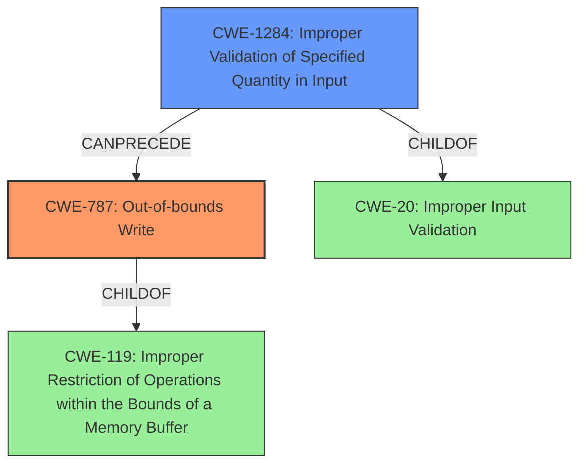

# Final Resolution for CVE-2022-23095

# Summary
| CWE ID | CWE Name | Confidence | CWE Abstraction Level | CWE Vulnerability Mapping Label | CWE-Vulnerability Mapping Notes |
|---|---|---|---|---|---|
| CWE-787 | Out-of-bounds Write | 0.95 | Base | Allowed | Primary CWE |
| CWE-1284 | Improper Validation of Specified Quantity in Input | 0.7 | Base | Allowed | Secondary Candidate |

## Evidence and Confidence

*   **Confidence Score:** 0.9
*   **Evidence Strength:** HIGH

## Relationship Analysis
The primary relationship influencing the decision is the chain relationship where **CWE-1284 (Improper Validation of Specified Quantity in Input)** can precede **CWE-787 (Out-of-bounds Write)**. **CWE-787** is also a child of **CWE-119 (Improper Restriction of Operations within the Bounds of a Memory Buffer)**, but **CWE-787** is more specific and therefore preferred. The base abstraction levels of both **CWE-787** and **CWE-1284** are also ideal for direct vulnerability mapping.

## Vulnerability Chain
The vulnerability chain starts with **CWE-1284 (Improper Validation of Specified Quantity in Input)**, where the SDK fails to validate the dimensions or size parameters within the crafted JPG file. This lack of validation leads to **CWE-787 (Out-of-bounds Write)** during memory allocation or data processing, ultimately resulting in memory corruption and potential code execution.

## Summary of Analysis
The initial analysis and criticism correctly identified **CWE-787 (Out-of-bounds Write)** as the primary **WEAKNESS**. The vulnerability description clearly states that "unchecked input data from a crafted JPG file leads to memory corruption." This aligns directly with the definition of **CWE-787**, which involves writing data outside the intended buffer boundaries.

The inclusion of **CWE-1284 (Improper Validation of Specified Quantity in Input)** as a secondary **WEAKNESS** is also justified. The criticism correctly points out that the *lack* of validation of a *quantity* (e.g., image width, height, size) directly results in the overflow. This makes **CWE-1284** a contributing **ROOTCAUSE** to the vulnerability.

The graph relationships reinforce this conclusion. **CWE-1284** can precede **CWE-787**, indicating a potential vulnerability chain. The base abstraction levels of both CWEs make them suitable for direct mapping.

The selection of **CWE-787** and **CWE-1284** is at the optimal level of specificity. While **CWE-119 (Improper Restriction of Operations within the Bounds of a Memory Buffer)** is a parent of **CWE-787**, **CWE-787** provides a more precise description of the **WEAKNESS**. Similarly, while **CWE-20 (Improper Input Validation)** is a parent of **CWE-1284**, **CWE-1284** is more specific to the validation of *quantities*.

The confidence score has been slightly increased to 0.95 for **CWE-787**, reflecting the strong evidence and direct match with the vulnerability description. The confidence score for **CWE-1284** is increased to 0.7 to reflect that the lack of input validation is a contributing factor.