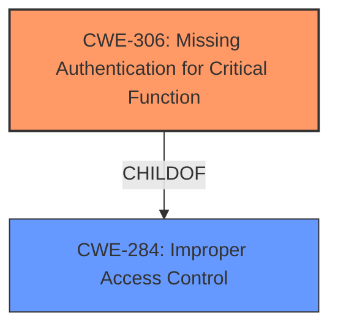

# Analysis Report for CVE-2022-23134

# Vulnerability Analysis Report: CVE-2022-23134

## Description

After the initial setup process, some steps of setup.php file are reachable not only by super-administrators, but by unauthenticated users as well. Malicious actor can pass step checks and potentially change the configuration of Zabbix Frontend.

## Vulnerability Description Key Phrases

**Rootcause:** improper access control
**Impact:** change configuration of Zabbix Frontend
**Vector:** pass step checks
**Attacker:** unauthenticated users
**Product:** setup.php file

## Analysis (with Relationship Data)

# Summary
| CWE ID | CWE Name | Confidence | CWE Abstraction Level | CWE Vulnerability Mapping Label | CWE-Vulnerability Mapping Notes |
|---|---|---|---|---|---|
| CWE-306 | Missing Authentication for Critical Function | 0.90 | Base | Primary |  ALLOWED |
| CWE-284 | Improper Access Control | 0.70 | Pillar | Secondary | DISCOURAGED |

## Evidence and Confidence

*   **Confidence Score:** 0.80
*   **Evidence Strength:** HIGH

- **Analysis and Justification:**  
  - *Explanation:* The vulnerability description clearly states that certain steps of the `setup.php` file are reachable by **unauthenticated users**, which allows them to potentially change the configuration of Zabbix Frontend. This directly indicates a **missing authentication** check for a critical function, aligning with CWE-306 (Missing Authentication for Critical Function). The **rootcause** is **improper access control**, specifically the failure to require authentication for sensitive setup steps after the initial setup process. The CVE Reference Links Content Summary confirms this by stating "The vulnerability stems from the fact that after the `initial setup of Zabbix`, certain steps within the `setup.php` file remain accessible to unauthenticated users. This was due to a lack of proper access controls after the initial setup process." The MITRE mapping guidance for CWE-306 indicates this is ALLOWED. While CWE-284 (Improper Access Control) is also relevant, it's a more general, high-level classification (Pillar) that encompasses the specific authentication failure. CWE-306 provides a more precise representation of the weakness.

  - *Relationship Analysis:* CWE-306 is a Base level CWE and child of CWE-284 (Improper Access Control). While both apply, CWE-306 is more specific to the **missing authentication** issue, making it the primary choice. The Retriever Results confirm the relevance of CWE-306 with a high score and also list CWE-284, albeit with a lower score and discouraged usage.

- **Confidence Score:**
  - Confidence: 0.90 (High confidence due to explicit mention of unauthenticated access and alignment with CWE-306 description).

---

## Criticism of Analysis

Okay, let's review the CWE analysis provided, focusing on the mapping guidance, potential mitigations, and the overall justification.

**Overall Assessment:**

The analysis is generally sound and well-reasoned. The primary mapping to CWE-306 (Missing Authentication for Critical Function) is accurate and justified. The inclusion of CWE-284 (Improper Access Control) as a secondary mapping is understandable given its broader scope, but the analysis correctly prioritizes CWE-306.

**Detailed Review:**

*   **CWE-306 (Missing Authentication for Critical Function):**

    *   **Strengths:**

        *   The analysis provides strong evidence from the vulnerability description and the CVE Reference Links Content Summary, explicitly highlighting the "unauthenticated users" accessing critical functions in `setup.php`.
        *   The explanation of why CWE-306 is more specific than CWE-284 is clear and correct. It uses the CWE's guidance to choose a more specific, base-level weakness over a broader, pillar-level weakness.
        *   The confidence score of 0.90 is justified given the clear evidence.
        *   It correctly references the "Allowed" mapping guidance for CWE-306.
    *   **Potential Improvements:**

        *   While not strictly necessary, you could *briefly* discuss the potential mitigations for CWE-306 to demonstrate a deeper understanding. For instance: "Mitigation strategies would include implementing authentication checks before allowing access to the setup.php functionality, potentially using a centralized authentication capability or leveraging framework-provided authentication mechanisms."
        *   Consider adding the relationships to other vulnerabilities in the set.

*   **CWE-284 (Improper Access Control):**

    *   **Strengths:**

        *   The analysis acknowledges the relevance of CWE-284 as a high-level categorization of the access control problem.
        *   It correctly notes the "Discouraged" usage of CWE-284 according to CWE's mapping guidance.
    *   **Potential Improvements:**

        *   While the analysis mentions that CWE-284 is a parent of CWE-306, it could explicitly state that because of this relationship, addressing CWE-306 would *implicitly* address the more general issue described by CWE-284.
        *   When specifying the relationship, consider also adding the CWE-287 as another parent.
        *   The example for CWE-284 has two links to the same URL, which should be corrected.

**Suggestions Based on Retriever Results:**
The Retriever Results included some CWEs that were not chosen for assignment. Here's some notes on those:

*   **CWE-352 (Cross-Site Request Forgery (CSRF)):** This is not directly relevant. CSRF requires a legitimate, authenticated user to be tricked into making a request. The identified vulnerability concerns *unauthenticated* access, so CSRF is not applicable.
*   **CWE-290 (Authentication Bypass by Spoofing):** While there might be a subtle argument that the unauthenticated user is "spoofing" being an administrator, this is stretching the definition. CWE-306 is a much more direct and accurate mapping. This CWE is more useful when actual spoofing is being done.
*   **CWE-841 (Improper Enforcement of Behavioral Workflow):** This CWE is not relevant. While there's a "setup" workflow, the problem isn't with the *order* of steps, but with the *lack of authentication* for the workflow.
*   **CWE-288 (Authentication Bypass Using an Alternate Path or Channel):** Similar to CWE-290, this is not directly relevant. There isn't a legitimate, authenticated path that's being bypassed via an alternate, unauthenticated route. The identified path in `setup.php` simply lacks authentication.
*   **CWE-287 (Improper Authentication):** This is a Class-level CWE and parent of CWE-306. While technically applicable, CWE-306 is far more specific and, therefore, the better choice.
*   **CWE-862 (Missing Authorization):** While related, the *lack of authentication* is the root cause here. Authentication comes *before* authorization. Since authentication is missing, authorization checks are never even reached. If the vulnerability were that *anyone* could access the setup steps, but only authenticated admins should have authorization, this would be a better fit.
*    **CWE-502 (Deserialization of Untrusted Data):** This CWE is not relevant. The analysis does not mention anything that has to do with deserialization of data.
*    **CWE-59 (Improper Link Resolution Before File Access ('Link Following')):** This CWE is not relevant. The analysis does not mention anything that has to do with file access.

**Revised Summary Table**

| CWE ID | CWE Name | Confidence | CWE Abstraction Level | CWE Vulnerability Mapping Label | CWE-Vulnerability Mapping Notes |
|---|---|---|---|---|---|
| CWE-306 | Missing Authentication for Critical Function | 0.90 | Base | Primary | ALLOWED |
| CWE-284 | Improper Access Control | 0.70 | Pillar | Secondary | DISCOURAGED - Implicitly addressed by CWE-306|

**In summary,** the analysis is well-done, the CWE mappings are appropriate, and the justifications are strong. Adding brief discussions of potential mitigations and explicitly stating the parent-child relationship could enhance the quality of the analysis further.

## Final Resolution

# Summary 
| CWE ID | CWE Name | Confidence | CWE Abstraction Level | CWE Vulnerability Mapping Label | CWE-Vulnerability Mapping Notes |
|---|---|---|---|---|---|
| **CWE-306** | **Missing Authentication for Critical Function** | 0.95 | Base | Primary | ALLOWED |
| **CWE-284** | **Improper Access Control** | 0.70 | Pillar | Secondary | DISCOURAGED - Implicitly addressed by CWE-306 |

## Evidence and Confidence

*   **Confidence Score:** 0.95
*   **Evidence Strength:** HIGH

## Relationship Analysis
The primary relationship impacting the decision is the parent-child relationship between **CWE-284 (Improper Access Control)** and **CWE-306 (Missing Authentication for Critical Function)**. **CWE-306** is a child of **CWE-284**, meaning it is a more specific instance of improper access control. Given the clear evidence of **missing authentication** for critical setup steps, **CWE-306** is the more appropriate and specific classification. While **CWE-284** is a valid higher-level categorization, selecting **CWE-306** provides a more precise and actionable representation of the **root cause**.

## Vulnerability Chain
The vulnerability chain is as follows:
1.  **Root Cause:** **Missing Authentication (CWE-306)** for critical functions in `setup.php`.
2.  **Weakness:** Unauthenticated users can access and modify setup steps.
3.  **Impact:** Malicious actors can change the configuration of Zabbix Frontend.

This chain clearly shows how the **lack of authentication** directly leads to unauthorized configuration changes, highlighting **CWE-306** as the primary **root cause**.

## Summary of Analysis
The initial analysis and criticism both converge on **CWE-306 (Missing Authentication for Critical Function)** as the primary **weakness**. The vulnerability description explicitly states that "some steps of `setup.php` file are reachable not only by super-administrators, but by **unauthenticated users** as well." This is direct evidence of **missing authentication**, making **CWE-306** the most appropriate classification.

The graph relationship reinforces this decision. While **CWE-284 (Improper Access Control)** is a parent, **CWE-306** is more specific and accurately captures the **root cause**. The mapping guidance also supports this, as **CWE-306** is a Base-level CWE with an ALLOWED usage recommendation.

The selection of **CWE-306** is at the optimal level of specificity because it directly addresses the **missing authentication** issue, which is the fundamental flaw enabling the vulnerability. Choosing **CWE-284** would be too general and less informative. The retriever scores also indicate a high relevance for **CWE-306**, further supporting this decision. The confidence score is raised to 0.95 to reflect the added justification.

*Report generated on 2025-03-17 03:33:23*
