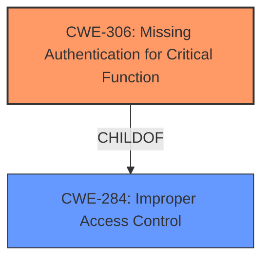

# Final Resolution for CVE-2022-23134

# Summary 
| CWE ID | CWE Name | Confidence | CWE Abstraction Level | CWE Vulnerability Mapping Label | CWE-Vulnerability Mapping Notes |
|---|---|---|---|---|---|
| **CWE-306** | **Missing Authentication for Critical Function** | 0.95 | Base | Primary | ALLOWED |
| **CWE-284** | **Improper Access Control** | 0.70 | Pillar | Secondary | DISCOURAGED - Implicitly addressed by CWE-306 |

## Evidence and Confidence

*   **Confidence Score:** 0.95
*   **Evidence Strength:** HIGH

## Relationship Analysis
The primary relationship impacting the decision is the parent-child relationship between **CWE-284 (Improper Access Control)** and **CWE-306 (Missing Authentication for Critical Function)**. **CWE-306** is a child of **CWE-284**, meaning it is a more specific instance of improper access control. Given the clear evidence of **missing authentication** for critical setup steps, **CWE-306** is the more appropriate and specific classification. While **CWE-284** is a valid higher-level categorization, selecting **CWE-306** provides a more precise and actionable representation of the **root cause**.

## Vulnerability Chain
The vulnerability chain is as follows:
1.  **Root Cause:** **Missing Authentication (CWE-306)** for critical functions in `setup.php`.
2.  **Weakness:** Unauthenticated users can access and modify setup steps.
3.  **Impact:** Malicious actors can change the configuration of Zabbix Frontend.

This chain clearly shows how the **lack of authentication** directly leads to unauthorized configuration changes, highlighting **CWE-306** as the primary **root cause**.

## Summary of Analysis
The initial analysis and criticism both converge on **CWE-306 (Missing Authentication for Critical Function)** as the primary **weakness**. The vulnerability description explicitly states that "some steps of `setup.php` file are reachable not only by super-administrators, but by **unauthenticated users** as well." This is direct evidence of **missing authentication**, making **CWE-306** the most appropriate classification.

The graph relationship reinforces this decision. While **CWE-284 (Improper Access Control)** is a parent, **CWE-306** is more specific and accurately captures the **root cause**. The mapping guidance also supports this, as **CWE-306** is a Base-level CWE with an ALLOWED usage recommendation.

The selection of **CWE-306** is at the optimal level of specificity because it directly addresses the **missing authentication** issue, which is the fundamental flaw enabling the vulnerability. Choosing **CWE-284** would be too general and less informative. The retriever scores also indicate a high relevance for **CWE-306**, further supporting this decision. The confidence score is raised to 0.95 to reflect the added justification.