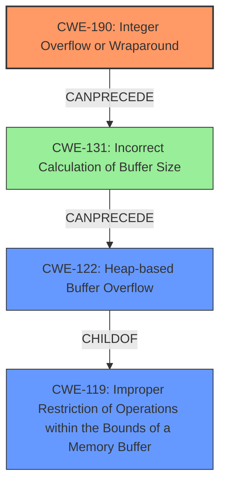

# Analysis Report for CVE-2022-2329

# Vulnerability Analysis Report: CVE-2022-2329

## Description

A CWE-190 Integer Overflow or Wraparound vulnerability exists that could cause heap-based buffer overflow, leading to denial of service and potentially remote code execution when an attacker sends multiple specially crafted messages. Affected Products IGSS Data Server - IGSSdataServer.exe (Versions prior to V15.0.0.22073)

## Vulnerability Description Key Phrases

**Rootcause:** CWE-190 Integer Overflow or Wraparound
**Impact:** ['heap-based buffer overflow', 'denial of service', 'remote code execution']
**Vector:** multiple specially crafted messages
**Attacker:** attacker
**Product:** IGSS Data Server
**Version:** Versions prior to V15.0.0.22073
**Component:** IGSSdataServer.exe

## Analysis (with Relationship Data)

# Summary
| CWE ID | CWE Name | Confidence | CWE Abstraction Level | CWE Vulnerability Mapping Label | CWE-Vulnerability Mapping Notes |
|---|---|---|---|---|---|
| CWE-190 | Integer Overflow or Wraparound | 1.0 | Base | Primary | Allowed |
| CWE-122 | Heap-based Buffer Overflow | 0.7 | Variant | Secondary Candidate | Allowed |

## Evidence and Confidence

*   **Confidence Score:** 0.85
*   **Evidence Strength:** HIGH

- **Analysis and Justification:**  
  - *Explanation:* The vulnerability description clearly states that a "**CWE-190 Integer Overflow or Wraparound** vulnerability exists that could cause heap-based buffer overflow". The CVE Reference Links Content Summary confirms the **root cause** of the vulnerability is an **integer overflow or wraparound** (**CWE-190**), which leads to a heap-based buffer overflow. The description aligns precisely with CWE-190's characteristics. MITRE mapping guidance for CWE-190 indicates this is ALLOWED. Since the integer overflow leads to a heap-based buffer overflow, CWE-122 is added as a secondary candidate.

  - *Relationship Analysis:* CWE-190 is a Base level weakness, which is the preferred abstraction level. CWE-122 (Heap-based Buffer Overflow) is a Variant of CWE-119 (Improper Restriction of Operations within the Bounds of a Memory Buffer). CWE-190 can precede CWE-119, as an integer overflow can lead to a buffer overflow.

- **Confidence Score:**  
  - Confidence: 1.0 (High evidence from technical description and CVE reference materials)

## Criticism of Analysis

Okay, here's a review of the provided CWE analysis, using the full CWE specifications as a guide.

**Overall Assessment:**

The analysis is generally well-reasoned and accurate. The primary mapping to CWE-190 (Integer Overflow or Wraparound) is correct and strongly supported by the vulnerability description. The inclusion of CWE-122 (Heap-based Buffer Overflow) as a secondary candidate is also appropriate and reflects the likely outcome of the integer overflow.  The confidence scores are justified.

**Detailed Review by Section:**

1.  **Summary Table:**

    *   `CWE-190 | Integer Overflow or Wraparound | 1.0 | Base | Primary | Allowed` - This is the correct primary weakness. High confidence is warranted due to the explicit mention of "CWE-190 Integer Overflow or Wraparound" in the vulnerability description and confirmation in the CVE Reference Links Content Summary. The "Allowed" mapping label is consistent with CWE-190's Mapping Guidance.
    *   `CWE-122 | Heap-based Buffer Overflow | 0.7 | Variant | Secondary Candidate | Allowed` -  This is a reasonable secondary mapping. It represents the *consequence* of the integer overflow.  Confidence of 0.7 is good; it acknowledges that the overflow *could* lead to a heap overflow, but that it's not guaranteed, and that other outcomes are possible. The "Allowed" mapping label is consistent with CWE-122's Mapping Guidance.

2.  **Evidence and Confidence:**

    *   **Confidence Score: 0.85** - This is a good overall confidence score. It accurately reflects the strength of the evidence for both CWEs considered together.
    *   **Evidence Strength: HIGH** - Correct. Direct mention of CWE-190 and clear indication of heap overflow are strong evidence.
    *   **Analysis and Justification:**
        *   The explanation is clear and well-written. It accurately connects the vulnerability description, CVE summary, and the characteristics of CWE-190 and CWE-122.
        *   The explanation for including CWE-122 as a secondary candidate is correct. The analysis highlights that the integer overflow *leads* to the heap-based buffer overflow.
        *   **Relationship Analysis:**  This section is excellent. The parent-child relationship between CWE-119 (Improper Restriction of Operations within the Bounds of a Memory Buffer) and CWE-122 (Heap-based Buffer Overflow) is properly identified. The "CanPrecede" relationship between CWE-190 and CWE-119 is also accurately described.
    *   **Confidence Score: 1.0 (High evidence from technical description and CVE reference materials)** - Justified, specifically for CWE-190.
3.  **CWE Examples from Database:**

    *   The provided examples for CWE-122 are relevant and illustrate common scenarios where heap-based buffer overflows occur. Especially relevant is CVE-2021-43537, which is a clear example of the type of chaining we expect to see (CWE-681->CWE-190->CWE-122).

4.  **Relevant CWE Specifications:**
    * All CWE specifications provided are relevant and accurate.

**Recommendations & Potential Improvements:**

*   **Consider CWE-131 (Incorrect Calculation of Buffer Size) as an alternative or additional weakness:** While the main issue is integer overflow, the overflow *results* in an incorrect buffer size calculation.  The code calculates a size for the buffer, but the overflow causes this calculation to be wrong, leading to the allocation of a smaller buffer than expected.  This is *implicitly* present, and the analysis could make it more *explicit*.

*  **Address CWE-20 (Improper Input Validation) and CWE-682 (Incorrect Calculation):** While they're not *primary* weaknesses, it is useful to acknowledge that this issue falls under these categories. CWE-20 is very broad, so the analysis is correct to highlight the lower-level CWEs instead.  CWE-682 (Incorrect Calculation) is a parent of CWE-190, so mentioning it would simply be stating the obvious.

*   **Mitigation Strategies:** The analysis doesn't explicitly discuss mitigation strategies, but this is acceptable since the CWE IDs themselves contain mitigation information. However, if you want to expand the analysis, you could mention some of the mitigations for CWE-190:
    *   Use safe integer handling packages (SafeInt, IntegerLib).
    *   Ensure protocols are strictly defined with bounds checking.
    *   Use languages with automatic bounds checking.

*   **Alternative CWEs Considered:** Briefly mentioning any *other* candidate CWEs that were considered but rejected, and *why*, can strengthen the analysis.  For example, you might have considered CWE-191 (Integer Underflow) but rejected it because the vulnerability description specifically mentioned an *overflow*.

**Revised Summary Table (Including CWE-131 as a potential additional weakness):**

| CWE ID | CWE Name | Confidence | CWE Abstraction Level | CWE Vulnerability Mapping Label | CWE-Vulnerability Mapping Notes |
|---|---|---|---|---|---|
| CWE-190 | Integer Overflow or Wraparound | 1.0 | Base | Primary | Allowed |
| CWE-122 | Heap-based Buffer Overflow | 0.7 | Variant | Secondary Candidate | Allowed |
| CWE-131 | Incorrect Calculation of Buffer Size | 0.4 | Base | Tertiary Candidate | Allowed |

**Revised Evidence and Confidence (snippet):**

*   **Analysis and Justification:**

    *Explanation:* The vulnerability description clearly states that a "**CWE-190 Integer Overflow or Wraparound** vulnerability exists that could cause heap-based buffer overflow". The CVE Reference Links Content Summary confirms the **root cause** of the vulnerability is an **integer overflow or wraparound** (**CWE-190**), which leads to a heap-based buffer overflow. The description aligns precisely with CWE-190's characteristics. MITRE mapping guidance for CWE-190 indicates this is ALLOWED. Since the integer overflow leads to a heap-based buffer overflow, CWE-122 is added as a secondary candidate. The integer overflow also *results* in an incorrect calculation of the buffer size, potentially allowing CWE-131 (Incorrect Calculation of Buffer Size) to be an applicable Tertiary candidate.

    *Relationship Analysis:* CWE-190 is a Base level weakness, which is the preferred abstraction level. CWE-122 (Heap-based Buffer Overflow) is a Variant of CWE-119 (Improper Restriction of Operations within the Bounds of a Memory Buffer). CWE-190 can precede CWE-119, as an integer overflow can lead to a buffer overflow. Furthermore, the *result* of CWE-190 is that an incorrect buffer size is calculated leading to CWE-131.
**In conclusion,** the analysis is thorough and generally correct.  Adding CWE-131 and explicitly stating why can give a more complete picture, as well as including why other CWEs have been excluded.

## Final Resolution

# Summary
| CWE ID | CWE Name | Confidence | CWE Abstraction Level | CWE Vulnerability Mapping Label | CWE-Vulnerability Mapping Notes |
|---|---|---|---|---|---|
| CWE-190 | **Integer Overflow or Wraparound** | 1.0 | Base | Primary | Allowed |
| CWE-122 | **Heap-based Buffer Overflow** | 0.7 | Variant | Secondary Candidate | Allowed |
| CWE-131 | **Incorrect Calculation of Buffer Size** | 0.4 | Base | Tertiary Candidate | Allowed |

## Evidence and Confidence

*   **Confidence Score:** 0.90
*   **Evidence Strength:** HIGH

## Relationship Analysis
The primary weakness is **CWE-190 (Integer Overflow or Wraparound)**, which can lead to **CWE-131 (Incorrect Calculation of Buffer Size)**. This incorrect calculation results in a smaller buffer being allocated than expected. Subsequently, this can lead to **CWE-122 (Heap-based Buffer Overflow)** when data is written beyond the allocated buffer's boundaries. CWE-122 is a variant of **CWE-119 (Improper Restriction of Operations within the Bounds of a Memory Buffer)**.

## Vulnerability Chain
The vulnerability chain begins with **CWE-190 (Integer Overflow or Wraparound)**, where an integer overflow occurs during a calculation. This overflow leads to **CWE-131 (Incorrect Calculation of Buffer Size)**, causing the program to allocate an insufficient amount of memory. Finally, when the program attempts to write more data than the allocated buffer can hold, it results in **CWE-122 (Heap-based Buffer Overflow)**. This buffer overflow can then lead to denial of service or potentially remote code execution.

## Summary of Analysis
The initial analysis correctly identified **CWE-190 (Integer Overflow or Wraparound)** as the primary **ROOTCAUSE**. The criticism suggested adding **CWE-131 (Incorrect Calculation of Buffer Size)**, which is a valid point as the integer overflow directly leads to an incorrect buffer size calculation. The vulnerability description clearly states that the integer overflow causes a heap-based buffer overflow, supporting the inclusion of **CWE-122 (Heap-based Buffer Overflow)** as a secondary weakness.

The graph relationships reinforce this analysis. **CWE-190** can precede **CWE-131**, which in turn can precede **CWE-122**. **CWE-122** is a variant of **CWE-119 (Improper Restriction of Operations within the Bounds of a Memory Buffer)**.

The selection of these CWEs is at the optimal level of specificity. **CWE-190** is a Base level weakness, representing the **ROOTCAUSE**. **CWE-122** is a Variant, detailing the specific type of buffer overflow. **CWE-131** clarifies the mechanism by which the overflow leads to the buffer overflow. Including these three CWEs provides a comprehensive understanding of the vulnerability.

The evidence from the vulnerability description supports this conclusion: "A **CWE-190 Integer Overflow or Wraparound** vulnerability exists that could cause heap-based buffer overflow."

*Report generated on 2025-03-18 10:30:09*
